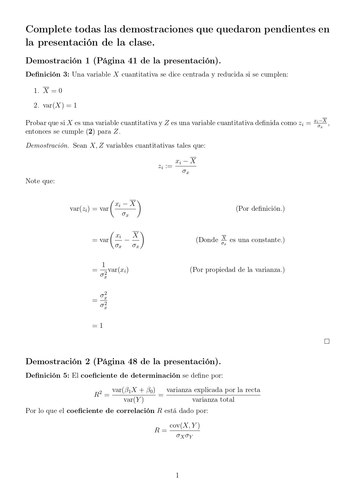
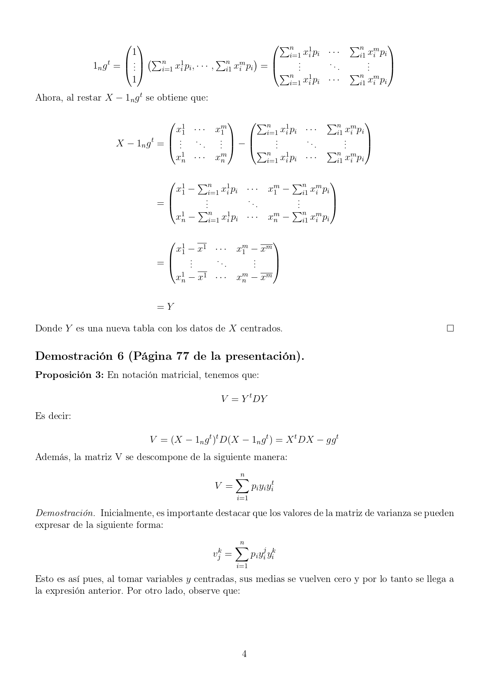

```{r setup, include=FALSE}
knitr::opts_chunk$set(echo = TRUE, warning = FALSE, message = FALSE)
```


# Ejercicio 1

**Complete todas las demostraciones que quedaron pendientes en la presentación de la clase.**







# Librerías 

Primeramente, se cargan las librerías necesarias.
```{r}
library(readr)
library(GGally)
library(univariateML)
library(rriskDistributions)
library(fitdistrplus)
```


# Ejercicio 2 

**Desarrolle una función R que recibe un DataFrame y dos números de columna y que retorna el nombre de las variables correspondientes a las columnas, la covarianza y la correlación entre esas dos variables.**

A continuación se muestra el código desarrollado para la creación de la función en R. 

```{r}
escanear <- function(dataframe, columna1, columna2){
  nombre_variables <- vector(length = 2) 
  nombre_variables[1] <- colnames(dataframe)[columna1]
  nombre_variables[2] <- colnames(dataframe)[columna2]
  covarianza <- cov(dataframe[, columna1], dataframe[, columna2])
  correlacion <- cor(dataframe[, columna1], dataframe[, columna2])
  return(list(nombre_variables = nombre_variables, covarianza = covarianza, 
              correlación = correlacion))
}
```

La función llamada escanear recibe un dataframe, el nombre de la primer columna que se desea y el de la segunda. Se crea un vector para almacenar los nombres de las variables. Luego se le asigna a cada uno de los espacios del vector el nombre de la variables, extraídos por medio de la función colnames( ). Seguidamente, se utilizan las funciones cov( ) para la covarianza y cor( ) para la correlación.

Como se puede observar la función retorna una lista donde el primer elemento es un vector con los nombres de las variables correspondientes a las columnas ingresadas, el segundo elemento es la covarianza entre las dos variables y el último es la correlación de las mismas. 

Una vez hecha la función se decide hacer la siguiente prueba para corroborar. 

```{r}
prueba <- read.csv("concreto.csv")

escanear(prueba, 3, 5)
```

# Ejercicio 3

**Programe la siguiente función recursiva:**


A continuación se muestra el código desarrollado para la creación de la función recursiva. 

```{r}
U_n <- function(n){
  if(n == 0){
    resultado <- 5 
  } else if(n == 1){
    resultado <- -5 
  } else if(n == 2){
    resultado <- 2 
  } else{
    resultado <- 4*U_n(n-1) - 15*U_n(n-2) + U_n(n-3)
  }
  return(resultado)
}
```

La función recibe un n el cual especifica el valor que se desea calcular. Con el uso de los condicionales se crean los casos posibles de cada valor. Note que cuando n es mayor o igual a tres, debido a la recursividad, el resultado vuelve a ejecutar la función pero con los valores anteriores. Por último, la función retorna el resultado correspondiente. 

Para corroborar el buen funcionamiento se decide hacer una prueba con los 11 primeros valores de la recursión. 

```{r}
for (i in 0:10) {
  
  valor <- U_n(i)
  cat("U_", i, "=", valor, "\n")
  
}
```

# Ejercicio 4 

**En este ejercicio utilizaremos la tabla de datos concreto.csv, la cual contiene mediciones de los distintos componentes de una estructura de concreto. El concreto es el material más importante en la ingeniería civil.**

Primeramente, se carga la base de datos 
```{r}
concreto <- read_csv("concreto.csv")
```

Seguidamente, se realiza un análisis exploratorio de los datos para conocer ciertas
características y comportamientos de la información con la que contamos.

Primero, es necesario identificar el tipo de datos que son. A continuación se
muestra dicha información:
```{r}
str(concreto)
head(concreto)
```

Como se puede observar, todas la variables son de tipo númerico.

Segundo, se verifica si existen outliers entre las variables. Es decir, si se
presentan valores atípicos que se alejan del resto de los datos.Para esto, es
útil construir las cajas de bigotes correspondiente a cada variable ya que, nos 
permiten visualizar de manera sencilla si existen estos tipos de datos.

Entonces,transformamos el dataframe para obtener uno con variables categóricas 
de la siguiente manera:
```{r}
stacked_concreto <- stack(concreto)
head(stacked_concreto)
```

Con lo anterior, se construyen las cajas de bigotes para cada variable:
```{r, fig.width=18, fig.height=10}
boxplot(stacked_concreto$values ~ stacked_concreto$ind,
        col = rainbow(ncol(concreto)), xlab = "Variables", ylab ="y")
```

Se puede observar que la variable edad y agua son los que presentan más outiliers (3 y 4 respectivamente). También, ciertos valores atípicos de la variable de edad  se encuentran considerablemente lejanos al resto de los datos. Sin embargo, no se proceden a eliminar pues, el outlier más alto es 365 días  lo cuál, considerando la definición de esta variable y  las propiedades del concreto es un valor que se debe tomar en cuenta. En el caso de las otras variables que poseen outliers, estos se encuentra no muy lejos de los límites de la caja y otros están muy cercanos al límite superior o inferior como es el caso de agua. Por ende, tampoco se eliminan pues, no se consideran datos muy lejanos del resto o que no tienen sentido y no representan un problema para el cálculo de ciertos estadísticos como la media o correlaciones.


También, se presenta un resumen númerico de las variables de la base de datos
que brinda información como la media, máximo, mínimo entre otros.
```{r}
summary(concreto)
```


Además, como parte del análisis exploratorio vamos a identificar qué tipo de 
densidad paramétrica se aproxima mejor a la variable resistencia_comprension 
mediante el criterio AIC.

El criterio de información de Akaike (AIC) es una medida de la calidad de un modelo dentro de un conjunto de modelos. Brinda información sobre la complejidad de un modelo y su exactitud, pues describe el sesgo y la varianza presentes en el modelo estadístico en estudio. Con el AIC, se permite determinar cuál modelo es el más apropiado entre los modelos estadísticos propuestos. Como criterio de selección, se considera como mejor modelo aquel cuyo valor de AIC es menor. Se debe tener presente que el AIC no es prueba de hipótesis, por lo que no indica si un modelo es de calidad, es decir, todos los modelos pueden ser erróneos y el AIC solo indica entre ellos cúal es el que mejor se ajusta.


Para realizar dicho análisis se emplean dos métodos:

Método 1
```{r}
model_select(concreto$resistencia_compresion, models = univariateML_models, criterion = "aic",
             na.rm = FALSE)
```
Según el resultado, la densidad que mejor se ajusta es la Weibull pues, presenta
el menor valor de AIC.

Método 2
```{r}
fit.cont(concreto$resistencia_compresion)
```

Mediante el criterio AIC, la densidad Weibull también es la que mejor se ajusta a los datos de resistencia_comprension

Por ende, con ambos métodos se determina que la densidad paramétrica que presenta
mejor ajuste con la variable es la Weibull.

En el siguiente gráfico se puede observar cómo es el ajuste.
```{r}
fw <- fitdist(concreto$resistencia_compresion, "weibull")

par(mfrow = c(2,2))

denscomp(fw, legendtext = "Weibull")
qqcomp(fw, legendtext = "Weibull")
cdfcomp(fw, legendtext = "Weibull")
ppcomp(fw, legendtext = "Weibull")
```

Por último, se realiza un gráfico de correlaciones para identificar cúal variable
se correlaciona mejor con la variable resistencia_comprension
```{r}
ggpairs(concreto,  upper = list(continuous = wrap("cor", size = 2.5)))
```
A partir del gráfico se puede observar que la variable que mejor se correlaciona con resistencia_comprension es cemento pues,  se puede ver que el gráfico de dispersión
correspondiente es que el presenta una forma más lineal en comparación con el resto.
Además, el coeficiente de correlación positiva es la más alta. Lo cual, significa 
que conforme una variable aumenta la otra también.


# Ejercicio 5 

**En este ejercicio usaremos la tabla de datos que viene en el archivo toyota price.csv. Este es un conjunto de datos de autos usados de la marca Toyota, donde se presentan distintas propiedades del vehículo y su correspondiente precio de venta.**

Se carga la base de datos y se ignora la columna con la variable 'modelo'.
```{r}
toyota_price <- read.csv(file = "toyota_price.csv", sep = ";", 
                         stringsAsFactors = TRUE)[,-1]
```

Se muestra un resumen de la base cargada.
```{r}
str(toyota_price)
head(toyota_price)
```

Se genera un resumen numérico para la variable precio y se crea un boxplot con el fin de analizar posible valores atípicos.
```{r}
summary(toyota_price$precio)
boxplot(toyota_price$precio, xlab = "", ylab ="Precios", col = "orange", horizontal = T)
```

Como se puede ver en el resumen, la media de los datos está en 12497, el mínimo en 850 y el máximo en 54991. Sin embargo, gracias al gráfico boxplot se puede notar que existen una gran cantidad de posibles valores atípicos. Una posible interpretación a esto, es que, al tratarse de precios de autos, Toyota como empresa cuenta con múltiples modelos con precios variados y al ser los autos con precios más accesibles los de mayor demanda y aquellos con precios elevados los menos adquiridos por el público general, estos últimos se vuelven compras atípicas al compararse con todas las demás.

Ahora, con el objetivo de realizan una matriz de correlación se omiten las variables de tipo categórico.
```{r}
toyota_price_numericos <- toyota_price[,-c(1,3,5)]
head(toyota_price_numericos)
```

Se genera una matriz de correlación.
```{r}
ggpairs(toyota_price_numericos,  upper = list(continuous = 
                                                wrap("cor", size = 2.5)))
```

Como se puede observar en la matriz de correlaciones, los dos pares de variables con mayores coeficientes de correlación fuerte positiva fueron el tamaño del motor con el precio del vehículo y el impuesto por circulación con el precio nuevamente. Una de las posibles explicaciones para la primera relación es que un motor más grande implica un mayor costo de producción para Toyota por lo que se debe subir el precio del auto para cubrir esos costos aumentados. Por otro lado, la posible explicación para la relación entre el impuesto de circulación con el precio del vehículo es que los autos con precios más altos tienen por ley, una mayor carga impositiva, lo que implica que, a mayor precio mayor el monto a pagar por impuesto de circulación.

