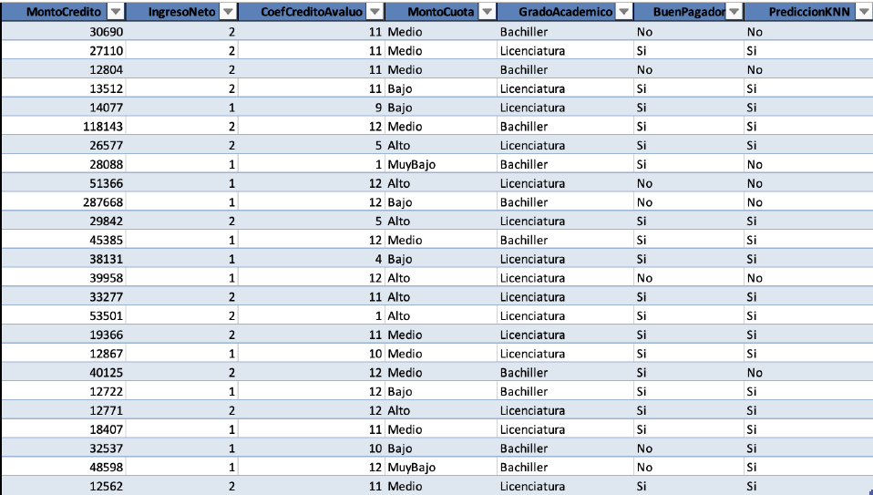

```{r setup, include=FALSE}
knitr::opts_chunk$set(echo = TRUE)
```

**1. Usando la columna BuenPagador en donde aparece el verdadero valor de la variable a predecir y la columna PrediccionKNN en donde aparece la predicción del Método KNN para esta tabla de Testing, calcule la Matriz de Confusión.**



Primeramente, se tienen los siguientes conteos:

	• Cantidad de verdaderos positivos (VP) : 16
	• Cantidad de verdaderos negativos (VN) : 5
	• Cantidad de falsos positivos (FP) : 2
	• Cantidad de falsos negativos (FN) : 2

De tal manera, la matriz de confusión es: 


**2. Con la Matriz de Confusión anterior calcule “a mano” la Precisión Global, el Error Global, la Precisión Positiva (PP), la Precisión Negativa (PN), la Proporción de Falsos Positivos (PFP), la Proporción de Falsos Negativos (PFN), la Asertividad Positiva (AP) y la Asertividad Negativa (AN).**

*Precisión Global:*

$P=\dfrac{VP+VN}{VN+FP+FN+VP}=\dfrac{16+5}{5+2+2+16}= \dfrac{21}{25}$   

*Error Global:*
 
$E= \dfrac{FP+FN}{VN+FP+FN+VP}=\dfrac{2+2}{5+2+2+16}= \dfrac{4}{25}$

*Precisión positiva:*

$PP=\dfrac{VP}{FN+VP}=\dfrac{16}{2+16}= \dfrac{8}{9}$

*Precisión negativa:*

$PN=\dfrac{VN}{FP+VN}=\dfrac{5}{2+5}= \dfrac{5}{7}$

*Falsos positivos:*

$PFP= \dfrac{FP}{FP+VN}=\dfrac{2}{2+5}= \dfrac{2}{7}$

*Falsos negativos:*

$PFN=\dfrac{FN}{FN+VP}=\dfrac{2}{2+16}= \dfrac{1}{9}$

*Asertividad Positiva:*

$AP=\dfrac{VP}{FP+VP}=\dfrac{16}{2+16}= \dfrac{8}{9}$

*Asertividad Negativa:*

$AN=\dfrac{VN}{FN+VN}=\dfrac{5}{2+5}= \dfrac{5}{7}$

