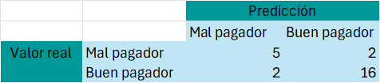
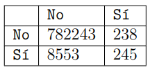

```{r setup, include=FALSE}
knitr::opts_chunk$set(echo = TRUE)
```

# Librerías

```{r, warning=FALSE, message=FALSE}
library(traineR)
library(caret)
library(dplyr)
library(GGally)
```

# Ejercicio 1

**1. Usando la columna BuenPagador en donde aparece el verdadero valor de la variable a predecir y la columna PrediccionKNN en donde aparece la predicción del Método KNN para esta tabla de Testing, calcule la Matriz de Confusión.**


Primeramente, se tienen los siguientes conteos:

	• Cantidad de verdaderos positivos (VP) : 16
	• Cantidad de verdaderos negativos (VN) : 5
	• Cantidad de falsos positivos (FP) : 2
	• Cantidad de falsos negativos (FN) : 2

De tal manera, la matriz de confusión es: 




**2. Con la Matriz de Confusión anterior calcule “a mano” la Precisión Global, el Error Global, la Precisión Positiva (PP), la Precisión Negativa (PN), la Proporción de Falsos Positivos (PFP), la Proporción de Falsos Negativos (PFN), la Asertividad Positiva (AP) y la Asertividad Negativa (AN).**

*Precisión Global:*

$P=\dfrac{VP+VN}{VN+FP+FN+VP}=\dfrac{16+5}{5+2+2+16}= \dfrac{21}{25}$   

*Error Global:*
 
$E= \dfrac{FP+FN}{VN+FP+FN+VP}=\dfrac{2+2}{5+2+2+16}= \dfrac{4}{25}$

*Precisión positiva:*

$PP=\dfrac{VP}{FN+VP}=\dfrac{16}{2+16}= \dfrac{8}{9}$

*Precisión negativa:*

$PN=\dfrac{VN}{FP+VN}=\dfrac{5}{2+5}= \dfrac{5}{7}$

*Falsos positivos:*

$PFP= \dfrac{FP}{FP+VN}=\dfrac{2}{2+5}= \dfrac{2}{7}$

*Falsos negativos:*

$PFN=\dfrac{FN}{FN+VP}=\dfrac{2}{2+16}= \dfrac{1}{9}$

*Asertividad Positiva:*

$AP=\dfrac{VP}{FP+VP}=\dfrac{16}{2+16}= \dfrac{8}{9}$

*Asertividad Negativa:*

$AN=\dfrac{VN}{FN+VN}=\dfrac{5}{2+5}= \dfrac{5}{7}$

# Ejercicio 2

**Programe en lenguaje R una clase que contenga un método que reciba como entrada la Matriz de Confusión (para el caso 2×2) que calcule y retorne en un diccionario: la Precisión Global, el Error Global, la Precisión Positiva (PP), la Precisión Negativa (PN), la Proporción de Falsos Positivos (PFP), la Proporción de Falsos Negativos (PFN), la Asertividad Positiva (AP) y la Asertividad Negativa (AN). Supongamos que tenemos un modelo predictivo para detectar Fraude en Tarjetas de Crédito, la variable a predecir es Fraude con dos posibles valores Sí (para el caso en que sí fue fraude) y No (para el caso en que no fue fraude). Supongamos que la matriz de confusión es:**



- **Con ayuda de la clase programada anteriormente calcule la Precisión Global, el Error Global, la Precisión Positiva (PP), la Precisión Negativa (PN), la Proporción de Falsos Positivos (PFP), la Proporción de Falsos Negativos (PFN), la Asertividad Positiva (AP) y la Asertividad Negativa (AN).**

```{r}
indices_matriz <- function(matriz_confusion){
  VN <- matriz_confusion[1,1]
  FP <- matriz_confusion[1,2]
  FN <- matriz_confusion[2,1]
  VP <- matriz_confusion[2,2]
  
  P <- (VN+VP)/sum(matriz_confusion)
  E <- (FP+FN)/sum(matriz_confusion)
  PP <- VP/(FN+VP)
  PN <- VN/(VN+FP)
  PFP <- FP/(VN+FP)
  PFN <- FN/(FN+VP)
  AP <- VP/(FP+VP)
  AN <- VN/(VN+FN)
  
  indices <- list(
    'Precision Global' = P,
    'Error Global' = E,
    'Precisión Positiva' = PP,
    'Precisión Negativa' = PN,
    'Proporción de Falsos Positivos' = PFP,
    'Proporción de Falsos Negativos' = PFN,
    'Asertividad Positiva' = AP,
    'Asertividad Negativa' = AN
  )
  
  return(indices)
}
```

```{r}
matriz_confusion <- matrix(c(782243, 238, 8553, 245), nrow = 2, ncol = 2, 
                           byrow = TRUE)
rownames(matriz_confusion) <- c("No", "Sí")
colnames(matriz_confusion) <- c("No", "Sí")

indices_matriz(matriz_confusion)
```

- **¿Es bueno o malo el modelo predictivo? Justifique su respuesta.**

Después de obtener los indicadores anteriores se puede ver que realmente no es un buen modelo predictivo debido a que la precisión positiva que es la proporción de casos positivos que fueron identificados correctamente es de un 2.78% lo cual es muy bajo y esta es la categoría que nos interesa predecir correctamente con el modelo. Además, la Proporción de falsos negativos que es la proporción de casos positivos que fueron clasificados incorrectamente es de un 97.22%, es decir, prácticamente todos los casos que sí eran fraudes el modelo los predijo como que no eran fraudes.Por último, la asertividad postiva que indica la proporción de buena predicción para los positivos es de un 50.72% que no es tan buena como la asertividad negativa. 

# Ejercicio 3

Primero sembramos una semilla para poder realizar el análisis sin estar cambiando los resultados. 

```{r}
set.seed(15)
```

**Esta pregunta utiliza los datos (tumores.csv). Se trata de un conjunto de datos de características del tumor cerebral que incluye cinco variables de primer orden y ocho de textura y cuatro parámetros de evaluación de la calidad con el nivel objetivo. Las variables son: Media, Varianza, Desviación estándar, Asimetría, Kurtosis, Contraste, Energía, ASM (segundo momento angular), Entropía, Homogeneidad, Disimilitud, Correlación, Grosor, PSNR (Pico de la relación señal-ruido), SSIM (Índice de Similitud Estructurada), MSE (Mean Square Error), DC (Coeficiente de Dados) y la variable a predecir tipo (1 = Tumor, 0 = No-Tumor). Realice lo siguiente:**

## 1. ¿Es un problema equilibrado? 

```{r}
# Cargamos la base de datos 
datos_tumores <- read.csv("tumores.csv", header = TRUE, sep = ",", dec = ".")
datos_tumores$tipo <- as.factor(datos_tumores$tipo)
```

```{r}
prediction.variable.balance(datos_tumores,"tipo")
```

Es un problema desbalanceado debido a que hay muchas más observaciones que poseen un tumor que las que no poseen un tumor. 

## 2. Use el método de K vecinos más cercanos en el paquete traineR para generar un modelo predictivo para la tabla tumores.csv usando el 75 % de los datos para la tabla aprendizaje y un 25 % para la tabla testing. No olvide recodificar, desde R, la variable a predecir como categórica.

Se generar al azar una tabla de testing de con el 25% de los datos y una tabla de aprendizaje del 75%.

```{r}
muestra <- createDataPartition(y = datos_tumores$tipo, p = 0.75, list = F)
tabla_testing <- datos_tumores[muestra,]
tabla_aprendizaje <- datos_tumores[-muestra,]
tabla_testing <- tabla_testing[,-1]
tabla_aprendizaje <- tabla_aprendizaje[,-1]
```

Se aplica el método de K vecinos más cercanos. 
```{r}
modelo <- train.knn(tipo~., data = tabla_aprendizaje, 
                    kmax = floor(sqrt(nrow(tabla_aprendizaje))))
modelo
```

Se realiza la predicción.
```{r}
prediccion   <- predict(modelo, tabla_testing, type = "class")
head(prediccion$prediction)
```

Se realiza la matriz de confusión.
```{r}
matriz_confusion <- confusion.matrix(tabla_testing, prediccion)
```

Se calculan los índices de calidad de la predicción.
```{r}
general.indexes(mc = matriz_confusion)
```

## 3. Genere un Modelo Predictivo usando K vecinos más cercanos para cada uno de los siguientes núcleos: rectangular, triangular, epanechnikov, biweight, triweight, cos, inv, gaussian y optimal ¿Cuál produce los mejores resultados en el sentido de que predice mejor los tumores, es decir, Tumor = 1?

### Rectangular
```{r}
modelo_rectangular <- train.knn(tipo~., data = tabla_aprendizaje, 
                    kmax = floor(sqrt(nrow(tabla_aprendizaje))), 
                    kernel = "rectangular")
prediccion_rectangular <- predict(modelo_rectangular, tabla_testing, 
                                    type = "class")
matriz_confusion_rectangular <- confusion.matrix(tabla_testing, 
                                                 prediccion_rectangular)

indices_rectangular <- general.indexes(mc = matriz_confusion_rectangular)

indices_rectangular
```

### Triangular
```{r}
modelo_triangular <- train.knn(tipo~., data = tabla_aprendizaje, 
                                kmax = floor(sqrt(nrow(tabla_aprendizaje))), 
                                kernel = "triangular")
prediccion_triangular <- predict(modelo_triangular, tabla_testing, 
                                    type = "class")
matriz_confusion_triangular <- confusion.matrix(tabla_testing, 
                                                 prediccion_triangular)

indices_triangular <- general.indexes(mc = matriz_confusion_triangular)

indices_triangular
```

### Epanechnikov
```{r}
modelo_epanechnikov <- train.knn(tipo~., data = tabla_aprendizaje, 
                               kmax = floor(sqrt(nrow(tabla_aprendizaje))), 
                               kernel = "epanechnikov")
prediccion_epanechnikov <- predict(modelo_epanechnikov, tabla_testing, 
                                   type = "class")
matriz_confusion_epanechnikov <- confusion.matrix(tabla_testing, 
                                                prediccion_epanechnikov)

indices_epanechnikov <- general.indexes(mc = matriz_confusion_epanechnikov)

indices_epanechnikov
```

### Biweight
```{r}
modelo_biweight <- train.knn(tipo~., data = tabla_aprendizaje, 
                                 kmax = floor(sqrt(nrow(tabla_aprendizaje))), 
                                 kernel = "biweight")
prediccion_biweight <- predict(modelo_biweight, tabla_testing, 
                                     type = "class")
matriz_confusion_biweight <- confusion.matrix(tabla_testing, 
                                                  prediccion_biweight)

indices_biweight <- general.indexes(mc = matriz_confusion_biweight)

indices_biweight
```

### Triweight
```{r}
modelo_triweight <- train.knn(tipo~., data = tabla_aprendizaje, 
                             kmax = floor(sqrt(nrow(tabla_aprendizaje))), 
                             kernel = "triweight")
prediccion_triweight <- predict(modelo_triweight, tabla_testing, 
                                 type = "class")
matriz_confusion_triweight <- confusion.matrix(tabla_testing, 
                                              prediccion_triweight)

indices_triweight <- general.indexes(mc = matriz_confusion_triweight)

indices_triweight
```

### Cos
```{r}
modelo_cos <- train.knn(tipo~., data = tabla_aprendizaje, 
                              kmax = floor(sqrt(nrow(tabla_aprendizaje))), 
                              kernel = "cos")
prediccion_cos <- predict(modelo_cos, tabla_testing, 
                                  type = "class")
matriz_confusion_cos <- confusion.matrix(tabla_testing, 
                                               prediccion_cos)

indices_cos <- general.indexes(mc = matriz_confusion_cos)

indices_cos
```

### Inv
```{r}
modelo_inv <- train.knn(tipo~., data = tabla_aprendizaje, 
                        kmax = floor(sqrt(nrow(tabla_aprendizaje))), 
                        kernel = "inv")
prediccion_inv <- predict(modelo_inv, tabla_testing, 
                            type = "class")
matriz_confusion_inv <- confusion.matrix(tabla_testing, 
                                         prediccion_inv)

indices_inv <- general.indexes(mc = matriz_confusion_inv)

indices_inv
```

### Gaussian
```{r}
modelo_gaussian <- train.knn(tipo~., data = tabla_aprendizaje, 
                        kmax = floor(sqrt(nrow(tabla_aprendizaje))), 
                        kernel = "gaussian")
prediccion_gaussian <- predict(modelo_gaussian, tabla_testing, 
                            type = "class")
matriz_confusion_gaussian <- confusion.matrix(tabla_testing, 
                                         prediccion_gaussian)

indices_gaussian <- general.indexes(mc = matriz_confusion_gaussian)

indices_gaussian
```

### Optimal
```{r}
modelo_optimal <- train.knn(tipo~., data = tabla_aprendizaje, 
                             kmax = floor(sqrt(nrow(tabla_aprendizaje))), 
                             kernel = "optimal")
prediccion_optimal <- predict(modelo_optimal, tabla_testing, 
                                 type = "class")
matriz_confusion_optimal <- confusion.matrix(tabla_testing, 
                                              prediccion_optimal)

indices_optimal <- general.indexes(mc = matriz_confusion_optimal)

indices_optimal
```

Se crea una lista con la exactitud del modelo según el kernel seleccionado para el caso de importancia, el cual es cuando el individuo sí posee un tumor.
```{r}
indices <- c(rectangular = indices_rectangular$category.accuracy[2],
                triangular = indices_triangular$category.accuracy[2],
                epanechnikov = indices_epanechnikov$category.accuracy[2],
                biweight = indices_biweight$category.accuracy[2],
                triweight = indices_triweight$category.accuracy[2],
                cos = indices_cos$category.accuracy[2],
                inv = indices_inv$category.accuracy[2],
                gaussian = indices_gaussian$category.accuracy[2],
                optimal = indices_optimal$category.accuracy[2])
indices
```
Se obtiene el máximo. 
```{r}
max(indices)
```

El kernel que produce los mejores resultados en el sentido de que predice mejor los tumores es el rectangular con un 99.43% de casos acertados, lo cual es bastante bueno debido a la importancia de la predicción en este tema específico. Note que, el kernel que trae la función por defecto es el optimal que tiene un poder predictivo de casos positivos menor. 

# Ejercicio 4

**1. Cargue la tabla de datos titanicV2024.csv, asegúrese de re-codificar las variables cualitativas y de ignorar variables que no se deben usar**

Se carga la base de datos.
```{r, message=FALSE}
titanic_datos <- read.csv("titanicV2024.csv", header = TRUE, sep = ",", dec = ".")
head(titanic_datos)
```

Se eliminan las variables Passengerid, Name, Ticket y Cabin, pues, son valores únicos implicando que 
la cantidad de categorías por variables sean demasiadas, lo cual, resta precisión. 

```{r}
titanic_datos <- titanic_datos[, -c(1,4,9,11)]
```

Se re-codifican las variables cualitativas para que sean de tipo factor.

```{r}
titanic_datos <- titanic_datos %>%
   mutate(Survived =  as.factor(Survived),
          Pclass =  as.factor(Pclass),
          Sex =  as.factor(Sex),
          Embarked =  as.factor(Embarked))
str(titanic_datos)  
```

Se identican la cantidad de NA's presentes en cada variable.

```{r}
na_variables <- colSums(is.na(titanic_datos))
print(na_variables)
```

De acuerdo con los mostrado, la variable Age cuenta con datos faltantes. Por tal motivo, se procede
a rellenarlos con el promedio de las edades según el sexo.

```{r}
# Se filtran las edades
mujeres_edades <- na.omit(titanic_datos$Age[titanic_datos$Sex == "female"])
hombres_edades <- na.omit(titanic_datos$Age[titanic_datos$Sex == "male"])

# Se calculan los promedios de las edades
edad_promedio_mujeres <- round(mean(mujeres_edades))
edad_promedio_hombres <- round(mean(hombres_edades))

# Se rellenan los datos faltantes
titanic_datos$Age[titanic_datos$Sex == "female" & is.na(titanic_datos$Age)] <- edad_promedio_mujeres
titanic_datos$Age[titanic_datos$Sex == "male" & is.na(titanic_datos$Age)] <- edad_promedio_hombres
```

También, la variable Embarked presenta dos variables faltantes. Se rellenan con la moda de las cateogrías. 

```{r}
# Se obtiene la moda para la variable Embarked
tabla_frec <- table(titanic_datos$Embarked)  # Se calcula la tabla de frecuencias
moda  <- names(tabla_frec)[which.max(tabla_frec)]  # Encontrar el valor con la frecuencia más alta

# Se rellena el dato faltante
titanic_datos$Embarked[is.na(titanic_datos$Embarked)] <- moda
```

Finalmente, el dato faltante en Fare se rellena con el promedio de las tarifas
según el tipo de clase en que viajaba.

```{r}
# Se identifica la clase en que viajaba
clase <- titanic_datos$Pclass[is.na(titanic_datos$Fare)]

# Se filtran las tarifas según el tipo de clase de viaje
tarifas <- na.omit(titanic_datos$Fare[titanic_datos$Pclass == clase])

# Se obtiene el promedio de las tarifas
tarifa_promedio <- mean(tarifas)

# Se rellena el dato faltante
titanic_datos$Fare[is.na(titanic_datos$Fare)] <- tarifa_promedio

```

**2. Realice un análisis exploratorio (estadísticas básicas) que incluya: el resumen numérico (media, desviación estándar, etc.), los valores atípicos, la correlación entre las variables, el poder predictivo de las variables predictoras. Interprete los resultados**

Seguidamente, se realiza un análisis exploratorio de los datos para conocer ciertas características y comportamientos de la información con la que contamos.

Primeramente, se presenta un resumen númerico de las variables de la base de datos que brinda información como la media, máximo, mínimo entre otros.

```{r}
summary(titanic_datos)
```

Segundo, se verifica si existen outliers entre las variables. Es decir, si se presentan valores atípicos que se alejan del resto de los datos. Para esto, es útil construir la caja de bigotes correspondiente a cada variable númerica ya que, nos permiten visualizar de manera sencilla si existen estos tipos de datos.

```{r, warning=FALSE}
titanic_datos_num <- titanic_datos[, c(4,5,6,7)]
stacked_titanic <- stack(titanic_datos_num)
boxplot(stacked_titanic$values ~ stacked_titanic$ind,
        col = rainbow(ncol(titanic_datos_num)), xlab = "Variables", ylab ="y")
```

Se puede observar que para la edad hay varios valores atípicos por encima del 
límite superior(aprox 55) y unos pocos por debajo del límite inferior (aprox 1).
Sin embargo, no se eliminan de la base de datos, pues, es sabido que las personas
que viajaron en el Titanic eran de diversas edades, no solo rondaban entre los 1
y 55 años.

Para el caso de la cantidad de hermanos o cónyugues a bordo, la media 
es de 0 aproximadamente y lo máximo de 8 que se aleja mucho de la media, por ese
motivo se identifican dos valores atípicos. No obstante, no se eliminan, pues, 
no se encuentran muy alejados del límite superior y algunas familias solían ser 
numerosas. Similarmente pasa con la cantidad de padres o hijos a bordo del 
Titanic. Por tanto, tampoco se eliminan los outliers de esta variable. 

En cuanto a las tarifas, se muestran varios valores atípicos por encima
del límite superior. Esto se debe a que la mayoría de los pasajeros viajaron 
en tercera clase y por ende sus tarifas eran más bajas, entonces los valores 
atípicos corresponden a las tarifas de personas que viajaron en una clase superior. 
Se procede a eliminar solo el valor atípico que se encuentra muy lejos en 
comparación con el resto de los datos, es decir, el máximo de 512.329 según lo 
mostrado en el resumen númerico. 

```{r}
titanic_datos <- titanic_datos[-(titanic_datos$Fare == max(titanic_datos$Fare)),]
```

Tercero, se realiza un gráfico de correlaciones para identificar si hay o no
correlaciones entre las variables númericas. 

```{r, message=FALSE}
ggpairs(titanic_datos_num,  upper = list(continuous = wrap("cor", size = 2.5)))
```

Del gráfico anterior se puede identificar que Age tiene una correlación negativa
con SibSp y Parch, es decir, que conforme una variable aumenta la otra disminuye. 
Y tiene una relación positiva con Fare, lo que significa que ambas se comportan 
de manera proporcional. 

Además, SibSp tiene una relación positiva con Parch y Fare. Entonces, si incrementa
la cantidad de hermanos o cónyuges también aumenta la cantidad de hijos o padres
y la tarifa. 

Por último, Parch tiene una correlación positiva con Fare, por ende, si aumenta
la cantidad de hijos o padres también sube la tarifa.

Finalmente, se analiza el poder predictor de las variables. Es decir, la capacidad
de las variables para predecir si el pasajero del Titanic sobrevivió o no.

Para ese objetivo, se presentan los siguientes gráficos:

```{r}
titanic_datos_num_pred <- titanic_datos[, c(1,4,5,6,7)]
titanic_datos_cat_pred <- titanic_datos[, c(1,2,3,8)]

colnames(titanic_datos_num_pred)[1] <- "Survived"
colnames(titanic_datos_cat_pred)[1] <- "Survived"

lista_num_poder_pred <- list()
for (i in 2:ncol(titanic_datos_num_pred)) {
  variable  <- names(titanic_datos_num_pred)[i]
  lista_num_poder_pred[[i-1]] <- numerical.predictive.power(titanic_datos_num_pred, "Survived", variable)
}

lista_cat_poder_pred <- list()
for (i in 2:ncol(titanic_datos_cat_pred)) {
  variable  <- names(titanic_datos_cat_pred)[i]
  lista_cat_poder_pred[[i-1]] <- categorical.predictive.power(titanic_datos_cat_pred, "Survived", variable)
}
```

```{r}
lista_num_poder_pred
```

En todos los gráficos se tiene una grande sobreposición de las densidades. Lo cual,
significa que el poder predictivo de las variables númericas es poco.Por esa razón,
no se considerarán esas variables en la predicción. 


```{r}
lista_cat_poder_pred
```

En cuanto a las variables categóricas, se puede determinar que todas tienen
poder de predicción, pues, la proporción de las barras son distintas en cada
categoría. Entonces, todas esas variables se tomarán en cuenta para la predicción. 


**3.¿Es este problema equilibrado o desequilibrado? Justifique su respuesta**

El siguiente gráfico permite identificar si el problema está o no equilibrado.

```{r}
prediction.variable.balance(titanic_datos, "Survived")
```

Es evidente que las barras son de distintos tamaños, la cantidad de sobrevivientes
es menor a la de no sobrevivientes. Entonces, se está ante un problema desequilibrado. 

**4. Use el método de K vecinos más cercanos en el paquete traineR, con los parámetros que logren el mejor resultado, para generar un modelo predictivo con la tabla titanicV2024.csv usando el 80% de los datos para la tabla aprendizaje y un 20% para la tabla testing, luego calcule para los datos de testing la matriz de confusión, la precisión global y la precisión para cada una de las dos categorías. ¿Son buenos los resultados? Explique.**

Primeramente, se crea una muestra para generar las particiones tabla 
aprendizaje-testing. Dado que el problema es desequilibrado, se genera la muestra 
de la siguiente manera:

```{r}
set.seed(2529) # se siembra una semilla para la reproducibilidad
muestra_titanic <- createDataPartition(y = titanic_datos$Survived, p = 0.80, list = F)
```

Con esa muestra se obtienen las particiones en tabla de aprendizaje y testing.

```{r}
taprendizaje_titanic <- titanic_datos[muestra_titanic, ]
ttesting_titanic     <- titanic_datos[-muestra_titanic, ]
```

Seguido, se realiza el modelo predictivo mediante el método de k vecinos más cercanos con las variables predictoras que tuvieron mejor poder de predicción indicadas en la parte 2.

```{r}
modelo_titanic <- train.knn(Survived ~ Pclass + Sex + Embarked, data = taprendizaje_titanic, kmax = floor(sqrt(nrow(taprendizaje_titanic))))
modelo_titanic
```

Luego, se obtienen las predicciones del modelo:

```{r}
prediccion_titanic <- predict(modelo_titanic, ttesting_titanic, type = "class")
prediccion_titanic$prediction
```

Se calcula la matriz de confusión que permite identificar la información
de las predicciones dada por el modelo y comparar con los datos reales. 

```{r}
matriz_confusion_titanic <- confusion.matrix(ttesting_titanic, prediccion_titanic)
general.indexes(mc = matriz_confusion_titanic)
```

Se puede observar que el modelo predice bien que 160 pasajeros del Titanic no 
sobrevivieron pero falla en la predicción de 29 casos. Además, predice 
correctamente que 69 pasajeros sobrevivieron al incidente pero falló en la predicción
de 2. En general, el número de aciertos del modelo para ambas categorías es mayor que la 
cantidad de fallos, lo cual, parece indicar que el modelo es bueno.

Sin embargo, se deben analizar otras medidas más precisas para determinar qué tan 
buenos son los resultados del modelo. La función muestra algunos índices de 
calidad,interpretando se tiene que la Precisión Global (Overaal Accuracy), es 
decir, el porcentaje de predicciones correctas con respecto al total de predicciones,
es de 0.8808 lo que es bastante bueno.

Además, la Precisión Positiva, que corresponde al porcentaje de sobrevivientes predichos correctamente, es de 0.704082 lo cual, también es bueno.

Finalmente, se tiene que la Precisión Negativa, que corresponde al porcentaje de no sobrevivientes predichos correctamente, es de 0.987654  siendo bastante alto y mejor que la predicción de sobrevivientes.

En general, los tres índices de calidad analizados indicaron una buena calidad
del modelo para predecir a los pasajeros que sobrevivieron o no. 


**5. Repita el item 4), pero esta vez, seleccione las 5 variables que, según su criterio, tienen mejor poder predictivo. ¿Mejoran los resultados?**

En el inciso anterior no se emplearon las variables númericas como predictoras por
su poco poder predictivo según lo descrito en la parte 2. 
De tal manera, se analizarán qué resultados se obtienen si junto con las variables
categóricas, que indicaron tener poder predictivo, se añaden dos de esas
variables númericas al modelo. Según los gráficos de la parte 2,  las variables 
Age y Fare presentan menos sobreposición de las densidades en comparación con 
SibSp y Parch, entonces tienen mejor poder predicitivo que esas  últimas dos. 
Por ese motivo, se efectuará de nuevo el modelo ahora con las siguientes 5
variables: Age, Fare, Pclass, Sex y Embarked. 

Para esto, se emplea la misma muestra, tabla de aprendizaje y testing de la parte 4.
Después, se realiza el modelo predictivo mediante el método de k vecinos más 
cercanos con las 5 variables predictoras mencionados anteriormente.

```{r}
modelo_titanic_2 <- train.knn(Survived ~ Age+ Fare + Pclass + Sex + Embarked, data = taprendizaje_titanic, kmax = floor(sqrt(nrow(taprendizaje_titanic))))
modelo_titanic_2
```

Seguido, se obtienen las predicciones del modelo:

```{r}
prediccion_titanic_2 <- predict(modelo_titanic_2, ttesting_titanic, type = "class")
prediccion_titanic_2$prediction
```

Se calcula la matriz de confusión que permite identificar la información
de las predicciones dada por el modelo y comparar con los datos reales. 

```{r}
matriz_confusion_titanic_2 <- confusion.matrix(ttesting_titanic, prediccion_titanic_2)
general.indexes(mc = matriz_confusion_titanic_2)
```

Se puede observar que el modelo predice bien que 146 pasajeros del Titanic no 
sobrevivieron pero falla en la predicción de 16 casos. Además, predice 
correctamente que 82 pasajeros sobrevivieron al incidente pero falló en la predicción
de 16. En general, el número de aciertos del modelo para ambas categorías es mayor que la 
cantidad de fallos, lo cual, parece indicar que el modelo es bueno.

Sin embargo, se deben analizar otras medidas más precisas para determinar qué tan
buenos son los resultados del modelo. La función muestra algunos índices de calidad,
interpretando se tiene que la Precisión Global (Overaal Accuracy) es de 0.8769 lo
que es bastante bueno pero es menor que la dada en el modelo anterior.

Además, la Precisión Positiva es de 0.836735 lo cual, también es bueno y es mejor
que la obtenida con el modelo anterior.

Finalmente, se tiene que la Precisión Negativa es de  0.901235 siendo más que pequeña que
la indicada en el otro modelo pero sigue siendo mayor que la predicción de
sobrevivientes

En general, los tres índices de calidad analizados indicaron una buena calidad
del modelo para predecir a los pasajeros que sobrevivieron o no. Sin embargo,
solo la Precisión Positiva es mejor que la del modelo anterior. Se puede 
concluir que los mejores resultados se obtienen con el primer modelo.

**6.Usando la función programada en el ejercicio 2, los datos titanicV2024.csv y los modelos generados arriba construya un DataFrame de manera que en cada una de las filas aparezca un modelo predictivo y en las columnas aparezcan los índices Precisión Global, Error Global Precisión Positiva (PP), Precisión Negativa (PN), Falsos Positivos (FP), los Falsos Negativos (FN), la Asertividad Positiva (AP) y la Asertividad Negativa (AN). ¿Cuál de los modelos es mejor para estos datos?**

El dataframe con la información de los índices de calidad de cada modelo es el 
siguiente:

```{r}
# Se obtienen los índices de calidad de cada modeo
ind_modelo1 <- indices_matriz(matriz_confusion_titanic)
ind_modelo2 <- indices_matriz(matriz_confusion_titanic_2)

# Se convierte en dataframes
ind_modelo1 <- as.data.frame(ind_modelo1)
ind_modelo2 <- as.data.frame(ind_modelo2)

# Se unen los dos dataframes
indices_modelos <- rbind(ind_modelo1, ind_modelo2)

# Se crea un vector con el nombre de los modelos
nombre_modelo <- c("Modelo 1", "Modelo 2")

# Se une con los dataframes para crear un solo dataframe
indices_modelos <- cbind(nombre_modelo, indices_modelos)
names(indices_modelos) <- c("Modelo", "Precisión Global", "Erro Global",
                            "Precisión Positiva", "Precisión Negativa",
                            "Proporción de Falsos Positivos", 
                            "Proporción de Falsos Negativos",
                             "Asertividad Positiva","Asertividad Negativa")
indices_modelos
```

A partir del dataframe se puede observar que el Modelo 1 da mejores resultados 
para la Precisión Global y Error Global, pues, el índice  de este es más pequeño.
También, da mejor Precisión Negativa y Asertividad Positiva. El índice de Falsos
Positivos es mejor, ya que, presenta un valor menor.

En cambio, el Modelo 2 es mejor con el índice de Precisión Positiva y Proporción
de Falsos negativos porque el valor de este es menor que la del Modelo 1. 
Además, brinda mejor resultado para la Asertividad Negativa. 

Si se considera la cantidad de mejores índices obtenidos de la comparación de 
los modelos, el Modelo 1 es el que brinda mejores resultados. 
No obstante, depende del tipo de análisis que se pretenda realiza para determinar
cuál modelo es más apto.
