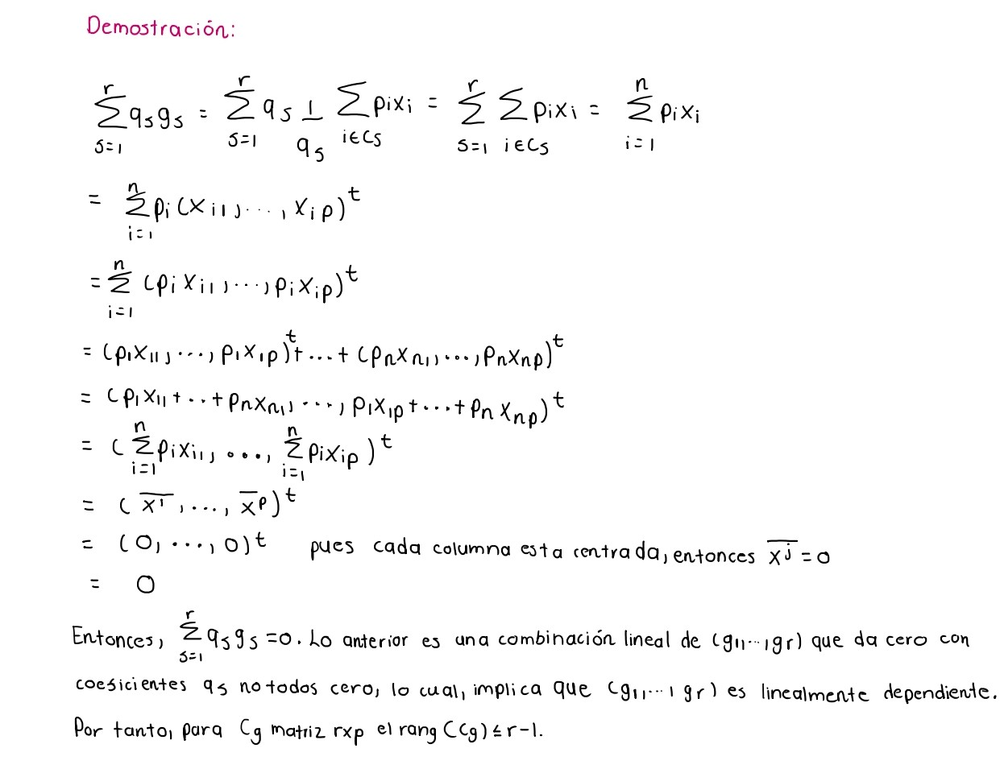

```{r setup, include=FALSE}
knitr::opts_chunk$set(echo = TRUE)
```

# Liberías

```{r, warning=FALSE}
library(readr)
library(kableExtra)
library(dplyr)
```


# Pregunta 1

**Complete las demostraciones de los Teoremas 2 y 4 de la presentación de la clase.**

## Teorema 2


## Teorema 4


# Pregunta 4


**Con las definiciones anteriores pruebe lo siguiente: Si V;VB;VW son las matrices de covarianza total, inter-clase intra-clase, respectivamente, entonces:**

**1. V = VB + VW**


**2. $\sum_{s=1}^rq_sg_s = 0$. Es decir, $rang(C_g) \leq r-1$**


**3. $rang(C_g) = rang(V_B)$**


**Además, para la tabla de datos Ejemplo AD.csv calcule: gA, gB, gC, V, VB, VW y verifique que V = VB + VW**

Primeramente, se carga la base de datos
```{r}
Ejemplo_AD <-read.csv("Ejemplo_AD.csv",sep = ";",dec='.',header=T,row.names = 1,stringsAsFactors = T)

```

Las columnas de variables númericas deben estar centradas, por lo que, la media de cada una debe ser cero. Verifiquemos si lo están:

```{r}
colMeans(Ejemplo_AD[,-6])
```
Se puede observar que las medias de cada columna númerica son diferente de cero, por lo que,
debemos centrarlos de la siguiente manera:
```{r}
for(i in 1: (ncol(Ejemplo_AD)-1)) {
  Ejemplo_AD[,i] <- Ejemplo_AD[,i]-mean(Ejemplo_AD[,i])
}

head(Ejemplo_AD)
```

Se obtienen los dos juegos de datos con las que se trabajan, la primera con variables
númericas y la segunda con el código disyuntivo completo de las modalidades de la variable categórica.

```{r}
X <- data.matrix(Ejemplo_AD)

# Datos con las variables númericas
X1<- X[,-6]
head(X1)

``` 
El segundo juego de datos es:
```{r}
# Datos con las variables categóricas
VC.A <- as.numeric(Ejemplo_AD$VC == "A")
VC.B <- as.numeric(Ejemplo_AD$VC == "B")
VC.C <- as.numeric(Ejemplo_AD$VC == "C")

X2 <- cbind(VC.A,VC.B,VC.C)
head(X2)
```
Luego, se calcula matriz $D_g$ diagonal del número de individuos en cada modalidad.
```{r}
D_G <- table(Ejemplo_AD$VC,Ejemplo_AD$VC)
D_G
```
Ahora, se obtienen los centros de gravedad de A, B y C.

$g_A$

```{r}
# Matriz cuyas filas son los centros de gravedad
G <- solve(D_G) %*% t(X2) %*% X1

gA <- G[1,]
gA
```

$g_B$
```{r}
gB <- G[2,]
gB

```
$g_C$
```{r}
gC <- G[3,]
gC
```
Seguido, se procede a calcular la matriz de covarianzas total $V$.

```{r}
# Matriz de pesos del conjuntos de individuos de la matriz X1
peso <-1/nrow(X1)
pesos_ind <- diag(peso, nrow(X1))

V <- t(X1)%*%pesos_ind %*%X1
kable_styling(kable(V))

```

La matriz de covarianzas inter-clase $V_B$ es:
```{r}
# Matriz diagonal de pesos de las 3 clases
pesos_clases <- D_G*peso

VB <- t(G)%*%pesos_clases%*%G
kable_styling(kable(VB))
```

La matriz de covarianzas intra-clase $V_W$ es:
```{r}
clases <- unique(Ejemplo_AD$VC)

# Se calcula la matriz VW
VW <- matrix(0, nrow = 5, ncol = 5)

for(i in (1:length(clases))) {
  clase <- Ejemplo_AD[Ejemplo_AD$VC == clases[i], -6]
  n <- nrow(clase)

  # Calcular la suma para la clase actual
  suma <- matrix(0, nrow = 5, ncol = 5)
  for(j in 1: n){
    xi_minus_g <- as.numeric(clase[j,] - G[i,])
    suma <- suma + xi_minus_g%*%t(xi_minus_g)
  }
  VW <- VW + suma
}
VW <- peso*VW
kable_styling(kable(VW))
```

Verificamos que se cumple $V = V_B+V_W$.
```{r}
kable_styling(kable(VB+VW))
```
Se puede notar que la suma de esas matrices es igual a $V$.
