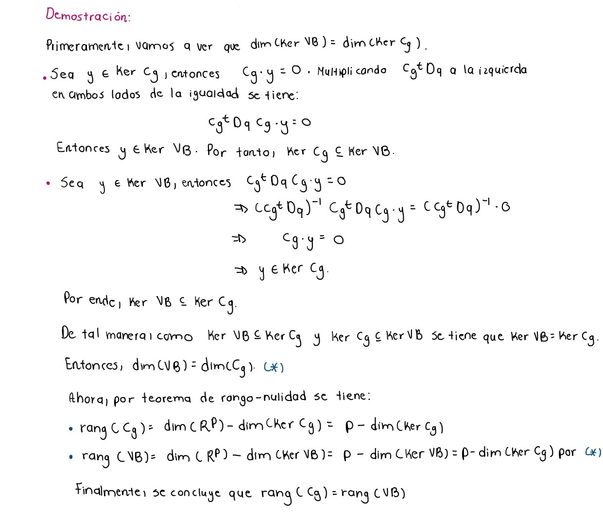

```{r setup, include=FALSE}
knitr::opts_chunk$set(echo = TRUE)
```

# Liberías

```{r, warning=FALSE, message=FALSE}
library(readr)
library(kableExtra)
library(dplyr)
library(caret)
library(traineR)
```


# Pregunta 1

**Complete las demostraciones de los Teoremas 2 y 4 de la presentación de la clase.**

## Teorema 2


## Teorema 4


# Pregunta 2
**Diseñe un algoritmo en pseudocódigo para el Método del Análisis Discriminante Lineal según la teoría vista en clase.**

```
Entrada:
- X: Matriz de datos de tamaño n por m

Salida:
- resultado: Vector que cuenta con:
-- G: matriz de centros de gravedad de cada clase
-- u: Los factores discriminates
-- lambda : valores propios

Paso Inicial: Separar los datos en dos bases
- X1 = datos con m_1 variables númericas
- X2 = código disyuntivo completo de las modalidades de la variable catégorica

Funcion ADL(X):

Paso 1: Calcular la matriz diagonal de cantidad de individuos en cada 
- clase D_G <- diag(n_g)

Paso 2: Calcular la matriz de centros de gravedades
- G = (D_G)^-1*(X2)^t*X1

Paso 3: Calcular la matriz de la cual se obtienen los factores discriminantes
y valores propios asociados
- FD_matriz <- (X1^t*X1)^-1*G^t*D_G*G

Paso 4: Obtener los vectores y valores propios de FD_matriz
- u <- eigen(FD_matriz)$vectors
- lambda <- eigen(FD_matriz)$values

Paso 5: Devolver matriz de centros de gravedad de cada clase,los factores discriminates
y valores propios
- devolver lista(G, u, lambda)

Fin Funció
```


# Ejercicio 3
**Programa en R el algoritmo disenando en el ejercicio anterior**

## Carga de datos

Inicialmente se procede cargando los datos que se utilizarán en el *Análisis Discriminante Lineal*.
```{r}
Ejemplo_AD <- read.csv("Ejemplo_AD.csv", sep = ";", dec='.', header=T, 
                       row.names = 1, stringsAsFactors = T)

Tumores <- read.csv("tumores.csv", sep = ",", dec='.', header=T, 
                       row.names = 1, stringsAsFactors = T)
```

## Partición de los datos

A continuación se procede con la partición de los datos en 2 sets, uno de entrenamiento con el 70% de los datos, y otro con un 30% para las pruebas.
```{r}
# Se fija la semilla para reproducibilidad.
set.seed(2901)

# Se obtiene los indices para el primer set de train.
indices <- createDataPartition(Ejemplo_AD[,6], p = .70,list = F)

# Se obtiene la muestra para aprendizaje y prueba.
Ejemplo_AD_train <- Ejemplo_AD[indices,]
Ejemplo_AD_test <- Ejemplo_AD[-indices,]
```

Ahora se repite el proceso para el segundo set de datos.
```{r}
# Se fija la semilla para reproducibilidad.
set.seed(2901)

# Se obtiene los indices para el primer set de train.
indices <- createDataPartition(Tumores[,17], p = .70,list = F)

# Se obtiene la muestra para aprendizaje y prueba.
Tumores_train <- Tumores[indices,]
Tumores_test <- Tumores[-indices,]
```


## Creación del algoritmo con base en el *pseudo codigo*.

Ahora se procede con la creación de una función llamada `ADL` la cual recibe un dataframe (`datos`) con la información de entrenamiento.
```{r}
ADL <- function(datos){
  # Se convierte la información recibida en un matriz para mejorar la forma en 
  # que se trabaja con los datos.
  X <- data.matrix(datos)
  
  # Se obtiene el indice la la variable categórica que está al final.
  indice <- ncol(datos)
  
  # Se divide la información.
  X1 <- X[,-indice]
  
  # Se obtiene las modalidades de la variable categórica.
  modalidades <- as.vector(unique(datos[,indice]))
  
  # Se obtiene el numero de modalidades que será útil.
  n_mod <- length(modalidades)
  
  # Se inicializa la matriz que contendrá los códigos disyuntivos.
  X2 <- matrix(, nrow = nrow(X), ncol = 0)
  
  # Se recorre cada modalidad y se crean los códigos disyuntivos respectivos.
  for(i in 1:n_mod){
    X2 <- cbind(X2, as.numeric(datos[indice] == modalidades[i]))
  }

  # Se crea la matriz diagonal D_g.
  D_g <- table(datos[,indice], datos[,indice])
  
  # Se obtiene la matriz inversa.
  Inv_D_g <- solve(D_g)
  
  # Se obtiene la matriz G con los centros de gravedad.
  G <- Inv_D_g %*% t(X2) %*% X1
  
  # Se crea la matriz de la cual se obtendrán los factores discriminantes.
  FD_matriz <- solve(t(X1) %*% X1) %*% t(G) %*% D_g %*% G
  
  
  # Se obtiene los valores y vectores propios de la matriz anterior.
  eigen <- eigen(FD_matriz)
  
  # Se crea una lista que contendrá toda la información del modelo para la 
  # clásificación de nuevos individuos.
  resultado <- list(Re(eigen[[1]][1:(n_mod-1)]), Re(eigen[[2]][,1:(n_mod-1)]),G)
  names(resultado) <- c("Valores propios", "Factores dicriminantes", 
                        "Matriz de CGs")
  
  return(resultado)
}
```

## Pruebas con la base *Ejemplo_AD*

```{r}
resultado <- ADL(Ejemplo_AD_train)
resultado
```
Ahora se procede a obtener las coordenadas y a graficar.
```{r}
z1 <- data.matrix(Ejemplo_AD_train[,-6]) %*% resultado[[2]][,1]
z2 <- data.matrix(Ejemplo_AD_train[,-6]) %*% resultado[[2]][,2]
coordenadas <- data.frame(z1, z2)
head(coordenadas)

plot(coordenadas, col = as.numeric(Ejemplo_AD_train[,6]))
```

```{r}
# Se genera el modelo.
modelo <- train.lda(VC~., data = Ejemplo_AD_train)
modelo

plot(modelo, col = as.numeric(Ejemplo_AD_train[,6]))
```


## Pruebas con la base *Tumores*

```{r}
resultado <- ADL(Tumores_train)
resultado
```


Ahora se procede a obtener las coordenadas y a graficar.
```{r}
z1 <- data.matrix(Tumores_train[,-17]) %*% resultado[[2]]
coordenadas <- data.frame(z1)
head(coordenadas)
```


```{r}
modelo <- train.lda(tipo~., data = Tumores_train)
modelo
```

## Conclusiones

Finalmente pese a que se fijo la semilla y se corrieron las mismas bases de datos, se puede notar que los resultados obtenidos variaron en gran medida, aunque en el gráfico del ejemplo con la base de datos *Ejemplo_AD* se nota que el procedimiento fue exitoso al separar a los individuos de test. Se puede teorizar que la diferencia en los resultados radica en el tratamiento de los datos que se da en la librería, pero según lo visto en la tería suministrada por el profesor, la metodología empleada en el algoritmo manual es también correcta.

# Pregunta 4


**Con las definiciones anteriores pruebe lo siguiente: Si V;VB;VW son las matrices de covarianza total, inter-clase intra-clase, respectivamente, entonces:**

**1. V = VB + VW**


**2. $\sum_{s=1}^rq_sg_s = 0$. Es decir, $rang(C_g) \leq r-1$**


**3. $rang(C_g) = rang(V_B)$**


**Además, para la tabla de datos Ejemplo AD.csv calcule: gA, gB, gC, V, VB, VW y verifique que V = VB + VW**

Primeramente, se carga la base de datos
```{r}
Ejemplo_AD <-read.csv("Ejemplo_AD.csv",sep = ";",dec='.',header=T,row.names = 1,stringsAsFactors = T)

```

Las columnas de variables númericas deben estar centradas, por lo que, la media de cada una debe ser cero. Verifiquemos si lo están:

```{r}
colMeans(Ejemplo_AD[,-6])
```
Se puede observar que las medias de cada columna númerica son diferente de cero, por lo que,
debemos centrarlos de la siguiente manera:
```{r}
for(i in 1: (ncol(Ejemplo_AD)-1)) {
  Ejemplo_AD[,i] <- Ejemplo_AD[,i]-mean(Ejemplo_AD[,i])
}

head(Ejemplo_AD)
```

Se obtienen los dos juegos de datos con las que se trabajan, la primera con variables
númericas y la segunda con el código disyuntivo completo de las modalidades de la variable categórica.

```{r}
X <- data.matrix(Ejemplo_AD)

# Datos con las variables númericas
X1<- X[,-6]
head(X1)

``` 
El segundo juego de datos es:
```{r}
# Datos con las variables categóricas
VC.A <- as.numeric(Ejemplo_AD$VC == "A")
VC.B <- as.numeric(Ejemplo_AD$VC == "B")
VC.C <- as.numeric(Ejemplo_AD$VC == "C")

X2 <- cbind(VC.A,VC.B,VC.C)
head(X2)
```
Luego, se calcula matriz $D_g$ diagonal del número de individuos en cada modalidad.
```{r}
D_G <- table(Ejemplo_AD$VC,Ejemplo_AD$VC)
D_G
```
Ahora, se obtienen los centros de gravedad de A, B y C.

$g_A$

```{r}
# Matriz cuyas filas son los centros de gravedad
G <- solve(D_G) %*% t(X2) %*% X1

gA <- G[1,]
gA
```

$g_B$
```{r}
gB <- G[2,]
gB

```
$g_C$
```{r}
gC <- G[3,]
gC
```
Seguido, se procede a calcular la matriz de covarianzas total $V$.

```{r}
# Matriz de pesos del conjuntos de individuos de la matriz X1
peso <-1/nrow(X1)
pesos_ind <- diag(peso, nrow(X1))

V <- t(X1)%*%pesos_ind %*%X1
kable_styling(kable(V))

```

La matriz de covarianzas inter-clase $V_B$ es:
```{r}
# Matriz diagonal de pesos de las 3 clases
pesos_clases <- D_G*peso

VB <- t(G)%*%pesos_clases%*%G
kable_styling(kable(VB))
```

La matriz de covarianzas intra-clase $V_W$ es:
```{r}
clases <- unique(Ejemplo_AD$VC)

# Se calcula la matriz VW
VW <- matrix(0, nrow = 5, ncol = 5)

for(i in (1:length(clases))) {
  clase <- Ejemplo_AD[Ejemplo_AD$VC == clases[i], -6]
  n <- nrow(clase)

  # Calcular la suma para la clase actual
  suma <- matrix(0, nrow = 5, ncol = 5)
  for(j in 1: n){
    xi_minus_g <- as.numeric(clase[j,] - G[i,])
    suma <- suma + xi_minus_g%*%t(xi_minus_g)
  }
  VW <- VW + suma
}
VW <- peso*VW
kable_styling(kable(VW))
```

Verificamos que se cumple $V = V_B+V_W$.
```{r}
kable_styling(kable(VB+VW))
```
Se puede notar que la suma de esas matrices es igual a $V$.
