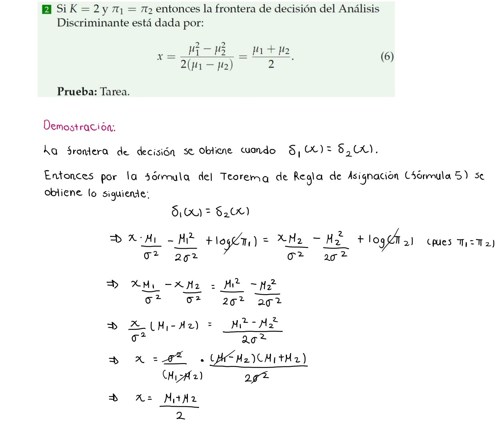
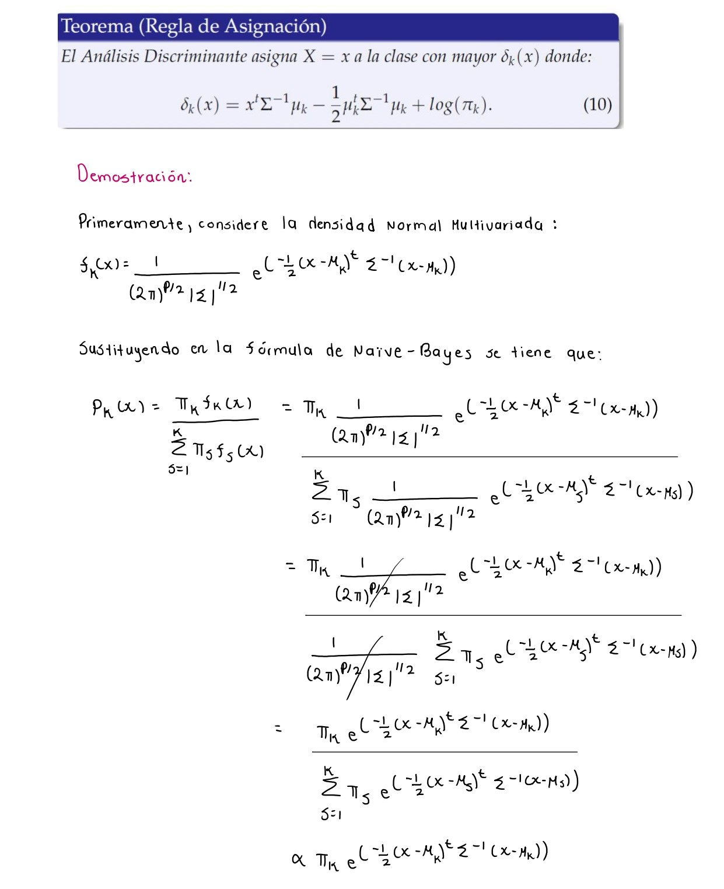
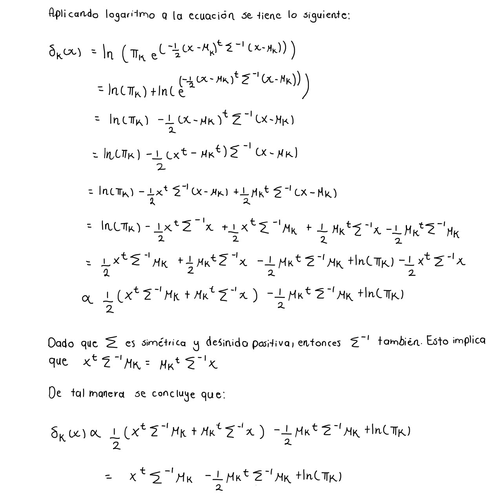

```{r setup, include=FALSE}
knitr::opts_chunk$set(echo = TRUE)
```

# Librerías

```{r, warning=FALSE, message=FALSE}
library(dplyr)
library(traineR)
library(MASS)
library(caret)
library(kableExtra)
```
# Pregunta 1


# Pregunta 2


# Pregunta 3

En esta pregunta utiliza los datos (tumores.csv). Se trata de un conjunto de datos de características del tumor cerebral que incluye cinco variables de primer orden y ocho de textura y cuatro parámetros de evaluación de la calidad con el nivel objetivo. La variables son: Media, Varianza, Desviación estándar, Asimetría, Kurtosis, Contraste, Energía, ASM (segundo momento angular), Entropía, Homogeneidad, Disimilitud, Correlación, Grosor, PSNR (Pico de la relaci´on señal-ruido), SSIM (Índice de Similitud Estructurada), MSE (Mean Square Error), DC (Coeficiente de Dados) y la variable a predecir tipo (1 = Tumor, 0 = No-Tumor). Realice lo siguiente:

## 1. Cargue la tabla de datos tumores.csv en R y genere en R usando la función createDataPartition(...) del paquete caret la tabla de testing con una 25 % de los datos y con el resto de los datos genere una tabla de aprendizaje.

```{r}
set.seed(12)
```

```{r}
datos_tumores <- read.csv("tumores.csv", header = TRUE, sep = ",", dec = ".")
datos_tumores$tipo <- as.factor(datos_tumores$tipo)

muestra <- createDataPartition(y = datos_tumores$tipo, p = 0.75, list = F)
tabla_testing <- datos_tumores[-muestra,]
tabla_aprendizaje <- datos_tumores[muestra,]
tabla_testing <- tabla_testing[,-1]
tabla_aprendizaje <- tabla_aprendizaje[,-1]
```

## 2. Usando Naive Bayes, LDA y QDA genere modelos predictivos para la tabla de aprendizaje, puede ser que LDA y QDA generen errores.

### Naive Bayes 
```{r}
modelo_bayes <- train.bayes(tipo~., data = tabla_aprendizaje)
prediccion_bayes <- predict(modelo_bayes, tabla_testing, type = "class")
```

### LDA
```{r}
modelo_LDA <- train.lda(tipo~., data=tabla_aprendizaje)
prediccion_LDA <- predict(modelo_LDA, tabla_testing)
```

### QDA

Como QDA genera errores se va a incluir un ruido en los valores de la tabla de aprendizaje.

```{r}
valores <- matrix(runif(n = nrow(tabla_aprendizaje[,-17]) * ncol(tabla_aprendizaje[,-17]), 
                        min = 0, max = 0.01), 
                  nrow = nrow(tabla_aprendizaje[,-17]), ncol = ncol(tabla_aprendizaje[,-17]))
tabla_aprendizaje_valores <- tabla_aprendizaje[,-17] + valores
tabla_aprendizaje_valores <- cbind(tabla_aprendizaje_valores, tipo = tabla_aprendizaje[,17])
```

Se genera el modelo con la nueva tabla de aprendizaje.

```{r}
modelo_QDA <- train.qda(tipo~., data=tabla_aprendizaje_valores)
prediccion_QDA <- predict(modelo_QDA, tabla_testing)
```

## 3. Para la tabla de testing calcule la matriz de confusión, la precisión global, el error global y la precisión en cada de las clases. Construya una tabla para los índices anteriores que permita comparar los resultados de Naive Bayes, LDA y QDA con respecto a los métodos generados en las tareas anteriores. ¿Cuál método es mejor?

### Naive Bayes
```{r}
matriz_confusion_bayes <- confusion.matrix(tabla_testing, prediccion_bayes)
general.indexes(mc = matriz_confusion_bayes)
```

### LDA 
```{r}
matriz_confusion_LDA <- confusion.matrix(tabla_testing, prediccion_LDA)
general.indexes(mc = matriz_confusion_LDA)
```

### QDA 
```{r}
matriz_confusion_QDA <- confusion.matrix(tabla_testing, prediccion_QDA)
general.indexes(mc = matriz_confusion_QDA)
```

### KNN
De los métodos de las tareas anteriores se tiene el metodo de K vecinos más cercanos (KNN).
```{r}
modelo_KNN <- train.knn(tipo~., data = tabla_aprendizaje, 
                        kmax = floor(sqrt(nrow(tabla_aprendizaje))))
prediccion_KNN <- predict(modelo_KNN, tabla_testing, type = "class")
matriz_confusion_KNN <- confusion.matrix(tabla_testing, prediccion_KNN)
general.indexes(mc = matriz_confusion_KNN)
```

### Tabla de índices 
<style>
table th {
  background-color: #d8bfd8; /* Color lila */
  color: white; /* Texto blanco para mejor contraste */
}
</style>

| Método       | P. Global | Error global | P. Tipo 0 |P. Tipo 1 |
|--------------|--------|--------|--------|--------------|
| Naive Bayes  | 0.8931 | 0.1069 | 0.5833 | 0.9184       |
| LDA          | 0.9465 | 0.0535 | 0.8750 | 0.9524       |
| QDA          | 0.9528 | 0.0472 | 0.5833 | 0.9830       |
| KNN          | 0.9686 | 0.0314 | 0.6667 | 0.9932       |

El mejor método depende de los resultados que se están deseando, sin embargo, al guiarse con estos índices se puede ver que el que tiene mayor precisión global, mayor precisión para detectar los casos en los que la persona sí tiene tumor y a su vez un menor error global es el método de K vecinos más cercanos. 

# Ejercicio 4




# Ejercicio 5

**1. Cargue la tabla de datos titanicV2024.csv, asegúrese de re-codificar las variables cualitativas y de ignorar variables que no se deben usar**

Se carga la base de datos.
```{r, message=FALSE}
titanic_datos <- read.csv("titanicV2024.csv", header = TRUE, sep = ",", dec = ".")
kable_styling(kable(head(titanic_datos)))
```

Se eliminan las variables Passengerid, Name, Ticket y Cabin, pues, son valores únicos implicando que 
la cantidad de cantegorías por variables sean demasiadas, lo cual, resta precisión. 

```{r}
titanic_datos <- titanic_datos[, -c(1,4,9,11)]
```


Se re-codifican las variables cualitativas para que sean de tipo factor.
```{r}
titanic_datos <- titanic_datos %>%
   mutate(Survived =  as.factor(Survived),
          Pclass =  as.factor(Pclass),
          Sex =  as.factor(Sex),
          Embarked =  as.factor(Embarked))
str(titanic_datos)  
```
Se identican la cantidad de NA's presentes en cada variable.
```{r}
na_variables <- colSums(is.na(titanic_datos))
print(na_variables)
```
De acuerdo con los mostrado, la variable Age cuenta con datos faltantes. Por tal motivo, se procede
a rellenarlos con el promedio de las edades según el sexo.

```{r}
# Se filtran las edades
mujeres_edades <- na.omit(titanic_datos$Age[titanic_datos$Sex == "female"])
hombres_edades <- na.omit(titanic_datos$Age[titanic_datos$Sex == "male"])

# Se calculan los promedios de las edades
edad_promedio_mujeres <- round(mean(mujeres_edades))
edad_promedio_hombres <- round(mean(hombres_edades))

# Se rellenan los datos faltantes
titanic_datos$Age[titanic_datos$Sex == "female" & is.na(titanic_datos$Age)] <- edad_promedio_mujeres
titanic_datos$Age[titanic_datos$Sex == "male" & is.na(titanic_datos$Age)] <- edad_promedio_hombres
```

También, la variable Embarked presenta dos variables faltantes. Se rellenan con la moda de las cateogrías. 

```{r}
# Se obtiene la moda para la variable Embarked
tabla_frec <- table(titanic_datos$Embarked)  # Se calcula la tabla de frecuencias
moda  <- names(tabla_frec)[which.max(tabla_frec)]  # Encontrar el valor con la frecuencia más alta

# Se rellena el dato faltante
titanic_datos$Embarked[is.na(titanic_datos$Embarked)] <- moda
```

Finalmente, el dato faltante en Fare se rellena con el promedio de las tarifas
según el tipo de clase en que viajaba.
```{r}
# Se identifica la clase en que viajaba
clase <- titanic_datos$Pclass[is.na(titanic_datos$Fare)]

# Se filtran las tarifas según el tipo de clase de viaje
tarifas <- na.omit(titanic_datos$Fare[titanic_datos$Pclass == clase])

# Se obtiene el promedio de las tarifas
tarifa_promedio <- mean(tarifas)

# Se rellena el dato faltante
titanic_datos$Fare[is.na(titanic_datos$Fare)] <- tarifa_promedio

```

**2. Usando el comando sample de R genere al azar una tabla aprendizaje con un 80% de los datos y con el resto de los datos genere una tabla de aprendizaje.**

Primeramente, se crea una muestra para generar las particiones tabla 
aprendizaje-testing, con un 80% y 20% de los datos respectivamente. 

```{r}
set.seed(2529) # se siembra una semilla para la reproducibilidad

n <- nrow(titanic_datos)
muestra_titanic <- sample(1:n, floor(n*0.20))
```

Con esa muestra se obtienen las particiones en tabla de aprendizaje y testing.

```{r}
taprendizaje_titanic <- titanic_datos[muestra_titanic, ]
ttesting_titanic     <- titanic_datos[-muestra_titanic, ]

kable_styling(kable(head(taprendizaje_titanic)))
kable_styling(kable(head(ttesting_titanic)))

```

**3. Genere un Modelo Predictivo usando Naïve Bayes, con el paquete traineR, luego para este modelo calcule la matriz de confusión, la precisión, la precisión positiva, la precisión negativa, los falsos positivos, los falsos negativos, la acertividad positiva y la acertividad negativa.**

Se realiza el modelo predictivo mediante el Naïve Bayes:
```{r}
modelo_titanic_bayes <- train.bayes(Survived~., data = taprendizaje_titanic)
modelo_titanic_bayes
```

Luego, se obtienen las predicciones del modelo:
```{r}
prediccion_titanic <- predict(modelo_titanic_bayes, ttesting_titanic, type = "class")
prediccion_titanic$prediction
```
Se calcula la matriz de confusión que permite identificar la información
de las predicciones dada por el modelo y comparar con los datos reales. 

```{r}
matriz_confusion_titanic <- confusion.matrix(ttesting_titanic, prediccion_titanic)
matriz_confusion_titanic
```
Para obtener los índices de calidad del modelo, se crea una función que devuelve una lista con los resultados.

```{r}
indices_matriz <- function(matriz_confusion){
  VN <- matriz_confusion[1,1]
  FP <- matriz_confusion[1,2]
  FN <- matriz_confusion[2,1]
  VP <- matriz_confusion[2,2]
  
  P <- (VN+VP)/sum(matriz_confusion)
  E <- (FP+FN)/sum(matriz_confusion)
  PP <- VP/(FN+VP)
  PN <- VN/(VN+FP)
  PFP <- FP/(VN+FP)
  PFN <- FN/(FN+VP)
  AP <- VP/(FP+VP)
  AN <- VN/(VN+FN)
  
  indices <- list(
    'Precision Global' = P,
    'Error Global' = E,
    'Precisión Positiva' = PP,
    'Precisión Negativa' = PN,
    'Proporción de Falsos Positivos' = PFP,
    'Proporción de Falsos Negativos' = PFN,
    'Asertividad Positiva' = AP,
    'Asertividad Negativa' = AN
  )
  
  return(indices)
}
```

```{r}
ind_modelo_bayes <- indices_matriz(matriz_confusion_titanic)
ind_modelo_bayes
```
**4. Genere Modelos Predictivos usando LDA y QDA, con el paquete MASS, luego para este modelo calcule la matriz de confusión, la precisión, la precisión positiva, la precisión negativa, los falsos positivos, los falsos negativos, la acertividad positiva y la acertividad negativa, puede ser que QDA falle.**

**LDA**

Se crea el modelo LDA usando la tabla de aprendizaje y testing que se crearon anteriormente.
```{r}
modelo_titanic_LDA <- lda(Survived~., data=taprendizaje_titanic)
modelo_titanic_LDA
```

Luego, se obtienen las predicciones del modelo:
```{r}
prediccion_titanic_LDA <- predict(modelo_titanic_LDA, ttesting_titanic, type = "class")
clases_predichas_LDA <- prediccion_titanic_LDA$class
clases_predichas_LDA
```

Seguido, se calcula la matriz de confusión.
```{r}
matriz_confusion_titanic_LDA <- table(ttesting_titanic$Survived,clases_predichas_LDA)
matriz_confusion_titanic_LDA
```
Después, se obtienen los índices de calidad del modelo LDA.
```{r}
ind_modelo_LDA <- indices_matriz(matriz_confusion_titanic_LDA)
ind_modelo_LDA 
```

**QDA**

Ahora, se crea el modelo QDA.
```{r}
modelo_titanic_QDA <- qda(Survived~., data=taprendizaje_titanic)
modelo_titanic_QDA
```

Luego, se obtienen las predicciones del modelo:
```{r}
prediccion_titanic_QDA <- predict(modelo_titanic_QDA, ttesting_titanic, type = "class")
clases_predichas_QDA <- prediccion_titanic_QDA$class
clases_predichas_QDA
```

Seguido, se calcula la matriz de confusión.
```{r}
matriz_confusion_titanic_QDA <- table(ttesting_titanic$Survived,clases_predichas_QDA)
matriz_confusion_titanic_QDA
```
Después, se obtienen los índices de calidad del modelo LDA.
```{r}
ind_modelo_QDA <- indices_matriz(matriz_confusion_titanic_QDA)
ind_modelo_QDA 
```
**5. Construya una tabla para los índices anteriores que permita comparar el resultado de los métodos Bayes, LDA y QDA con respecto a los métodos de las tareas anteriores ¿Cuál método es mejor?**

Primeramente, se realiza el modelo predictivo mediante el método de k vecinos más cercanos, el cual fue el aplicado en la tarea 10.
```{r}
modelo_titanic_knn <- train.knn(Survived ~ ., data = taprendizaje_titanic, kmax = floor(sqrt(nrow(taprendizaje_titanic))))
modelo_titanic_knn
```

Luego, se obtienen las predicciones del modelo:
```{r}
prediccion_titanic_knn <- predict(modelo_titanic_knn, ttesting_titanic, type = "class")
prediccion_titanic_knn$prediction
```
Se calcula la matriz de confusión.

```{r}
matriz_confusion_titanic_knn <- confusion.matrix(ttesting_titanic, prediccion_titanic_knn)
matriz_confusion_titanic_knn
```
Se obtienen los índices de calidad del modelo.
```{r}
ind_modelo_knn <- indices_matriz(matriz_confusion_titanic_knn)
ind_modelo_knn 
```
El dataframe con la información de los índices de calidad de cada modelo es el 
siguiente:
```{r}

# Se convierte la lista de índices en dataframes
ind_modelo_bayes <- as.data.frame(ind_modelo_bayes)
ind_modelo_LDA <- as.data.frame(ind_modelo_LDA)
ind_modelo_QDA <- as.data.frame(ind_modelo_QDA)
ind_modelo_knn <- as.data.frame(ind_modelo_knn )

# Se unen los dos dataframes
indices_modelos <- rbind(ind_modelo_bayes, ind_modelo_LDA,ind_modelo_QDA,ind_modelo_knn)

# Se crea un vector con el nombre de los modelos
nombre_modelo <- c("Modelo Bayes", "Modelo LDA", "Modelo QDA", "Modelo KNN")

# Se une con los dataframes para crear un solo dataframe
indices_modelos <- cbind(nombre_modelo, indices_modelos)
names(indices_modelos) <- c("Modelo", "Precisión Global", "Error Global",
                            "Precisión Positiva", "Precisión Negativa",
                            "Proporción de Falsos Positivos", 
                            "Proporción de Falsos Negativos",
                             "Asertividad Positiva","Asertividad Negativa")


kable(indices_modelos) %>%
  kable_styling(c("striped","bordered", "hover", "condensed", "responsive"))
```


A partir del dataframe se puede observar que el Modelo LDA da mejores resultados 
para la Precisión Global y Error Global, pues, el índice  de este último es más pequeño.
También, da mejor Precisión Negativa,  Asertividad Positiva y Asertividad Negativa. Además,
El índice de Falsos Positivos es mejor, ya que, presenta un valor menor.

En cuanto al índice de Precisión Positiva y Proporción de Falsos Negativos, el Modelo Bayes y KNN dan el mismo resultado, y el Modelo LDA y QDA dan el mismo. En general, los cuatro modelos dan un resultado muy similar. Pero, el Modelo de Bayes y KNN tienen un mayor índice de Precisión Positiva  y mejor Proporción de Falsos Negativos porque el valor de este es menor.
 
Si se considera la cantidad de mejores índices obtenidos de la comparación de 
los modelos, el Modelo LDA es el que brinda mejores resultados. 
No obstante, depende del tipo de análisis que se pretenda realiza para determinar
cuál modelo es más apto.

