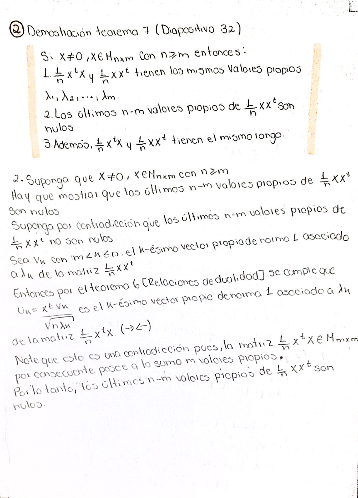

```{r setup, include=FALSE}
knitr::opts_chunk$set(echo = TRUE)
```

Se cargan las librerías necesarias.
```{r, warning=FALSE, message=FALSE}
library(readr)
library(FactoMineR)
library(ggplot2)
library(dplyr)
library(gridExtra)
library(factoextra)
```

# Ejercicio 1

**Complete todas las demostraciones que quedaron como tarea en la presentación de la clase.**





Para el desarrollo de los siguientes ejercicios se emplea la siguiente matriz:

```{r, warning=FALSE, message=FALSE}
X <- matrix(c(8,1,0,4,6,5,6,8,7,10,4,7,8,2,5,0,3,6), nrow = 6, ncol = 3, byrow
            = TRUE)
```

Además, para el ejercicio 8 se utilizan las siguientes bases de datos:
```{r, warning=FALSE, message=FALSE}
#----- Estudiantes--------
estudiantes_datos <- read.table('EjemploEstudiantes.csv', header=TRUE, sep=';',
                                dec=',',row.names=1)
estudiantes_datos<- as.matrix(estudiantes_datos)

#----- beans--------------
beans_datos <- read.csv("beansV2.csv")

#Convertir Class a código disyuntivo
categorias_class  <- unique(beans_datos$Class)
lista_disyuntivo  <- list()
beans_datos_disyuntivo <- beans_datos[,-17]

for (i in 1:length(categorias_class)) {
  lista_disyuntivo[[i]] <- as.numeric(beans_datos$Class == categorias_class[i])
  names(lista_disyuntivo)[i] <- paste("Class_", categorias_class[i], sep = "")
  beans_datos_disyuntivo <- cbind(beans_datos_disyuntivo, lista_disyuntivo[i])
}
beans_datos <- as.matrix(beans_datos_disyuntivo)
```

# Ejercicio 2
**Implemente en lenguaje R funciones que permitan ejecutar el algoritmo del Análisis en Componentes Principales (ACP) visto en clase para variables numéricas. Compare los resultados obtenidos con respecto a FactoMineR **

Primeramente, se construyen las siguientes funciones necesarias para plantear una función
que realice un ACP de una base de datos.

```{r, warning=FALSE, message=FALSE}
#Centramos y reducimos la matriz con la siguiente función
centrar_y_reducir <-  function(matriz){
  # Se obtiene la cantidad de filas y columnas que posee la matriz.
  columnas <- ncol(matriz)
  filas <- nrow(matriz)
  
  # Se crea una nueva matriz con los datos centrados y reducidos.
  for(i in 1:columnas){
    matriz[,i] <- ((matriz[,i] - mean(matriz[,i])) / 
                     (sd(matriz[,i])*sqrt((filas - 1)/filas)))
  }
  
  return(matriz)
}
```

```{r}
#Calcular la matriz de correlaciones 
matriz_correlaciones_ind <- function(matriz) {
  n <- nrow(matriz) 
  resultado <- (1/n)*t(matriz)%*%matriz
  return(resultado)
}
```

```{r, warning=FALSE, message=FALSE}

#Calcular la matriz de calidades de los individuos (cosenos cuadrados)
matriz_cos2_ind <- function(C, matriz) {
  n <-nrow(matriz)
  m <-ncol(matriz)
  resultado <- matrix(0, n,m)
  
  for(i in 1: n){
    suma <- 0 
    for(j in 1: m){
      suma <- suma + matriz[i,j]^2
    }
    for(r in 1: m){
      resultado[i,r] <- (C[i,r]^2)/suma
    }
  }
  return(resultado)
}
```

```{r}
#Calcular la contribución de cada individuo i a la varianza total del eje r
contribucion_ind <- function(C, valores_propios) {
  n <-nrow(C)
  m <-ncol(C)
  resultado <- matrix(0, n, m)
  
  for(i in 1: n){
    for(r in 1: m){
      resultado[i,r] <- ((C[i,r]^2)/(n*valores_propios[r]))*100
    }
  }
  return(resultado)
}
```

```{r}
# Calcular la matriz de coordenadas de las variables
coordenadas_var <- function(V, valores_propios){
  m <- ncol(V)
  resultado <- matrix(0, m, m)
  
  for(r in 1:m){
      resultado[,r] <- sqrt(valores_propios[r])*V[,r]
    }
    
  return(resultado)
}
```


```{r}
# Obtener contribuciones de las variables al cálculo de la varianza total  
# del eje r.
contribuciones_var <- function(cos2){
  m <- ncol(cos2)
  contribuciones <- matrix(nrow = m, ncol = m)
  
  for(i in 1:m){
    for(j in 1:m){
      contribuciones[j,i] <- (cos2[j,i]/sum(cos2[,i]))*100
    }
  }
  
  return(contribuciones)
}
```

```{r}
#Calcular vector de inercias de los ejes
calcular_inercias <- function(valores_propios){
  m <- length(valores_propios)
  resultado <- c()
  
  for(j in 1: m){
    resultado[j] <-100*(valores_propios[j]/m)
  }
  return(resultado)
}
```

Usamos la funciones anteriores para construir una sola función que retorne
el ACP de una base de datos.

```{r, warning= FALSE, message=FALSE}
ACP_funcion <- function(X){
  #1) centrar y reducir X
  X <- centrar_y_reducir(X)
  
  #2) matriz de correlaciones
  X_R <- matriz_correlaciones_ind(X)
  
  #3y 4) valores y vectores propios de la matriz de correlaciones
  X_R_e <- eigen(X_R)
  X_R_valores_propios <- X_R_e$values #ya vienen ordenados de mayor a menor
  X_R_vectores_propios <- X_R_e$vectors
  X_R_vectores_propios
  
  #5) Construir matriz V que tiene como columnas los vectores propios de la 
  #matriz de correlaciones
  V <- X_R_vectores_propios

  #6) Calcular la matriz de componentes principales 
  C <- X%*%V 
  
  #7) Calcular la matriz de calidades de los individuos
  X_Q <- matriz_cos2_ind(C, X)
  
  # La matriz de contribuciones para los individuos de X es:
  X_contrib <- contribucion_ind(C, X_R_valores_propios)
  
  #8) La matriz de coordenadas de las variables
  X_T <- coordenadas_var(V, X_R_valores_propios)
  
  #9) Matriz de calidades de las variables
  S <- X_T^2
  
  # Matriz de contribuciones de las variables
  var_contrib <- contribuciones_var(S)
  
  #10) Vector de inercias
  X_I <- calcular_inercias(X_R_valores_propios)
  
  resultado <- list(valores_propios = X_R_valores_propios,
                    ind = list(coord = C, cos2 =   X_Q, contrib = X_contrib),
                    var = list(coord = X_T, cos2 = S, contrib = var_contrib),
                    inercias = X_I)
}
```

Comparamos los resultados obtenidos con los de FactoMiner para la matriz X.

**Valores propios**

```{r, warning=FALSE, message=FALSE}
ACP_X <- ACP_funcion(X)
ACP_X$valores_propios
```
Comparamos con lo obtenido con FactoMiner

```{r, warning=FALSE, message=FALSE}
X_ACP <- PCA(X, ncp = 4, graph = FALSE)
X_ACP$eig
```
Se puede observar que los valores propios obtenidos con FactoMiner son iguales
a los del algoritmo.

**Coordenadas de los individuos**

```{r, warning=FALSE, message=FALSE}
ACP_X$ind$coord
```

Con FactoMiner se obtiene lo siguiente:

```{r, warning=FALSE, message=FALSE}
X_ACP$ind$coord
```
Podemos observar que lo único que varía es el signo de algunas entradas, pero
esto solo indica que se refleja con respecto a algunos de los ejes al graficar.

**Matriz de cosenos al cuadrado de los individuos**


```{r, warning=FALSE, message=FALSE}
ACP_X$ind$cos2
```
Vemos los resultados de FactoMiner
```{r}
X_ACP$ind$cos2
```
Los cuales son iguales a los obtenidos con el algoritmo.

**Constribución de los individuos**

```{r}
ACP_X$ind$contrib
```

Con FactoMiner se tiene:

```{r}
X_ACP$ind$contrib
```
Por lo tanto, se tiene el mismo resultado que FactoMiner.

**Coordenadas de las variables**
La matriz de coordenadas de las variables para los datos que tenemos es:
```{r}
ACP_X$var$coord
```

Y la dada con FactoMiner es:
```{r}
X_ACP$var$coord
```

**Matriz de cosenos al cuadrado de las variables**

```{r}
ACP_X$var$cos2
```
Con FactoMiner da:
```{r}
X_ACP$var$cos2
```
**Contribución de las variables**
```{r}
ACP_X$var$contrib
```

Con FactoMiner se obtiene 

```{r}
X_ACP$var$contrib
```
Por temas computacionales, el primer valor de la tercera dimensión de las matrices de coordenadas, calidades y contribuciones de las variables, obtenidas con el algoritmo, es muy cercano a cero. Por lo cual, con FactoMiner aparece como cero.

**Inercias**
```{r}
ACP_X$inercias[1:2]
```

Con FactoMiner se tiene:
```{r}
plot(X_ACP, axes=c(1, 2), choix="ind", col.ind="blue",new.plot=TRUE)
```
Podemos observar que las inercias correpondiente al eje "x" y "y" obtenidas con 
FactoMiner son iguales a las dadas por el algoritmo.

# Ejercicio 3
**Implemente en lenguaje R funciones que grafiquen el plano principal (en 2 dimensiones),el círculo de correlaciones (en 2 dimensiones) que incluya la inercia, el gráfico dual (en 2D) para ver ambos gráficos juntos. Compare los resultados obtenidos con respecto a FactoMineR**

A continuación se presentan las funciones para calcular dichos gráficos 

```{r, warning=FALSE, message=FALSE}
#---------------------------Plano principal individuos--------------------------

plano_principal <- function(matriz){
  #Obtenemos la matriz con las coordenadas de los individuos
  
  ACP_matriz <- ACP_funcion(matriz)
  C <- ACP_matriz$ind$coord
 
  #Convertimos la matriz en un dataframe
  C_data <- as.data.frame(C)
  col_names <- paste("Dim", 1:ncol(C_data)) 
  colnames(C_data) <- col_names

  if(is.null(rownames(C_data))) {
    C_data$individuo <- seq_len(nrow(C_data))
  } else {
    C_data$individuo <- rownames(C_data)
  }

  #Sacamos la inercia
  X_I <- ACP_matriz$inercias
  X_I_redondeados <- round(X_I, 2)
  inercia <- X_I_redondeados[1] + X_I_redondeados[2]
  
  
  #Graficamos
  
  if(nrow(C_data) <= 10){
    individuos <- ggplot(C_data, aes(x = `Dim 1`, y = `Dim 2`)) +
      geom_point(color = "lightblue") +  
      geom_text(aes(label = individuo), vjust = 0, hjust = 0, 
                color = "lightblue") + 
      labs(x = paste("Dim 1 (", X_I_redondeados[1], "%)"), 
         y = paste("Dim 2 (", X_I_redondeados[2], "%)"), 
         subtitle = paste("Inercia = ", inercia, "%"), 
         title = "Plano principal (Individuos)")+
      theme_minimal()
  }else{
    individuos <- ggplot(C_data, aes(x = `Dim 1`, y = `Dim 2`)) +
      geom_point(color = "lightblue") +  
      labs(x = paste("Dim 1 (", X_I_redondeados[1], "%)"), 
         y = paste("Dim 2 (", X_I_redondeados[2], "%)"), 
         subtitle = paste("Inercia = ", inercia, "%"), 
         title = "Plano principal (Individuos)") +
      theme_minimal()
  }
  
  return(individuos)
}

```

```{r,warning=FALSE, message=FALSE}
#----------------------------Círculo de correlaciones---------------------------
circulo_correlaciones <- function(matriz){
  #Obtenemos la matriz con las coordenadas de las variables
  
  ACP_matriz <- ACP_funcion(matriz)
  
  X_T <- ACP_matriz$var$coord
  
  #Convertimos la matriz en un dataframe y ajustamos para el gráfico
  X_T_data <- as.data.frame(X_T)
  
  col_names <- paste("Dim", 1:ncol(X_T_data))  
  colnames(X_T_data) <- col_names
  
  if(is.null(colnames(matriz))) {
    X_T_data$variable <- seq_len(ncol(matriz))
  } else {
    X_T_data$variable <- colnames(matriz)
  }
  X_T_data$`x origen` <- 0
  X_T_data$`y origen` <- 0
  
  #Sacamos la inercia
  X_I <- ACP_matriz$inercias
  X_I_redondeados <- round(X_I, 2)
  inercia <- X_I_redondeados[1] + X_I_redondeados[2]
  
  #Graficamos
  variables0 <- ggplot(X_T_data, aes(x = `x origen`, y = `y origen`)) +
    geom_segment(aes(xend = `Dim 1`, yend = `Dim 2`), 
                 arrow = arrow(length = unit(0.2, "inches")), color = "orange")+
    geom_text(aes(x = `Dim 1`, y = `Dim 2`, label = variable), vjust = -0.5, 
              nudge_y = 0, nudge_x = 0, color ="orange") +
    labs(x = paste("Dim 1 (", X_I_redondeados[1], "%)"), 
         y = paste("Dim 2 (", X_I_redondeados[2], "%)"), 
         subtitle = paste("Inercia = ", inercia, "%")) +
    theme_minimal()
  
  variables <- variables0 + 
    geom_path(data = data.frame(x = cos(seq(0, 2 * pi, length.out = 100)),
                                y = sin(seq(0, 2 * pi, length.out = 100))),
              aes(x, y), color = "black", linewidth = 1, linetype = "dashed") +
    labs(title = "Círculo de correlaciones")
  
  return(list(variables0 = variables0, variables = variables))
}
```

```{r,warning=FALSE, message=FALSE}
#---------------------------Grafico Dual----------------------------------------
grafico_dual <- function(graf_ind, graf_var, matriz) {
  # Obtener los graficos y las etiquetas 
  grafico_circulo <- graf_var$variables0
  data_graf_ind <- ggplot_build(graf_ind)$data[[1]]
  data_graf_var <-ggplot_build(grafico_circulo)$data[[1]]
  
  if(is.null(rownames(matriz))) {
    data_graf_ind$label <- seq_len(nrow(matriz))
  } else {
    data_graf_ind$label <- rownames(matriz)
  } 
  
  if (is.null(colnames(matriz))){
    data_graf_var$label <- seq_len(ncol(matriz))
  }else {
    data_graf_var$label <- colnames(matriz)
  }
  
  # Superponer los gráficos
  if(nrow(data_graf_ind) <= 10){
    grafico_final <- grafico_circulo +
      geom_point(data = data_graf_ind, aes(x, y), color = "lightblue") +
      geom_text(data = data_graf_ind, aes(x, y, label = label), 
                vjust = 0, hjust = 0, color = "lightblue")
  }else{
    #grafico_final <- grafico_circulo +
      #geom_point(data = data_graf_ind, aes(x, y), color = "lightblue", size=1)
    grafico_final <- graf_ind + 
      geom_segment(data = data_graf_var, aes(x = x, y = y, xend =  xend, 
                                             yend = yend), 
                   arrow = arrow(length = unit(0.2, "inches")), 
                   color = "orange") +
      geom_text(data = data_graf_var, aes(x = xend, y = yend, label =label), 
                vjust = 0, hjust = 0, color = "orange" )
  }
  
  return(grafico_final)
}

```

Ahora, comparamos los gráficos obtenidos con el algoritmo para la matriz X y los
dados por FactoMiner.

```{r,warning=FALSE, message=FALSE}
individuos_FM <- plot(X_ACP)

grid.arrange(plano_principal(X), individuos_FM, ncol = 2)
```

```{r,warning=FALSE, message=FALSE}
variables_FM <- plot(X_ACP, axes=c(1, 2), choix="var", col.var="orange",
                     new.plot=TRUE)

grid.arrange(circulo_correlaciones(X)[["variables"]], variables_FM, ncol = 2)
```

```{r,warning=FALSE, message=FALSE}
dual_FM <- fviz_pca_biplot(X_ACP,col.var = "orange",col.ind = "lightblue")
grid.arrange(grafico_dual(plano_principal(X), circulo_correlaciones(X), X), 
             dual_FM, ncol = 2)
```
Como se puede observar, todos los gráficos generados por FactoMiner están reflejados con 
respecto al eje "y" en comparación con los generados por el algortimo .

# Ejercicio 4
**Programe una función en R que reciba una fila (individuo) de una matriz y calcule la proyección en suplementario de este individuo en el plano principal 2D programado en el punto anterior. Compare los resultados obtenidos con respecto a FactoMineR**

Primeramente, es necesario mencionar que el individuo suplementario se considera como una nueva fila que se le añade a la base de datos inicial. Por lo tanto, en caso de que la fila no tenga una etiqueta, se le coloca un identificador que corresponde al número de fila, en este caso, el último.

La función es la siguiente:

```{r, warning=FALSE, message=FALSE}
ind_sup_proyeccion <- function(fila, matriz) {
  
 #Obtener medias de las columnas de la matriz
  medias <-c()
  for(i in 1:ncol(matriz)) {
    medias[i] <- mean(matriz[,i])
  }
 
#desviaciones estándar poblacionales de la matriz 
  sd <- c()
  n <- nrow(matriz)
  for(i in 1:ncol(matriz)) {
    sd[i] <- sqrt(((n-1)/n))*sd(matriz[,i])
  }

  #centramos y reducimos la fila y la matriz
  for(i in 1:length(fila)){
    fila[i] <- (fila[i]-medias[[i]])/sd[[i]]
  }
  
  matriz <- centrar_y_reducir(matriz)
  
  #Matriz de correlaciones
  correlaciones <- matriz_correlaciones_ind(matriz)
  
  #Vectores propios
  matriz_e <- eigen(correlaciones)
  V <- matriz_e$vectors
  
  #Se calcula las coordenadas 
  C <- fila%*%V
  
  #Se gráfica esas coordenadas en el plano mediante la conversión de la fila en 
  # un dataframe.
  C_data_ind <- as.data.frame(C)
  col_names <- paste("Dim", 1:ncol(C_data_ind))  
  colnames(C_data_ind) <- col_names
 
  if(is.null(rownames(fila))){
    C_data_ind$individuo <- nrow(matriz) + 1
  }else {
    C_data_ind$individuo <- rownames(fila)
  }
  
  resultado <- plano_principal(matriz) + 
    geom_point(data = C_data_ind, aes(x = `Dim 1`, y = `Dim 2`), color = "red")+
    geom_text(data = C_data_ind, aes(x = `Dim 1`, y = `Dim 2`), 
              vjust = -0.5, hjust = -0.5, color = "red", 
              label = C_data_ind$individuo )
  return(resultado)
  
}
```

Comparamos la proyección suplementaria del individuo en el plano inicial que da esta función
con el resultado de FactoMiner. Para esto, tomamos como individuo suplementario a la fila número 6 de la 
matriz X.

```{r}
fila <- X[6,]
coordenadasind_sup <- ind_sup_proyeccion(fila, X[-6,])

ACP_indsup <- PCA( X,ind.sup = 6, graph = F)
coordenadasind_sup_FM <-plot.PCA(ACP_indsup, choix = "ind")

grid.arrange(coordenadasind_sup, coordenadasind_sup_FM, ncol = 2)
```
Podemos observar que los gráficos se encuentran reflejados con respecto al eje "y". Además, el punto de color distinto, en cada gráfico, corresponde al individuo suplementario.
También, es posible notar que al agregar la proyección suplementaria no se alteran las coordenadas de los individuos iniciales. 

# Ejercicio 5 

**Programe una función en R que reciba una columna (variable) de una matriz y calcule su proyección en suplementario en el círculo de correlaciones 2D programado en el punto2. Compare los resultados obtenidos con respecto a FactoMineR.**

Primeramente, es necesario mencionar que la variable suplementaria se considera como una nueva columna que se le añade  a la base de datos inicial. Por lo tanto, en caso de que la columna no tenga una etiqueta, se le coloca un identificador que corresponde al número de columna, en este caso, el último.

La función es la siguiente:

```{r, warning=FALSE, message=FALSE}
var_sup_proyeccion <- function(columna, matriz) {
  #se calcula la media y desviación estándar de la columna 
  media <- mean(columna)
  n <- length(columna)
  sd <-sqrt(((n-1)/n))*sd(columna)
  
  #Se obtienen los componentes principales 
  ACP_matriz <- ACP_funcion(matriz)
  C <- ACP_matriz$ind$coord
  
  #Se calculan las correlaciones de la columna con los componentes principales
  coordenada <- c()
  for(i in 1: ncol(matriz)){
    coordenada[i] <-cor(columna, C[,i])
  }
  
  #Se gráfica en el círculo de correlaciones
  circulo <- circulo_correlaciones(matriz)
  graf_circulo <- circulo$variables
  
  #Convertimos la matriz en un dataframe y ajustamos para el gráfico
  coordenada_var <- as.data.frame(t(coordenada))
  col_names <- paste("Dim", 1:ncol(coordenada_var))  
  colnames(coordenada_var) <- col_names
  coordenada_var$`x origen` <- 0
  coordenada_var$`y origen` <- 0
  
  if(is.null(colnames(columna))){
   coordenada_var$variable <- ncol(matriz) + 1
  }else {
    coordenada_var$variable <- colnames(columna)
  }
  
  resultado <- graf_circulo + 
    geom_segment(data = coordenada_var, 
                 aes(x = `x origen`, y = `y origen`, xend = `Dim 1`, 
                     yend = `Dim 2`), 
    arrow = arrow(length = unit(0.2, "inches")), color = "red")+
    geom_text(data = coordenada_var, aes(x = `Dim 1`, y = `Dim 2`), 
              vjust = -0.5, hjust = -0.5, color = "red", 
              label = coordenada_var$variable )
  return(resultado)
}
```

Para comparar con FactoMiner, tomamos como variable suplementaria a la columna 3.

```{r}
columna <- X[,3]
coordenadasvar_sup <- var_sup_proyeccion(columna, X[,-3])

ACP_varsup <- PCA( X,quanti.sup = 3, graph = F)
coordenadasvar_sup_FM <- plot.PCA(ACP_varsup, choix = "var")

grid.arrange(coordenadasvar_sup, coordenadasvar_sup_FM, ncol = 2)
```

Para el caso de la variable suplementaria, se puede ver que los gráficos se encuentran reflejados con respecto al eje x. También, el vector con distinto color, en cada gráfico, corresponde a la variable suplementaria.
Además, es posible observar que al agregar la proyección suplementaria no se alteran las coordenadas de las variables iniciales. 

# Ejercicio 6
**Programe en R un algoritmo para el ACP que en lugar de calcular la matriz de correlaciones R calcule H y con base en H realice los cálculos de lado de las variables y luego usando relaciones de dualidad realice todos los cálculos para la parte de los individuos. Verifique los resultados obtenidos con respecto a FactoMineR.**

```{r}
ACP_basado_en_H <- function(matriz_cyr){
  # Se crea una función para generar la matriz H.
  calcular_H <- function(matriz){
    # Se retorna la matriz de Varianzas-covarianzas.
    return((1/nrow(matriz))* matriz %*% t(matriz))
  }
  
  # Se corre la función y se genera la matriz H.
  H <- calcular_H(matriz_cyr)
  
  # Se calculan los valores y vectores propios de la matriz H.
  e <- eigen(H)
  val_propios_var <- e$values
  vec_propios_var <- e$vectors

  # Dado que pude suceder que se obtengan valores propios cercanos a cero, 
  # entonces se procede a filtrar los valores y vectores propios.
  val_propios_var <- val_propios_var[val_propios_var > 1e-10]
  vec_propios_var <- vec_propios_var[,1:length(val_propios_var)]

  
  
  # Se crea una función que calcule las coordenadas de las variables.
  calcular_coordenadas <- function(matriz, vectores.propios){
    # Se obtiene la cantidad de filas y columnas que posee la matriz.
    m <- ncol(vectores.propios)
    n <- ncol(matriz)
    
    # Se crea una matriz en blanco la cual se rellenará con las coordenadas.
    coordenadas <- matrix(0,n,m)
    
    # Se rellena la matriz mediante un resultado obtenido a partir de la 
    # relación de dualidad.
    for(i in 1:n){
      for(j in 1:m){
        x <- matriz_cyr[,i]
        v <- vec_propios_var[,j]
        
        coordenadas[i,j] <- t(x)%*%v/sqrt(t(x)%*%x%*%t(v)%*%v)
      }
    }
    
    return(coordenadas)
  }
  
  # Se calcula la matriz de coordenadas para las variables.
  coordenadas_var <- calcular_coordenadas(matriz_cyr, vec_propios_var)

  # Una vez que se cuenta con matriz de coordenadas, se procede a elevar al
  # cuadrado dicha matriz para obtener la matriz de cosenos cuadrados. Además se
  # compara el resultado con el obtenido con FactoMineR.
  cos2_var <- (coordenadas_var)^2
  
  # Se crea una función para calcular la contribución de las variables.
  calcular_contribuciones <- function(matriz){
    m <- ncol(matriz)
    n <- nrow(matriz)
    
    # Se genera una matriz vacía a rellenar con las contribuciones.
    resultado <- matrix(0,n,m)
    
    for(i in 1:m){
      for(j in 1:n){
        resultado[j,i] <- matriz[j,i]/sum(matriz[,i])*100
      }
    }
    
    return(resultado)
  }
  
  # Se calculan las contribuciones.
  contribuciones_var <- calcular_contribuciones(cos2_var)
  
  # Ahora que se cuenta con toda la información útil sobre las variables, se 
  # se procede a crear una función para calcular los vectores propios de los
  # individuos.
  calcular_vec_propios_ind <- function(matriz, vec_p_v, val_p_v){
    n <- ncol(matriz)
    f <- nrow(matriz)
    m <- ncol(vec_p_v)
    
    # Se genera una matriz vacía a rellenar con los vectores propios de los
    # individuos.
    resultado <- matrix(0,n,m)
    
    for(i in 1:m){
      resultado[,i] <- (t(matriz)%*%vec_p_v[,i])/sqrt(f*val_p_v[i])
    }
    
    return(resultado)
  }
  
  # Se calculan los vectores propios de los individuos.
  vec_propios_ind <- calcular_vec_propios_ind(matriz_cyr, vec_propios_var, 
                                              val_propios_var)
  
  # Se calculan las coordenadas de los individuos.
  coordenadas_ind <- matriz_cyr%*%vec_propios_ind
  
  # Se crea la funcion para el calculo de los cosenos cuadrados.
  calcular_cos2_ind <- function(C, matriz) {
    n <-nrow(matriz)
    m <-ncol(matriz)
    f <- ncol(C)
    
    
    resultado <- matrix(0, n,f)
    
    for(i in 1: n){
      suma <- 0 
      for(j in 1: m){
        suma <- suma + matriz[i,j]^2
      }
      for(r in 1: f){
        resultado[i,r] <- (C[i,r]^2)/suma
      }
    }
    return(resultado)
  }
  
  # Se calcula la matriz de cosenos cuadrados.
  cos2_ind <- calcular_cos2_ind(coordenadas_ind, matriz_cyr)
  
  # Se calcula la matriz de contribuciones.
  contribuciones_ind <- contribucion_ind(coordenadas_ind, val_propios_var)
  
  # Se calcula la inercia.
  inercia <- calcular_inercias(val_propios_var)
  
  resultado <- list(
    eigen = list(values = val_propios_var, vectors = vec_propios_ind),
    var = list(coord = coordenadas_var, cos2 = cos2_var, 
               contrib = contribuciones_var),
    ind = list(coord = coordenadas_ind, cos2 = cos2_ind, 
               contrib = contribuciones_ind)
  )
  
  return(resultado)
}
```

Finalmente se corre todo el algoritmo y se compara los resultados con los obtenidos por FactoMineR.

```{r}
X_cyr <- centrar_y_reducir(X)

ACP_a_mano <- ACP_basado_en_H(X_cyr)
ACP_con_FM <- PCA(X_cyr, graph = FALSE)

# Valores propios,
ACP_a_mano$eigen$values
ACP_con_FM$eig

# Coordenadas de las variables.
ACP_a_mano$var$coord
ACP_con_FM$var$coord

# Coseno cuadrado de las variables.
ACP_a_mano$var$cos2
ACP_con_FM$var$cos2

# Contribuciones de las variables.
ACP_a_mano$var$contrib
ACP_con_FM$var$contrib

# Coordenadas de los individuos.
ACP_a_mano$ind$coord
ACP_con_FM$ind$coord

# Coseno cuadrado de los individuos.
ACP_a_mano$ind$cos2
ACP_con_FM$ind$cos2

# Contribuciones de los individuos.
ACP_a_mano$ind$contrib
ACP_con_FM$ind$contrib
```

# Ejercicio 7

**Programe en R un algoritmo óptimo para el ACP que tome en cuenta cual matriz sea más pequeña R  o H.**
```{r}
ACP <- function(X){
  if(nrow(X) >= ncol(X)){
    return(ACP_funcion(X))
  } else{
    X_cyr <- centrar_y_reducir(X)
    return(ACP_basado_en_H(X_cyr))
  }
}
```


# Ejercicio 8

**Verifique todo lo programado en los puntos anteriores con el ejemplo estudiantes.csv y con los datos del ejercicio 1 de la tarea anterior.**

## Base de datos de estudiantes

### Inciso 2

```{r}
ACP_estudiantes <- ACP_funcion(estudiantes_datos)
ACP_estudiantes
```
### Inciso 3

**Plano principal**
```{r, warning=FALSE, message=FALSE}
plano_principal(estudiantes_datos)

```

**Círculo de correlaciones**
```{r}
circulo_correlaciones(estudiantes_datos)$variables

```

**Gráfico Dual**
```{r}
grafico_dual(plano_principal(estudiantes_datos), 
             circulo_correlaciones(estudiantes_datos), estudiantes_datos)
```

### Inciso 4

```{r}
fila_sup_estudiantes <- as.matrix(estudiantes_datos[6,])
colnames(fila_sup_estudiantes) <- (rownames(estudiantes_datos))[6]
fila_sup_estudiantes <- t(fila_sup_estudiantes)

coordenadasind_sup_estudiantes <- ind_sup_proyeccion(fila_sup_estudiantes, 
                                                     estudiantes_datos[-6,])
coordenadasind_sup_estudiantes
```

### Inciso 5
```{r}
columna_sup_estudiantes <- as.matrix(estudiantes_datos[,2])
colnames(columna_sup_estudiantes) <- (colnames(estudiantes_datos))[2]

coordenadasvar_sup_estudiantes <- var_sup_proyeccion(columna_sup_estudiantes, 
                                                     estudiantes_datos[,-2])
coordenadasvar_sup_estudiantes
```

### Inciso 6

```{r}
ACP_estudiantes_H <- ACP_basado_en_H(centrar_y_reducir(estudiantes_datos))
ACP_estudiantes_H
```
### Inciso 7

```{r}
ACP_estudiantes_optimo <- ACP(estudiantes_datos)
ACP_estudiantes_optimo
```


## Base de datos beans

```{r, warning=FALSE}
ACP_beans <- ACP_funcion(beans_datos)
head(ACP_beans$ind$coord[,1:3],15)
```


```{r}
head(ACP_beans$ind$cos2[,1:3],15)
```

```{r}
head(ACP_beans$ind$contrib[,1:3],15)
```

```{r}
head(ACP_beans$var$coord[,1:3],15)
```
```{r}
head(ACP_beans$var$cos2[,1:3],15)
```

```{r}
head(ACP_beans$var$contrib[,1:3],15)
```

```{r}
head(ACP_beans$inercias)
```
### Inciso 3

**Plano principal**
```{r, warning=FALSE, message=FALSE}
plano_principal(beans_datos)

```

**Círculo de correlaciones**
```{r, warning=FALSE}
circulo_correlaciones(beans_datos)$variables

```

**Gráfico Dual**
```{r, warning=FALSE}
grafico_dual(plano_principal(beans_datos), 
             circulo_correlaciones(beans_datos), beans_datos)
```


### Inciso 4

```{r, warning=FALSE}
fila_sup_beans <- beans_datos[6,] 
coordenadasind_sup_beans <- ind_sup_proyeccion(fila_sup_beans, beans_datos[-6,])
coordenadasind_sup_beans
```

### Inciso 5
```{r, warning=FALSE}
columna_sup_beans <- as.matrix(beans_datos[,2])
colnames(columna_sup_beans) <- (colnames(beans_datos))[2]

coordenadasvar_sup_beans <- var_sup_proyeccion(columna_sup_beans, 
                                               beans_datos[,-2])
coordenadasvar_sup_beans
```

### Inciso 6

Dado que la base de datos `beans_datos` posee un total de 4767 individuos, al calcular la matriz H, se obtienen unas dimensiones de 4767x4767 lo cual genera que al pasarlo por la función `eigen()`, se tarde un periodo de tiempo elevado al calcular los vectores y valores propios. Por lo tanto, se decide no evaluar el código. Esto se corrobora en el inciso 7 donde la función `ACP()`, ejecuta a la función basada en la matriz de correlaciones R.

```{r, eval=FALSE}
ACP_beans_H <- ACP_basado_en_H(centrar_y_reducir(beans_datos))
ACP_beans_H
```

### Inciso 7

Este inciso no se imprime debido a que, por ser la matriz R más optima que la H, entonces se correría la función `ACP_funcion()`, que ya se ejecutó anteriormente.

```{r, warning=FALSE}
ACP_beans_optimo <- ACP(beans_datos)
```
