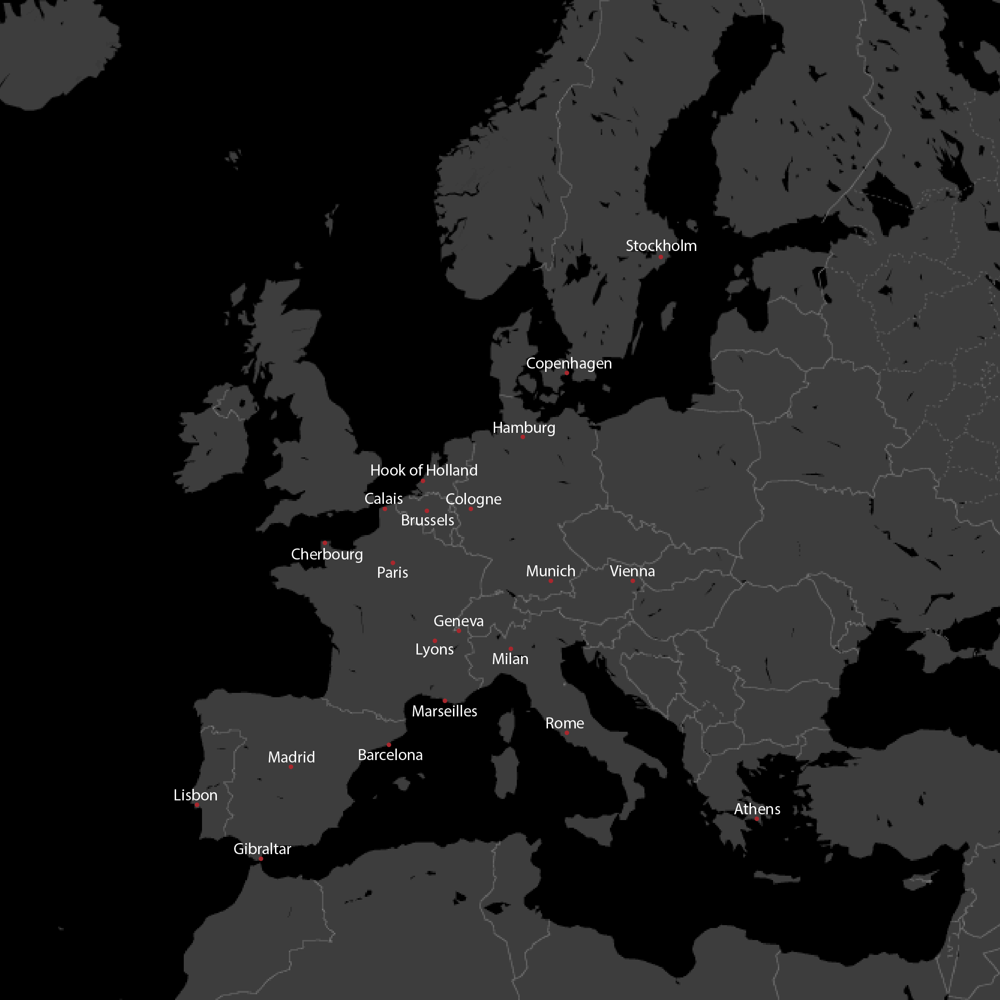
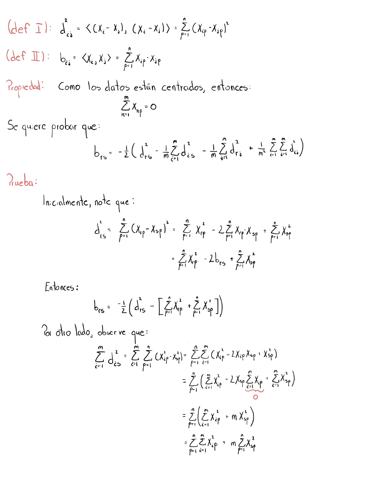
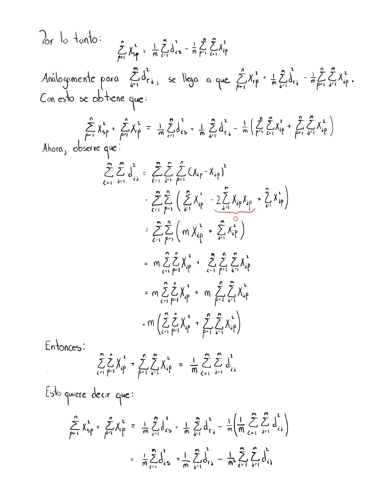
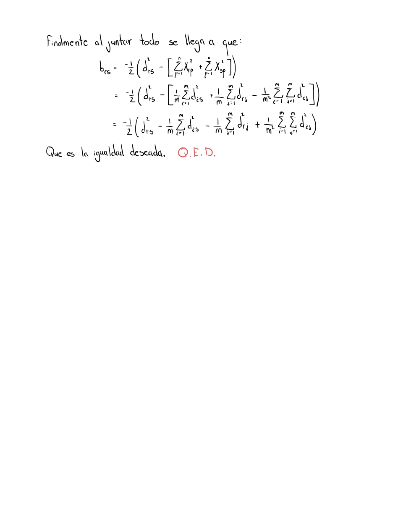
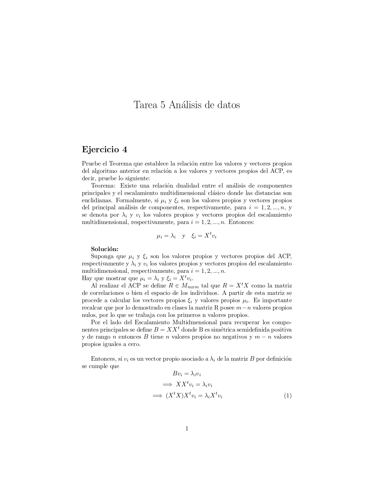
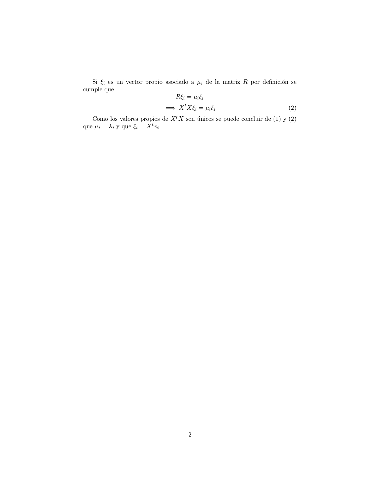

```{r setup, include=FALSE}
knitr::opts_chunk$set(echo = TRUE)
```

# Librerías.
```{r, warning=FALSE, message=FALSE}
library(datasets)
library(FactoMineR) 
library(factoextra)
library(MASS)
```

# Ejercicio 1.
**Para la tabla de datos `eurodist` que viene con el paquete datasets el cual contiene las distancias entre algunas de las ciudades más importantes de Europa ejecute un Escalamiento Multidimensional y luego compare el resultado con el mapa de Europa.**

Primero se obtienen los datos de las distancias apartir del paquete `datasets`.
```{r}
matriz_distancias <- eurodist
```

Una vez que se cuenta con las distancias, se ejecuta el ACP o *Multidimensional Scalling*, a partir de la matriz de distancias.
```{r}
MDS <- cmdscale(matriz_distancias,eig=TRUE, k=2)
MDS
```

Finalmente se gráfica a los individuos y se muestra una comparación con el mapa verdadero.

*Ubicaciones apartir del MDS:*
```{r, fig.width=10, fig.height=10}
x <- MDS$points[,1]
y <- -1*MDS$points[,2]
plot(x, y, xlab="Componente 1", ylab="Componente 2",main="MDS",pch = 19)
text(x, y, labels = labels(matriz_distancias), cex=0.85 , pos = 1) 
```

*Mapa real:*


Como es posible observar, los resultados del *MDS* son muy similares al mapa real, con tan solo un para de diferencias que son atribuibles a no tener las distancias exactas o por lo contrario, al mapa con el que se cuenta.

# Ejercicio 2.
**Programe el algoritmo para Escalamiento Multidimensional (Mutidimensional Scaling) visto en clase y con la tabla de estudiantes compare con `cmdscale()` de R y veri que los resultados con un ejemplo.**

A continuación, se presenta una función que realiza el MDS paso a paso.
```{r}
MDS_algoritmo <- function(X, distancias) {
  
  # Paso 1: Con las distancias, se obtiene la matriz B 
  n <- nrow(X) # cantidad de individuos
  B_matriz <- matrix(NA, n, n)
  suma3 <- sum(distancias^2)
  
  for (r in 1: n) {
    suma1 <- 0
    suma2 <- 0
    for (s in 1: n ) {
      suma1 <- sum((distancias[,s])^2)
      suma2 <- sum((distancias[r,])^2)
      B_matriz[r,s] <- -(1/2)*(distancias[r,s]^2 - (1/n)*(suma1 + suma2) 
                               + (1/n^2)*suma3) 
    }
  }
  
  # Paso 2 : Se calculan los valores y vectores propios de B.
  B_e <- eigen(B_matriz)
  valores_propios <- B_e$values
  
  # Los valores propios muy pequeños cercanos a cero, se ignoran para el cálculo 
  # de las coordenadas. Se define un umbral para los valores propios 
  umbral <- 1e-10 
  
  # Se filtran los valores propios mayores que el umbral
  valores_propios_filtrados <- valores_propios[valores_propios > umbral]
  # Se obtienen los vectores propios asociados a los valores propios filtrados
  m <- length(valores_propios_filtrados)
  vectores_propios <- B_e$vectors[, 1:m]
  
  # Paso 3 : Se calculan las coordenadas
  coordenadas <- matrix(NA, n, m)
  rownames(coordenadas) <- rownames(X)
  
  for(i in 1: n) {
    for(j in 1: m){
      coordenadas[i,j] <- (sqrt(valores_propios_filtrados[j])*
                             vectores_propios[i,j])
    }
  }
  
  # Paso 4: Graficar 
  x <- coordenadas[,1]
  y <- coordenadas[,2]
  
  grafico <- plot(x, y, xlab="Componente 1", ylab="Componente 2",
                  main="MDS algoritmo",pch = 19)
  text(x, y, labels = row.names(X), cex = 0.85 , pos = 1)
  
  resultado <- list("points" = coordenadas, "eig" = valores_propios, 
                    "plot"= grafico)
  
  return(resultado)
}
```


Comparación con `cmdscales()` 

Primeramente, se carga la base de datos de estudiantes.
```{r}
estudiantes_datos <- read.table('EjemploEstudiantes.csv', 
                                header=TRUE, sep=';',dec=',',row.names=1)
```

Se obtiene las distancias de cada par de individuos.
```{r}
distancias <- dist(estudiantes_datos)
distancias_matriz <- as.matrix(distancias)
```

Se verifican los resultados obtenidos por ambas funciones
```{r}
MDS_estudiantes <- cmdscale(distancias, k = 5, eig=TRUE)
MDS_estudiantes

x <- MDS_estudiantes$points[,1]
y <- MDS_estudiantes$points[,2]

plot(x, y, xlab="Componente 1", ylab="Componente 2",
                main="MDS",pch = 19)
text(x, y, labels = row.names(estudiantes_datos), cex = 0.85 , pos = 1)

MDS_algoritmo_estudiantes <- MDS_algoritmo(estudiantes_datos, distancias_matriz)
```

Las coordenadas de los individuos son iguales. Por otro lado, los primeros 5 valores propios dados por ambos son los mismos. En cuanto a los restantes 4, estos difieren,pues, al ser números cercanos a cero por cuestiones de cálculo de la función cmdscale la precisión númerica cambia en comparación con eigen.Por último, el plano principal es el mismo.

# Ejercicio 3.
**Pruebe la ecuación (1.3) de la filminas vistas en clase, la cual establece una fórmula para el cálculo de brs.**




# Ejercicio 4.
**Pruebe el Teorema que establece la relación entre los valores y vectores propios del algoritmo anterior en relación a los valores y vectores propios del ACP.**



# Ejercicio 5.
**Del documento adjunto MDS no métrico.pdf leer la sección MDS no métrico y replicar en R los dos ejemplos que ah se presentan.**

## Ejemplo 1.
```{r}
nombres_fila_columna1 <- c("M", "B", "V", "S", "SS", "LC")

m <- matrix(c(
  0,   627, 351, 550, 488, 603,
  627, 0,   361, 1043,565, 1113,
  351, 361, 0,   567, 564, 954,
  550, 1043,567, 0,   971, 950,
  488, 565, 564, 971, 0,   713,
  603, 1113,954, 950, 713, 0), 
  nrow = 6, byrow = TRUE)

m <- as.data.frame(m)
rownames(m) <- nombres_fila_columna1
colnames(m) <- nombres_fila_columna1
m <- as.matrix(m)
```

Calculamos Q
```{r}
Q <- matrix(0, nrow = 6, ncol = 6)

sum1 <- c()
i <- 0
for (s in 1:6) {
  for (r in 1:6) {
    i <- i + (m[r,s])^2
    sum1[s] <- i
  }
  i <- 0 
}
  
sum2 <- c()
j <- 0
for (r in 1:6) {
  for (s in 1:6) {
    j <- j + (m[r,s])^2
    sum2[r] <- j
  }
  j <- 0 
}

sum3 <- 0
for (r in 1:6) {
  for (s in 1:6) {
    sum3 <- sum3 + (m[r,s])^2
  }
}

for (r in 1:6) {
  for (s in 1:6) {
    Q[r,s] <- -(1/2)*(((m[r,s])^2) - (1/6)*sum1[s] - (1/6)*sum2[r] + 
                        (1/6^2)*sum3)
  }
}

Q 
```

Encontramos los valores y vectores propios de Q 
```{r}
propios <- eigen(Q)
valores_propios <- propios$values
valores_propios <- valores_propios[-c(5,6)]
vectores_propios <- propios$vectors
vectores_propios <- vectores_propios[,-c(5,6)]
valores_propios
vectores_propios
```

Calculamos las coordenadas 
```{r}
coordenadas <- matrix(0, nrow = 6, ncol = 4)
for (i in 1:6) {
  for (j in 1:4) {
    coordenadas[i,j] <- sqrt(valores_propios[j])*vectores_propios[i,j]
  }
}

coordenadas[,1:2]
```

Graficamos
```{r}
plot(coordenadas[,1], coordenadas[,2], col = "orange", pch = 16,
     xlab = "Coordenada X", ylab = "Coordenada Y", main = "Plot de Coordenadas")
text(coordenadas[,1], coordenadas[,2], 
     labels = rownames(m), pos = 4, cex = 0.7, col = "black")
```

## Ejemplo 2.
```{r}
nombres_fila_columna2 <- c("Atlanta", "Chicago", "Denver", "Houston", 
                           "L. Angeles", "Miami", "N York", 
                           "S Francisco", "Seattle", "Washington")
aire.dist <- matrix(c(0, 587, 1212, 701, 1936, 604, 748, 2139, 218, 543,
                      587, 0, 920, 940, 1745, 1188, 713, 1858, 1737, 597,
                      1212, 920, 0, 879, 831, 1726, 1631, 949, 1021, 1494,
                      701, 940, 879, 0, 1374, 968, 1420, 1645, 1891, 1220,
                      1936, 1745, 831, 1374, 0, 2339, 2451, 347, 959, 2300,
                      604, 1188, 1726, 968, 2339, 0, 1092, 2594, 2734, 923,
                      748, 713, 1631, 1420, 2451, 1092, 0, 2571, 2408, 205,
                      2139, 1858, 949, 1645, 347, 2594, 2571, 0, 678, 2442,
                      218, 1737, 1021, 1891, 959, 2734, 2408, 678, 0, 2329,
                      543, 597, 1494, 1220, 2300, 923, 205, 2442, 2329, 0), 
                    nrow = 10, byrow = TRUE)
aire.dist <- as.data.frame(aire.dist)
rownames(aire.dist) <- nombres_fila_columna2
colnames(aire.dist) <- nombres_fila_columna2
```

Se efectua un analisis clasico MDS metrico
```{r}
aire.mds <- cmdscale(as.matrix(aire.dist),k=9,eig=T)
aire.mds
```

Se Calculan los autovalores
```{r}
aire.mds$eig
```

Se normalizan los dos primeros autovalores
```{r}
sum(abs(aire.mds$eig[1:2]))/sum(abs(aire.mds$eig))
sum(aire.mds$eig[1:2]^2)/sum(aire.mds$eig^2)
```

Se muestran las coordenadas de las ciudades en las dos dimensiones
```{r}
aire.mds$points[,1:2]
```

Se dibujan las coordenadas de las ciudades en las dos dimensiones
```{r, fig.height=8, fig.width=8}
par(pty="s")
plot(-aire.mds$points[,1],aire.mds$points[,2],type="n",xlab="Coordenada 1",
     ylab="Coordenada 2",xlim = c(-2000,1500),ylim=c(-2000,1500))
text(-aire.mds$points[,1],aire.mds$points[,2],labels=row.names(aire.dist))
```

otra manera de dibujar las coordenadas 
```{r, fig.height=6, fig.width=8}
plot(-aire.mds$points[,1], aire.mds$points[,2], col = "orange", pch = 16, 
     xlab = "Coordenada X", ylab = "Coordenada Y", main = "Plot de Coordenadas")
text(-aire.mds$points[,1], aire.mds$points[,2], 
     labels = rownames(aire.mds$points), pos = 3, cex = 0.6, col = "black")
```

```{r}
data(swiss)
```

El fichero original de datos viene recogido ya en MASS:
```{r}
swiss
swiss.x <- as.matrix(swiss[, -1])
swiss.dist <- dist(swiss.x)
swiss.mds <- isoMDS(swiss.dist)
```

Las coordenadas son
```{r}
swiss.mds$points
```

Se dibujan los puntos
```{r}
plot(swiss.mds$points, type="n", xlab="Coordenada 1", ylab="Coordenada 2")
text(swiss.mds$points, labels=as.character(1:nrow(swiss.x)))
```

Otra manera de dibujar los puntos con los nombres de etiqueta 
```{r}
coordenadas <- swiss.mds$points
nombres <- rownames(swiss.mds$points)

plot(coordenadas[,1], coordenadas[,2], col = "orange", pch = 16, 
     xlab = "Coordenada X", ylab = "Coordenada Y", main = "Plot de Coordenadas")
text(coordenadas[,1], coordenadas[,2], labels = nombres, pos = 4, cex = 0.3, 
     col = "black")
```