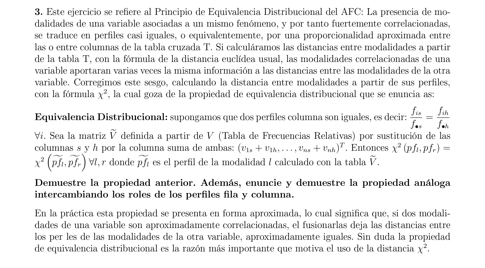
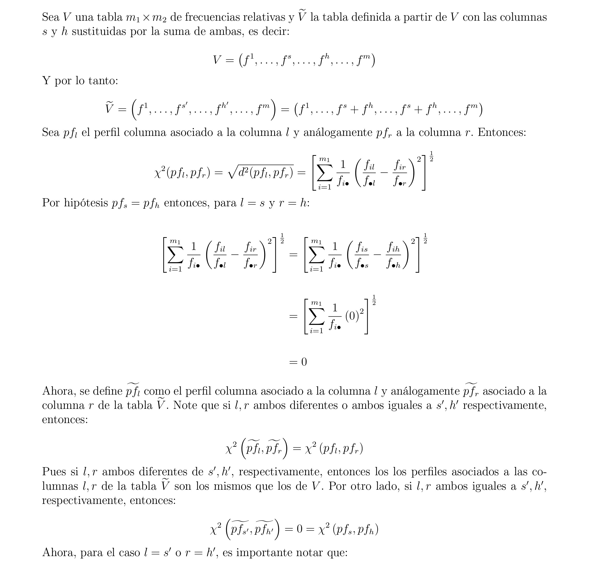
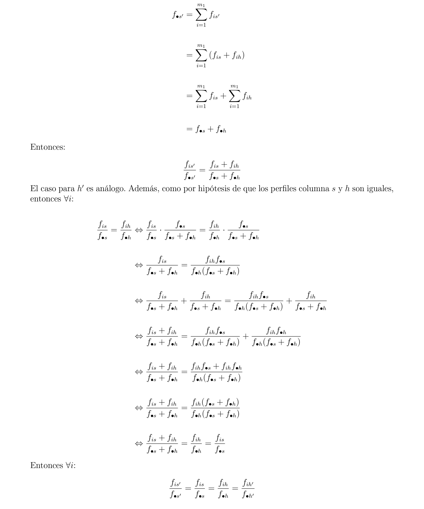
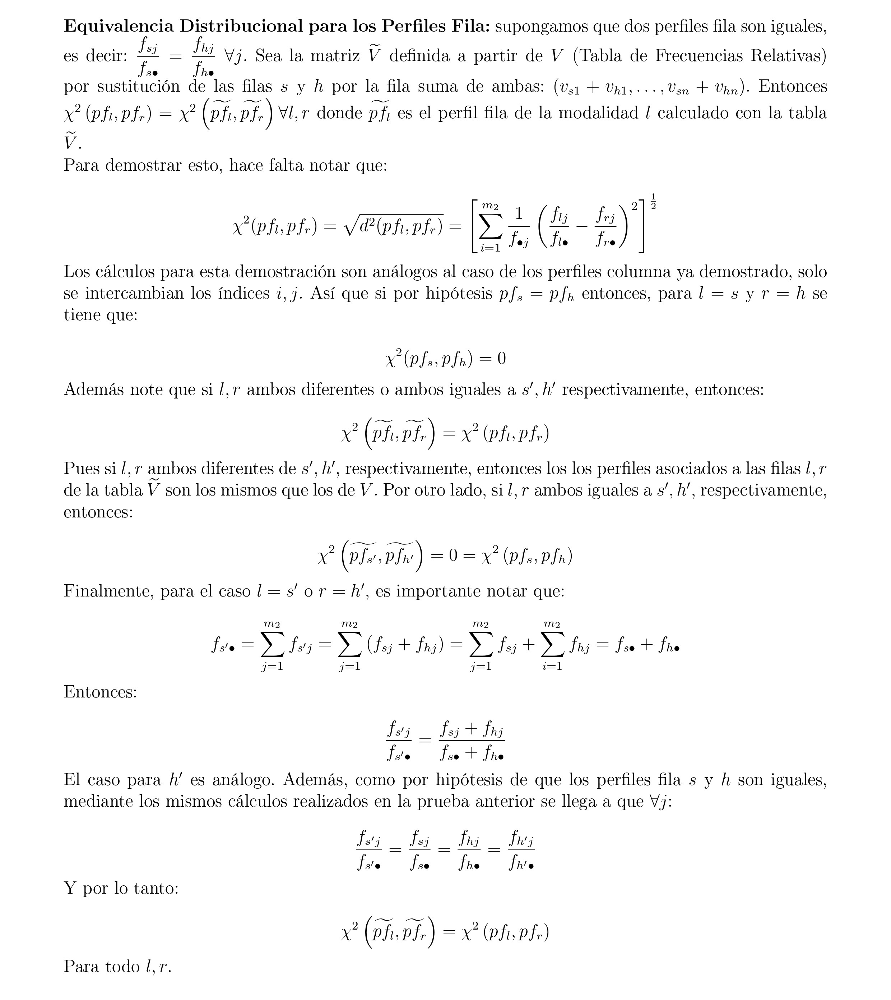

```{r setup, include=FALSE}
knitr::opts_chunk$set(echo = TRUE)
```

# Librerias
```{r, warning=FALSE, message=FALSE}
library(factoextra)
library(FactoMineR)
```

# Ejercicio 3







# Ejercicio 4
  
**Usando las variables categóricas de la tabla de datos poison del paquete FactoMineR realice un AFCM con la función MCA(...) del paquete FactoMineR. Incluya e interprete al menos: 1) Grafico de varianzas explicadas por los ejes 2) Grafico de variables 3) Grafico de variables con modalidades 4) el Biplot 5) cos2(x) de modalidades y variables y 6) contribuciones de variables y modalidades a la formación de ejes.**

## Base de datos

Se carga la base de datos `poison` del paquete `FactoMiner`.
```{r}
data(poison)

knitr::kable(head(poison[,1:10]))
```

## AFCM

Se realiza el *AFCM* con las variables categóricas de la base de datos `poison`
```{r}
poison_quali <- poison[,-c(1:2)]
poisonAFCM <- MCA(poison_quali, ncp = 13, graph = FALSE)
poisonAFCM
```
## Gráfico de varianzas explicadas por los ejes


Para realizar dicho gráfico se deben obtener las varianzas explicadas por los 
ejes, los cuales, son los valores propios asociados a cada eje.

```{r}
eigen_values <- get_eigenvalue(poisonAFCM)
eigen_values
```

A continuación, se presenta el gráfico de varianzas explicadas por los ejes.

```{r}
fviz_screeplot(poisonAFCM, ncp = 13, addlabels = TRUE, ylim = c(0, 45))
```
Como se puede observar, las componente 1 y 2 contribuyen más en la explicación
de la varianza. Conforme se realizan más pasos del AFCM, menos aporte a la varianza
se obtiene de cada componente principal. 

## Gráfico de las variables

```{r}
fviz_mca_var(poisonAFCM, choice = "mca.cor", repel = TRUE) 
```

En el gráfico se puede apreciar que las variables Fever, Sick, Diarrhae y 
Abdominals tienen mayor presencia en la componente principal 1. Por otro lado, 
las variables Courgette, Potato, Icecream, Sex y Fish tienen mayor presencia en
la componente 2. También, se puede apreciar que las variables Cheese, Nausea y 
Mayo tienen una presencia baja en ambos componentes y Vomiting una presencia 
moderada. 

## Gráfico de las modalidades con las variables 

```{r}
fviz_mca_var(poisonAFCM, choice = "var.cat", repel = TRUE)
```
En el gráfico se muestra que un infante que esté enfermo es probable que haya 
consumido queso, pescado, helado o mayo. Y que también presente fiebre, náuseas, 
diarrea, vómitos o dolor abdominal. En cambio, aquellos infantes que no estén 
enfermos es probable que no consumieron queso o mayo y que tampoco presenten fiebre, 
diarrea o  dolor abdominal. Además, infantes que consumieron papas y courgette no 
presentan náuseas o vómitos. Los infantes que no comieron pescado es muy probable
que no hayan consumido papas por la correlación positiva fuerte que se muestra.

## Gráfico de superposición Biplot

Se muestra el gráfico de superposicion de las variables con los individuos.

```{r}
fviz_mca_biplot(poisonAFCM, repel = TRUE)
```

Se puede observar que se forman dos clústeres de individuos, una de los que no 
están enfermos y otro de los que sí, y que presentan las características mencionadas
en el análisis del  gráfico anterior.

## Gráficos de cos2(x) y contribuciones de las modalidades de las variables

Se van a gráficar las calidades de representación y las contribuciones de las 
modalidades para las dos primeras dimensiones.

Para lo cual, es necesario conocer los cosenos cuadrados y contribuciones de las
modalidades. 

**Cos2 de las modalidades**
```{r}
var_categories <- get_mca_var(poisonAFCM)
head(var_categories$cos2)
```

**Contribuciones de las modalidades a las componentes**
```{r}
head(var_categories$contrib)
```
### Gráfico cos(2x)

Primeramente, se presenta el top 15 de los cos2(x) de las variables:

```{r}
fviz_cos2(poisonAFCM, choice = "var", axes = 1:2, top = 15)
```
De acuerdo con el gráfico, las modalidades mejores representadas en las primeras
dos dimensiones son Sick_y y Sick_n, seguidas de los síntomas. En cambio, la 
calidad de la representación de los alimentos es menor. 
      
### Gráfico de las contribuciones de las modalidades a la formación de los ejes 

El top 15 de las calidades de las modalidades se muestran en el siguiente gráfico:

```{r}
fviz_contrib(poisonAFCM, choice = "var", axes = 1:2, top = 15)
```
Según lo observado en el gráfico, las modalidades que más contribuyen a la 
formación de la dimensión 1 y 2 son Sick_n y Abdo_n. Por otro lado, las
modalidades Vomit_n, Icecream_n y Cheese_n aportan menos del umbral promedio
de contribución.

## Gráficos de cos2(x) y contribuciones de los individuos

Se van a gráficar las calidades de representación y las contribuciones de los
individuos para las dos primeras dimensiones.

Para lo cual, es necesario conocer los cosenos cuadrados y contribuciones de los
individuos. 

**Cos2 de los individuos**
```{r}
ind <- get_mca_ind(poisonAFCM)
head(ind$cos2)
```
**Contribuciones de los individuos**

```{r}
head(ind$contrib)
```
### Gráfico cos(2x)

El siguiente gráfico muestra el top 15 de las calidades de representación 
de los individuos:

```{r}
fviz_cos2(poisonAFCM, choice = "ind", axes = 1:2, top = 15)
```
Se puede observar en el gráfico, que todos los individuos del top se encuentran
bien representados pues, presentan un valor del coseno al cuadrado mayor al 10%.
También, se puede ver que los individuos mejores representados son el 51, 20, 4 
y 14.


### Gráfico de las contribuciones de las modalidades a la formación de los ejes 

El top 15 de las contribuciones de los individuos a la formación de los ejes
se presenta en el gráfico a continuación:
```{r}
fviz_contrib(poisonAFCM, choice = "ind", axes = 1:2, top = 15)
```
De acuerdo con lo mostrado en el gráfico, los individuos que más contribuyen a la 
formación de la dimensión 1 y 2 son el 53 y el 44. Además, dado que la contribución
de los individuos del top 15 están por encima de la línea roja, significa
que el aporte de estos es superior al umbral promedio de contribución.
