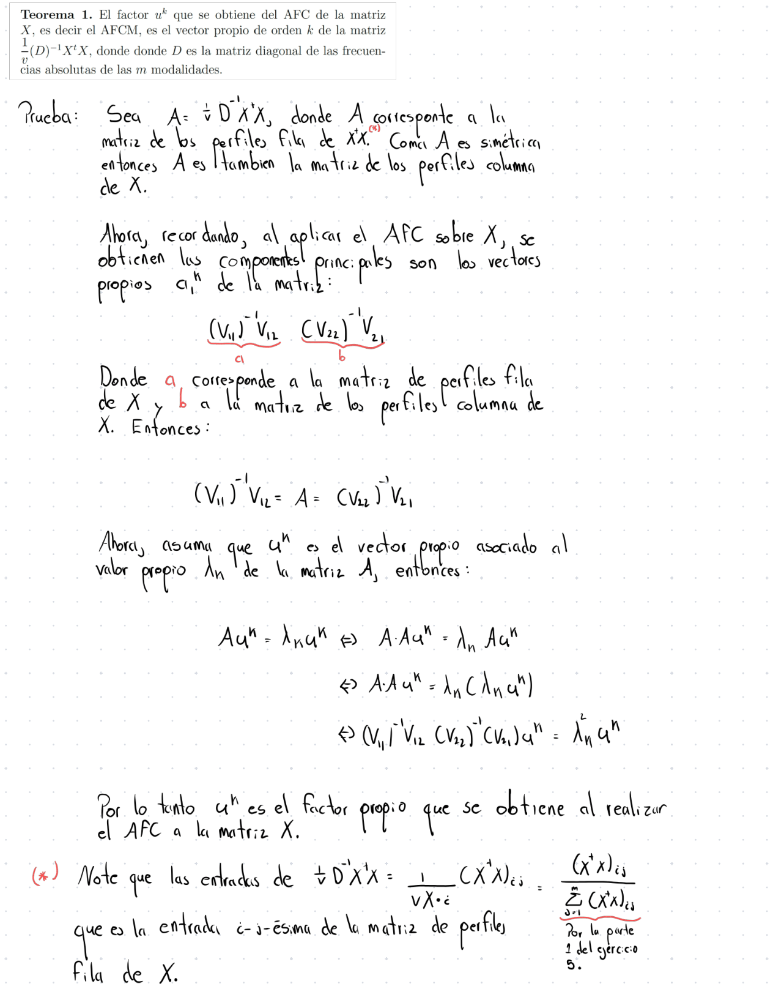
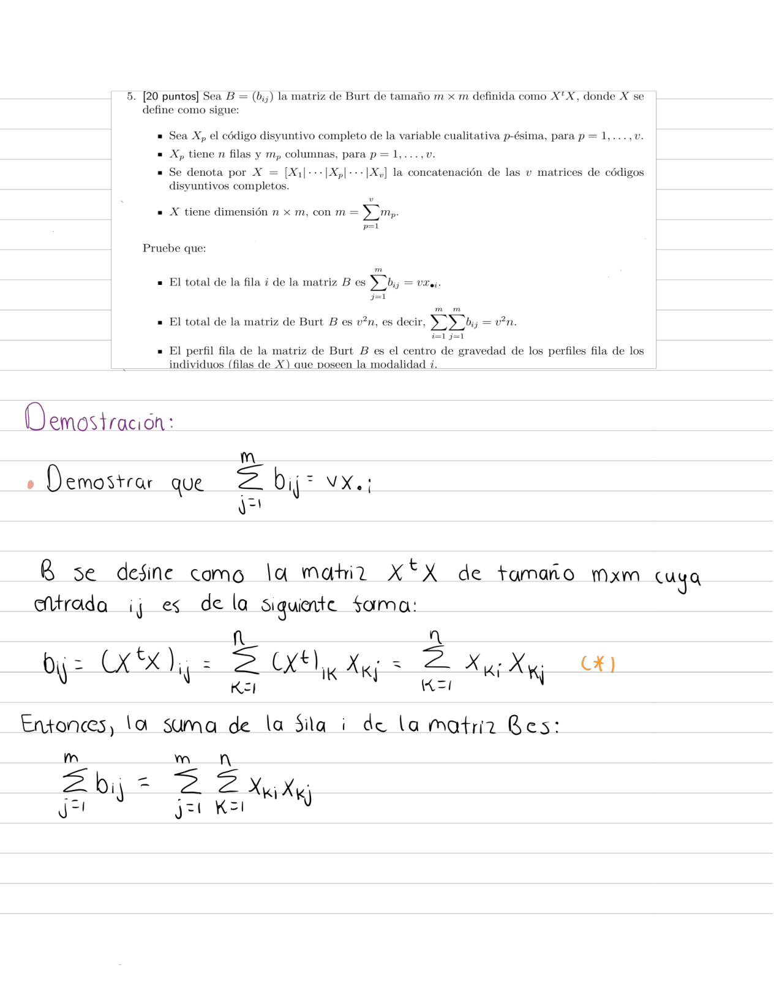
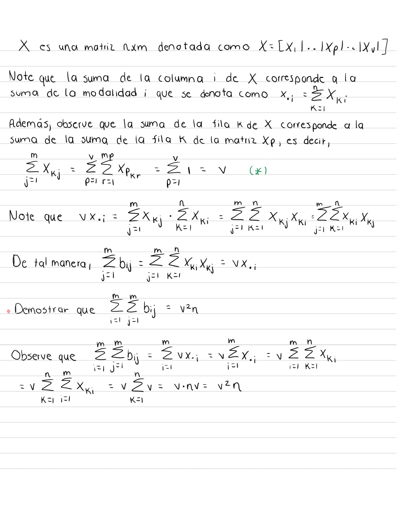
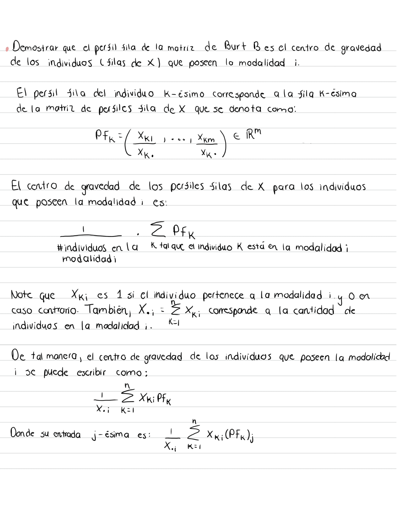
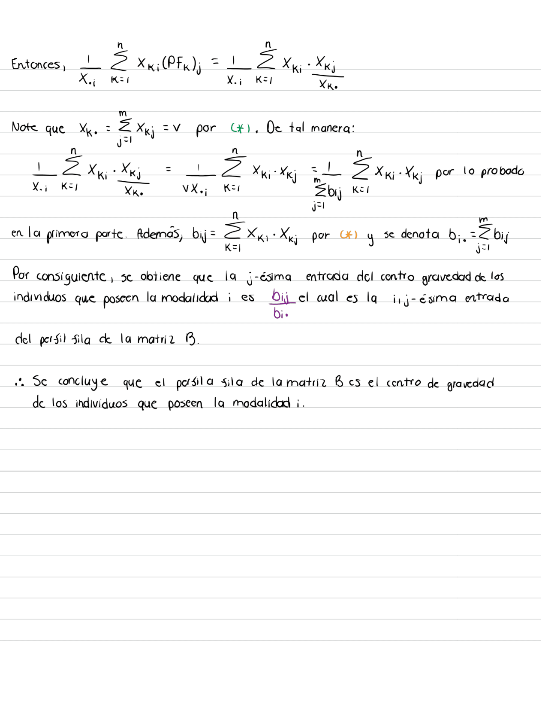

```{r setup, include=FALSE}
knitr::opts_chunk$set(echo = TRUE)
```

# Librerias
```{r, warning=FALSE, message=FALSE}
library(factoextra)
library(FactoMineR)
```

# Ejercicio 1



# Ejercicio 2

**Construya un ejemplo pequeño a pie con 4 variables categóricas que permita verificar el Teorema 2 visto en clase. Además, compare con el resultado de la función MCA(....) del paquete FactoMineR.**

Primero creamos las matrices en código disyuntivo de las 4 variables

```{r}
sexo <- matrix(
  c(0 , 1 , 
    0 , 1 , 
    1 , 0 ,
    1 , 0 ,
    0 , 1 ,
    1 , 0 ,
    0 , 1 ,
    1 , 0 ,
    1 , 0 ,
    0 , 1 ), nrow=10,ncol = 2, byrow = T)

sexo_df <- as.data.frame(sexo)
colnames(sexo_df) <- c("Mujer","Hombre")

Ingresos <- matrix(
  c(1 , 0 , 0 , 
    0 , 0 , 1 ,
    0 , 1 , 0 ,
    1 , 0 , 0 ,
    0 , 1 , 0 ,
    0 , 0 , 1 ,
    0 , 1 , 0 ,
    0 , 0 , 1 ,
    1 , 0 , 0 ,
    1 , 0 , 0 ), nrow=10,ncol = 3, byrow = T)

Ingresos_df <- as.data.frame(Ingresos)
colnames(Ingresos_df) <- c("Bajo","Medio","Alto")

Estado_civil <- matrix(
  c(0 , 1 , 0 , 0 ,
    0 , 0 , 1 , 0 ,
    0 , 0 , 0 , 1 ,
    1 , 0 , 0 , 0 ,
    0 , 1 , 0 , 0 ,
    0 , 0 , 1 , 0 ,
    0 , 1 , 0 , 0 ,
    0 , 0 , 1 , 0 ,
    1 , 0 , 0 , 0 ,
    0 , 0 , 0 , 1 ), nrow=10,ncol = 4, byrow = T)

Estado_civil_df <- as.data.frame(Estado_civil)
colnames(Estado_civil_df) <- c("Soltero","Casado","Viudo","Divorciado")

Nivel_educativo <- matrix(
  c(0 , 0 , 1 ,
    0 , 0 , 1 ,
    0 , 1 , 0 ,
    1 , 0 , 0 ,
    0 , 1 , 0 ,
    1 , 0 , 0 ,
    0 , 1 , 0 ,
    0 , 0 , 1 ,
    1 , 0 , 0 ,
    1 , 0 , 0 ), nrow=10,ncol = 3, byrow = T)

Nivel_educativo_df <- as.data.frame(Nivel_educativo)
colnames(Nivel_educativo_df) <- c("Primaria","Secundaria","Universitaria")
```

Se procede a calcular como primer método la matriz X la cual esta formada por la
concatenación de las 4 tablas de códigos disyuntivos completos.

```{r}
X <- cbind(sexo_df, Ingresos_df, Estado_civil_df, Nivel_educativo_df)
print(X)

AFCM_X <- CA(X, graph = FALSE)
```

## Coordenadas
```{r}
AFCM_X$col$coord
```

## Valores propios
```{r}
AFCM_X$eig[,1]
```

## Valores propios al cuadrado
```{r}
AFCM_X$eig[,1]^2
```

## Gráfico
```{r}
plot(AFCM_X,invisible = "row")
```

Como segundo método se va a realizar la matriz de Burt que es la matriz B que
cruza las modalidades de las 4 variables. 

```{r}
# Construimos la Tabla de Burt

B11 <- t(sexo) %*% sexo
B12 <- t(sexo) %*% Ingresos
B13 <- t(sexo) %*% Estado_civil
B14 <- t(sexo) %*% Nivel_educativo
FB1 <- cbind(B11,B12,B13,B14)

B21 <- t(Ingresos) %*% sexo
B22 <- t(Ingresos) %*% Ingresos
B23 <- t(Ingresos) %*% Estado_civil
B24 <- t(Ingresos) %*% Nivel_educativo
FB2 <- cbind(B21,B22,B23,B24)

B31 <- t(Estado_civil) %*% sexo
B32 <- t(Estado_civil) %*% Ingresos
B33 <- t(Estado_civil) %*% Estado_civil
B34 <- t(Estado_civil) %*% Nivel_educativo
FB3 <- cbind(B31,B32,B33,B34)

B41 <- t(Nivel_educativo) %*% sexo
B42 <- t(Nivel_educativo) %*% Ingresos
B43 <- t(Nivel_educativo) %*% Estado_civil
B44 <- t(Nivel_educativo) %*% Nivel_educativo
FB4 <- cbind(B41,B42,B43,B44)

matriz_burt <- rbind(FB1,FB2,FB3, FB4)

matriz_burt <- as.data.frame(matriz_burt)
colnames(matriz_burt) <- c("Mujer","Hombre","Bajo","Medio","Alto","Soltero",
                           "Casado","Viudo","Divorciado","Primaria",
                           "Secundaria","Universitaria")
print(matriz_burt)
AFCM_B <- CA(matriz_burt, graph = FALSE)
```

## Coordenadas
```{r}
AFCM_B$col$coord
```

## Valores propios
```{r}
AFCM_B$eig[,1]
```

## Gráfico 
```{r}
plot(AFCM_B, invisible = "row")
```

Los valores propios de la matriz B son los mismos que los valores propios al 
cuadrado de la matriz $X^tX$ en las primeras 6 dimensiones. En cuanto a los restantes 4, 
estos difieren, pues, al ser números cercanos a cero por cuestiones de cálculo de 
la multiplicación de las matrices la precisión númerica cambia en comparación con 
la matriz de Burt. Además, las coordenadas de las matrices difieren por 
decimales, sin embargo, el plano principal son semejantes.

Por último, se van a verificar los resultados obtenidos por medio del paquete 
FactoMiner y su función MCA. 

```{r}
categorias_sexo <- colnames(sexo_df)
indices_sexo <- max.col(sexo_df)
sexo_original <- categorias_sexo[indices_sexo]

categorias_ingresos <- colnames(Ingresos_df)
indices_ingresos <- max.col(Ingresos_df)
ingresos_original <- categorias_ingresos[indices_ingresos]

categorias_estado_civil <- colnames(Estado_civil_df)
indices_estado_civil <- max.col(Estado_civil_df)
estado_civil_original <- categorias_estado_civil[indices_estado_civil]

categorias_nivel_educativo <- colnames(Nivel_educativo_df)
indices_nivel_educativo <- max.col(Nivel_educativo_df)
nivel_educativo_original <- categorias_nivel_educativo[indices_nivel_educativo]

datos <- data.frame(
  Sexo = sexo_original,
  Ingresos = ingresos_original,
  'Estado civil' = estado_civil_original,
  'Nivel educativo' = nivel_educativo_original
)

rownames(datos) <- c("F1","F2","F3","F4","F5","F6","F7","F8","F9","F10")
str(datos)

AFCM_MCA <- MCA(datos, ncp = 5, graph = FALSE)
```

## Coordenadas

```{r}
AFCM_MCA$var$coord
```

## Valores propios 
```{r}
AFCM_MCA$eig[,1]
```

## Gráfico
```{r}
fviz_mca_var(AFCM_MCA, choice = "var.cat",repel = TRUE)
```

Los valores propios y las coordenadas de los métodos anteriores difieren a lo obtenido con la 
función MCA, pues, por cuestiones de cálculo dentro de las funciones MCA y CA .
Sin embargo, el plano principal es semejante.


# Ejercicio 3


# Ejercicio 4
  
**Usando las variables categóricas de la tabla de datos poison del paquete FactoMineR realice un AFCM con la función MCA(...) del paquete FactoMineR. Incluya e interprete al menos: 1) Grafico de varianzas explicadas por los ejes 2) Grafico de variables 3) Grafico de variables con modalidades 4) el Biplot 5) cos2(x) de modalidades y variables y 6) contribuciones de variables y modalidades a la formación de ejes.**

## Base de datos

Se carga la base de datos `poison` del paquete `FactoMiner`.
```{r}
data(poison)

knitr::kable(head(poison[,1:10]))
```

## AFCM

Se realiza el *AFCM* con las variables categóricas de la base de datos `poison`
```{r}
poison_quali <- poison[,-c(1:2)]
poisonAFCM <- MCA(poison_quali, ncp = 13, graph = FALSE)
poisonAFCM
```
## Gráfico de varianzas explicadas por los ejes


Para realizar dicho gráfico se deben obtener las varianzas explicadas por los 
ejes, los cuales, son los valores propios asociados a cada eje.

```{r}
eigen_values <- get_eigenvalue(poisonAFCM)
eigen_values
```

A continuación, se presenta el gráfico de varianzas explicadas por los ejes.

```{r}
fviz_screeplot(poisonAFCM, ncp = 13, addlabels = TRUE, ylim = c(0, 45))
```
Como se puede observar, las componente 1 y 2 contribuyen más en la explicación
de la varianza. Conforme se realizan más pasos del AFCM, menos aporte a la varianza
se obtiene de cada componente principal. 

## Gráfico de las variables

```{r}
fviz_mca_var(poisonAFCM, choice = "mca.cor", repel = TRUE) 
```

En el gráfico se puede apreciar que las variables Fever, Sick, Diarrhae y 
Abdominals tienen mayor presencia en la componente principal 1. Por otro lado, 
las variables Courgette, Potato, Icecream, Sex y Fish tienen mayor presencia en
la componente 2. También, se puede apreciar que las variables Cheese, Nausea y 
Mayo tienen una presencia baja en ambos componentes y Vomiting una presencia 
moderada. 

## Gráfico de las modalidades con las variables 

```{r}
fviz_mca_var(poisonAFCM, choice = "var.cat", repel = TRUE)
```
En el gráfico se muestra que un infante que esté enfermo es probable que haya 
consumido queso, pescado, helado o mayo. Y que también presente fiebre, náuseas, 
diarrea, vómitos o dolor abdominal. En cambio, aquellos infantes que no estén 
enfermos es probable que no consumieron queso o mayo y que tampoco presenten fiebre, 
diarrea o  dolor abdominal. Además, infantes que consumieron papas y courgette no 
presentan náuseas o vómitos. Los infantes que no comieron pescado es muy probable
que no hayan consumido papas por la correlación positiva fuerte que se muestra.

## Gráfico de superposición Biplot

Se muestra el gráfico de superposicion de las variables con los individuos.

```{r}
fviz_mca_biplot(poisonAFCM, repel = TRUE)
```

Se puede observar que se forman dos clústeres de individuos, una de los que no 
están enfermos y otro de los que sí, y que presentan las características mencionadas
en el análisis del  gráfico anterior.

## Gráficos de cos2(x) y contribuciones de las modalidades de las variables

Se van a gráficar las calidades de representación y las contribuciones de las 
modalidades para las dos primeras dimensiones.

Para lo cual, es necesario conocer los cosenos cuadrados y contribuciones de las
modalidades. 

**Cos2 de las modalidades**
```{r}
var_categories <- get_mca_var(poisonAFCM)
head(var_categories$cos2)
```

**Contribuciones de las modalidades a las componentes**
```{r}
head(var_categories$contrib)
```
### Gráfico cos(2x)

Primeramente, se presenta el top 15 de los cos2(x) de las variables:

```{r}
fviz_cos2(poisonAFCM, choice = "var", axes = 1:2, top = 15)
```
De acuerdo con el gráfico, las modalidades mejores representadas en las primeras
dos dimensiones son Sick_y y Sick_n, seguidas de los síntomas. En cambio, la 
calidad de la representación de los alimentos es menor. 
      
### Gráfico de las contribuciones de las modalidades a la formación de los ejes 

El top 15 de las calidades de las modalidades se muestran en el siguiente gráfico:

```{r}
fviz_contrib(poisonAFCM, choice = "var", axes = 1:2, top = 15)
```
Según lo observado en el gráfico, las modalidades que más contribuyen a la 
formación de la dimensión 1 y 2 son Sick_n y Abdo_n. Por otro lado, las
modalidades Vomit_n, Icecream_n y Cheese_n aportan menos del umbral promedio
de contribución.

## Gráficos de cos2(x) y contribuciones de los individuos

Se van a gráficar las calidades de representación y las contribuciones de los
individuos para las dos primeras dimensiones.

Para lo cual, es necesario conocer los cosenos cuadrados y contribuciones de los
individuos. 

**Cos2 de los individuos**
```{r}
ind <- get_mca_ind(poisonAFCM)
head(ind$cos2)
```
**Contribuciones de los individuos**

```{r}
head(ind$contrib)
```
### Gráfico cos(2x)

El siguiente gráfico muestra el top 15 de las calidades de representación 
de los individuos:

```{r}
fviz_cos2(poisonAFCM, choice = "ind", axes = 1:2, top = 15)
```
Se puede observar en el gráfico, que todos los individuos del top se encuentran
bien representados pues, presentan un valor del coseno al cuadrado mayor al 10%.
También, se puede ver que los individuos mejores representados son el 51, 20, 4 
y 14.


### Gráfico de las contribuciones de las modalidades a la formación de los ejes 

El top 15 de las contribuciones de los individuos a la formación de los ejes
se presenta en el gráfico a continuación:
```{r}
fviz_contrib(poisonAFCM, choice = "ind", axes = 1:2, top = 15)
```
De acuerdo con lo mostrado en el gráfico, los individuos que más contribuyen a la 
formación de la dimensión 1 y 2 son el 53 y el 44. Además, dado que la contribución
de los individuos del top 15 están por encima de la línea roja, significa
que el aporte de estos es superior al umbral promedio de contribución.

# Ejercicio 5






