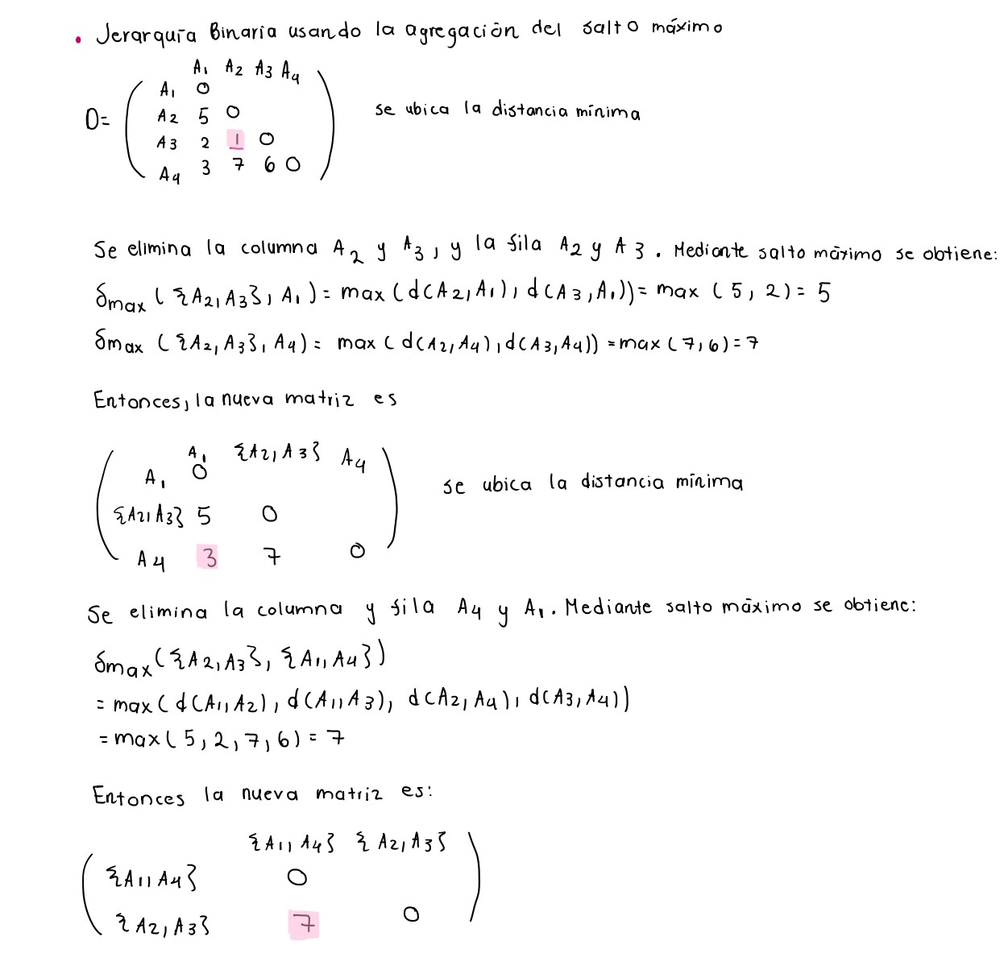
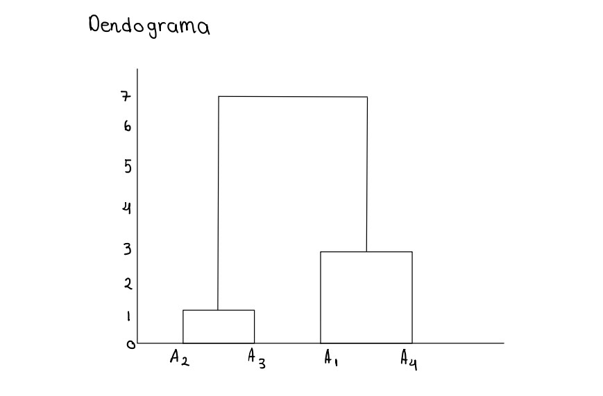
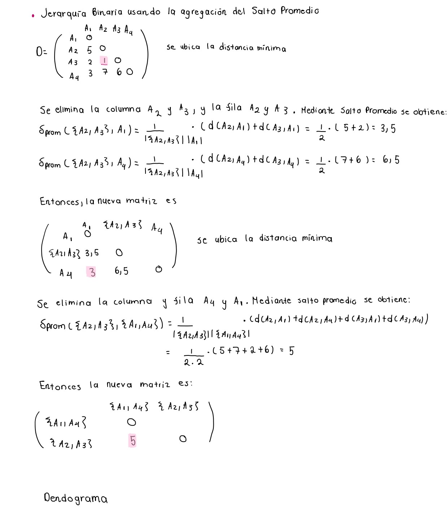
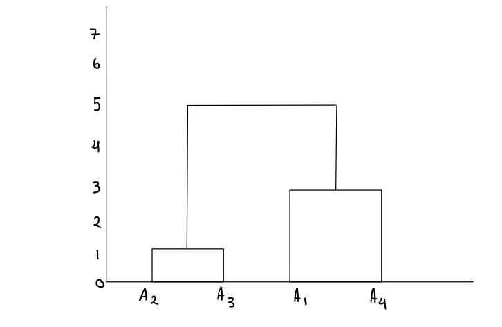
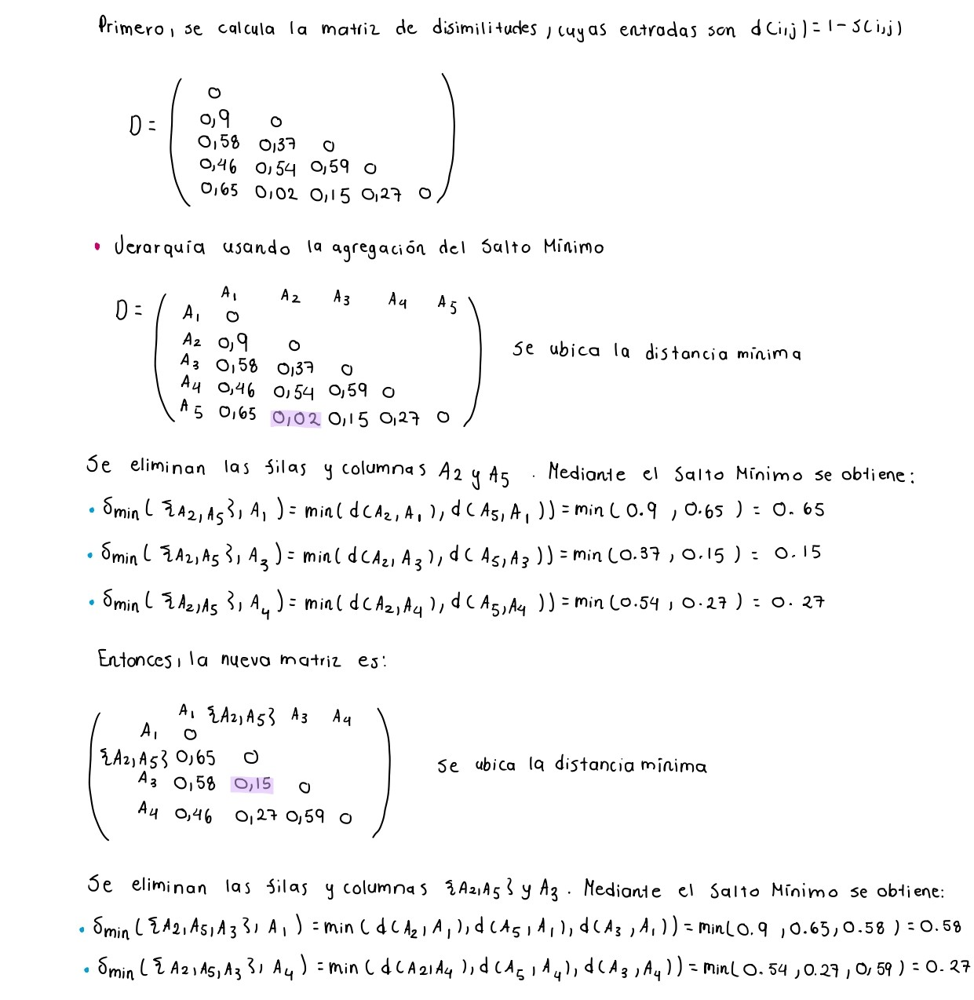
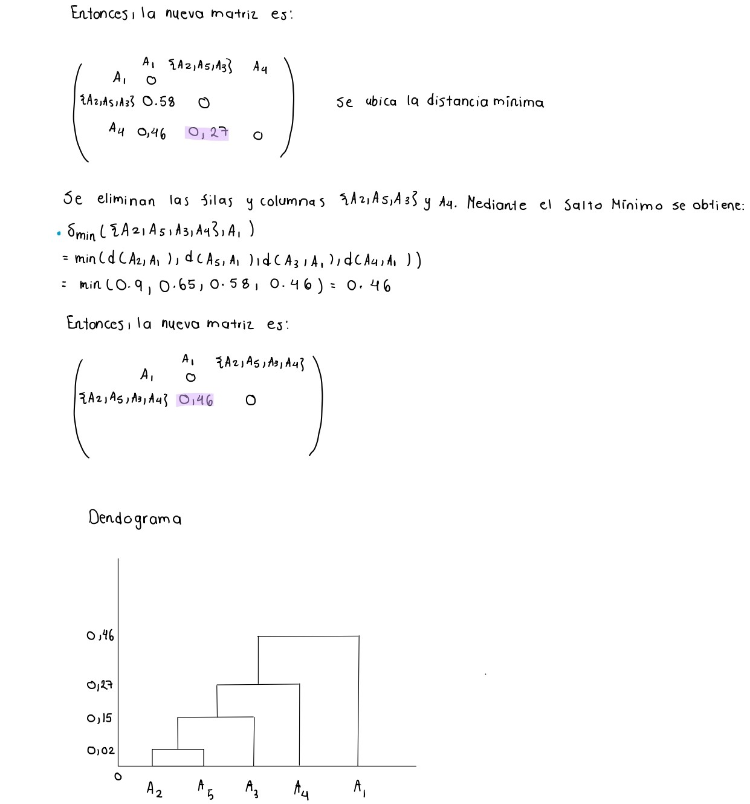
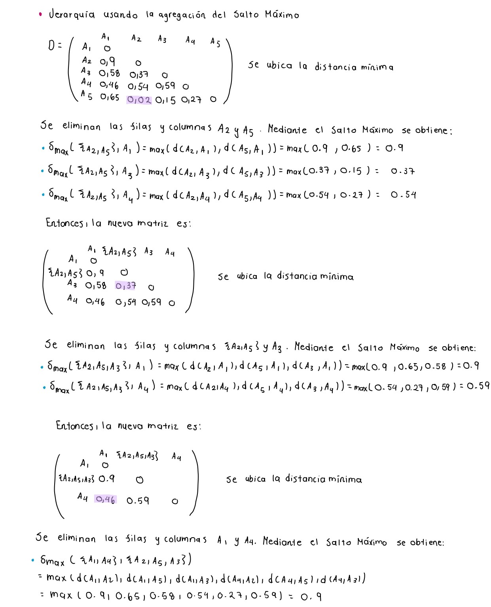
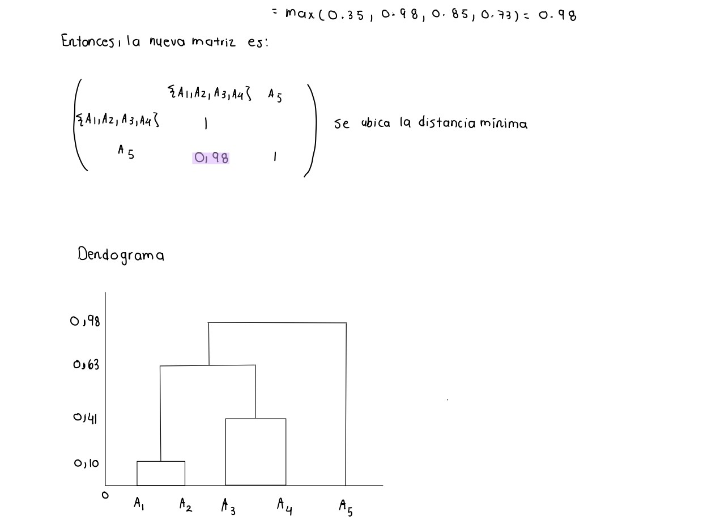

```{r setup, include=FALSE}
knitr::opts_chunk$set(echo = TRUE)
```

```{r, warning=FALSE}
library(cluster)
library(ggplot2)
library(factoextra)
```


# Ejercicio 4
**Dada la siguiente matriz de disimilitudes entre cuatro individuos A1, A2, A3 y A4, construya a mano" una Jerarquía Binaria usando la agregación del Salto Máximo y del Promedio, dibuje el dendograma en ambos casos: **

\[
D = \begin{bmatrix}
0 &   &   &    \\
5 & 0 &   &  \\
2 & 1 & 0 &   \\
3 & 7 & 6 & 0 \\
\end{bmatrix} 
\]

Primeramente, se crea la matriz de disimilitud D proporcionada.
```{r}
disimilitud_matriz <- rbind(rep(0, 4), c(5,0,0,0), c(2,1,0,0), c(3,7,6,0))
disimilitud_matriz <- as.dist(disimilitud_matriz)
disimilitud_matriz

```

Con esa matriz, se realiza la Jerarquía Binaria usando la agregación del Salto
Máximo y del Promedio.

## Agregación Salto Máximo



### Comparación con hclust
```{r}
modelo_SM <- hclust(disimilitud_matriz, method = "complete")
plot(modelo_SM)
```

Como se puede observar, el dendograma que se obtiene da las mismas agrupaciones
y alturas que las obtenidas con el procedimiento "a mano".

## Agregación Salto Promedio



### Comparación con hclust
```{r}
modelo_SP <- hclust(disimilitud_matriz, method = "average")
plot(modelo_SP)
```

El dendograma que se obtiene con hclust es el mismo que el dado con el
procedimiento a mano. Además, las agrupaciones formadas son las mismas que
con la agregación de Salto Máximo pero difieren en la altura de la última 
jerarquía ya que, con Salto Promedio es de 5 y con Salto Máximo es de 7.

# Ejercicio 5
**Dada la siguiente matriz de disimilitudes entre cinco individuos A1, A2, A3, A4 y A5 construya a mano" una Jerarquía Binaria usando la agregación del Salto Mínimo y del Salto Máximo, dibuje el dendograma en ambos casos: **

\[
S = \begin{bmatrix}
0.10 & 1    &      &      & \\
0.42 & 0.63 & 1    &      &  \\
0.54 & 0.46 & 0.41 & 1    &   \\
0.35 & 0.98 & 0.85 & 0.73 & 1  \\
\end{bmatrix} 
\]

Primeramente, se crea la matriz de disimilitud S proporcionada.
```{r}
  disimilitud_matriz_S <- 
  rbind(c(1,0,0,0,0), c(0.10,1,0,0,0), c(0.42,0.63,1,0,0),c(0.54,0.46,0.41,1,0),c(0.35,0.98,0.85,0.73,1))
disimilitud_matriz_S <- as.dist(disimilitud_matriz_S)
disimilitud_matriz_S

```

Con esa matriz, se realiza la Jerarquía Binaria usando la agregación del Salto
Mínimo y del Salto Máximo.

## Agregación Salto Mínimo



### Comparación con hclust
```{r}
modelo_SMin <- hclust(disimilitud_matriz_S, method = "single")
plot(modelo_SMin)
```

Como se puede observar, el dendograma que se obtiene da las mismas agrupaciones
y alturas que las obtenidas con el procedimiento "a mano".

## Agregación Salto Máximo



### Comparación con hclust
```{r}
modelo_SMax <- hclust(disimilitud_matriz_S, method = "complete")
plot(modelo_SMax)
```

El dendograma que se obtiene con hclust es el mismo que el dado con el
procedimiento a mano, dado que se tienen las mismas agrupaciones y alturas. Además,
note que la Jerarquía Binaria por la agregación de Salto Máximo y del Salto Mínimo
también agrupan 1 con 2 y 3 con 4, pero difieren en la manera de agrupar con 5 y las alturas
con el Salto Máximo son mayores.