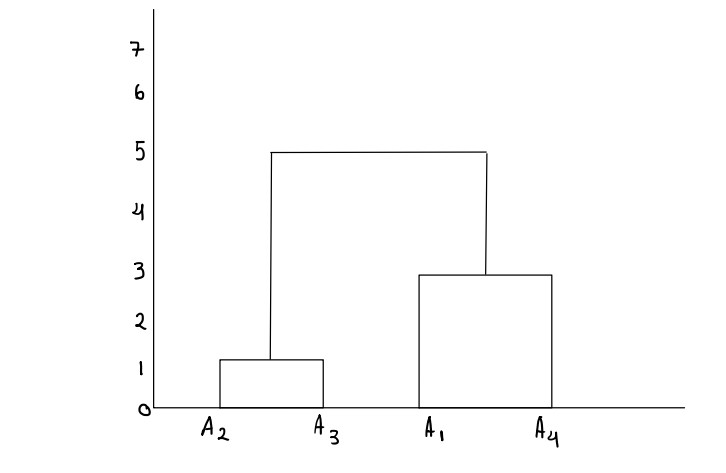
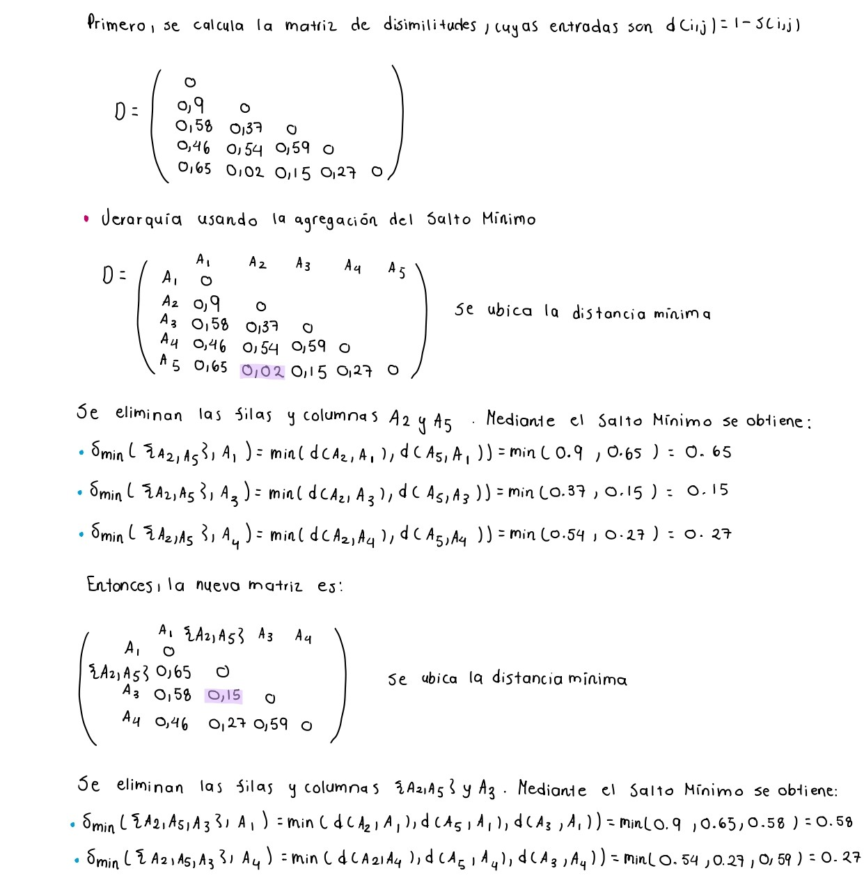
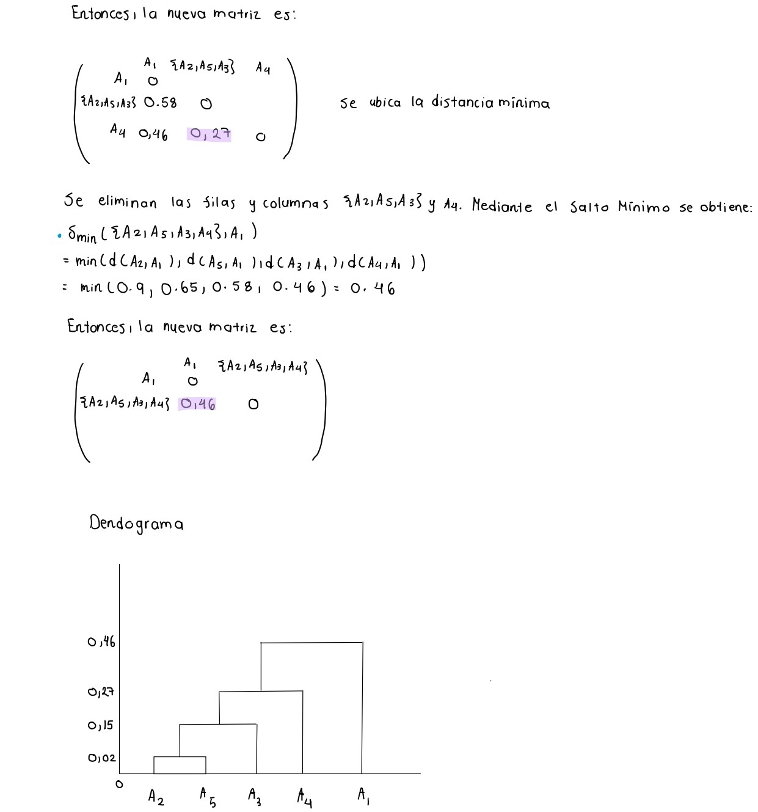
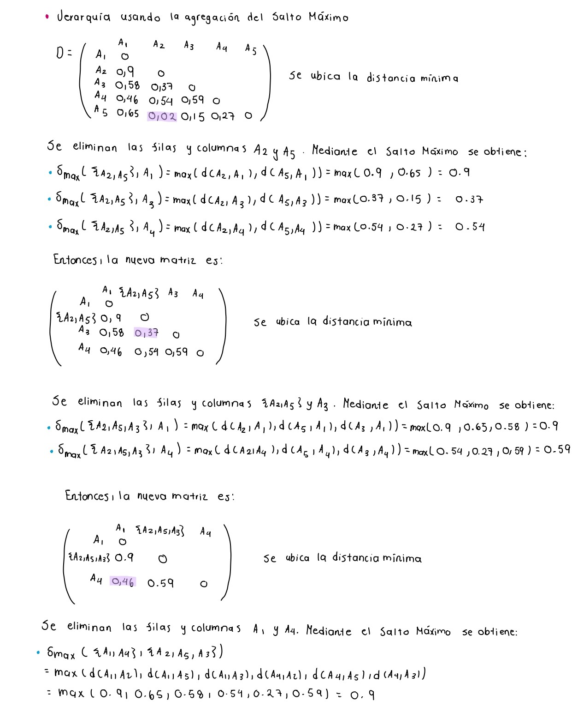
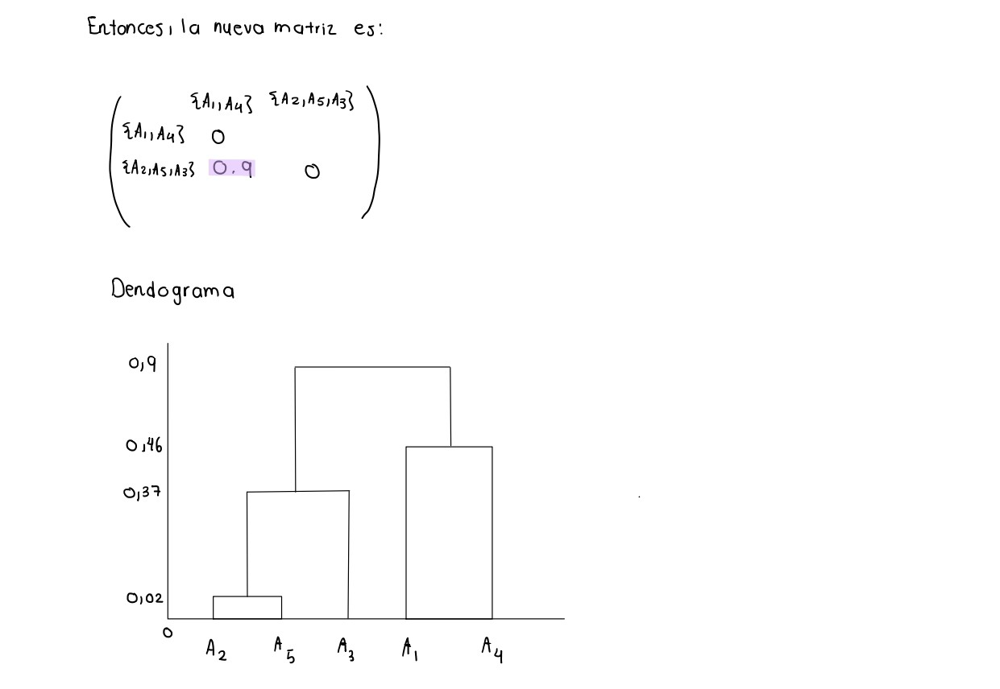

```{r setup, include=FALSE}
knitr::opts_chunk$set(echo = TRUE)
```

# Librerías 
```{r, warning=FALSE, message=FALSE}
library(readr)
library(cluster)
library(dplyr)
library(factoextra)
library(FactoMineR) 
library(ggplot2)
library(gridExtra)
```

# Ejercicio 1

**En este ejercicio usaremos la tabla de datos EjemploAlgoritmosRecomendación.csv, la cual contiene los promedios de evaluación de 100 personas que adquirieron los mismos productos o muy similares en la tienda AMAZON. La idea consiste en recomendar a un cliente los productos que ha comprado otra persona que pertenece al mismo clúster.**

Se carga la base de datos necesaria.

```{r, warning=FALSE, message=FALSE}
datos_Amazon <- read.table('EjemploAlgoritmosRecomendacion.csv', header=TRUE, sep=';',dec=',',row.names=1)
```

- **a) Ejecute un Clustering Jerárquico con la distancia euclídea y la agregación del Salto Máximo, Salto Mínimo, Promedio y Ward. Guarde la tabla de datos en el archivo AlgoritmosRecomendación2.csv con el clúster al que pertenece cada individuo para el caso de la agregación de Ward usando 2 clústeres.**

**Clustering Jerárquico con agregación del Salto Máximo**

```{r, warning=FALSE}
clustering_SaltoMaximo<- hclust(dist(datos_Amazon), method = "complete")
fviz_dend(clustering_SaltoMaximo, cex = 0.4, repel = TRUE)
```

**Clustering Jerárquico con agregación del Salto Mínimo**

```{r, warning=FALSE}
clustering_SaltoMinimo <- hclust(dist(datos_Amazon), method = "single")
fviz_dend(clustering_SaltoMinimo, cex = 0.4, repel = TRUE)

```

**Clustering Jerárquico con agregación del Salto Promedio**

```{r, warning=FALSE}
clustering_SaltoPromedio <- hclust(dist(datos_Amazon), method = "average")
fviz_dend(clustering_SaltoPromedio, cex = 0.4, repel = TRUE)

```

**Clustering Jerárquico con agregación Ward**
    
```{r, warning=FALSE}
clustering_Ward <- hclust(dist(datos_Amazon), method = "ward.D")
fviz_dend(clustering_Ward , cex = 0.4, repel = TRUE)

```

Ahora, usando el resultado obtenido por la agregación de Ward, se procede a guardar una tabla de datos con el clúster al que pertenece cada individuo usando 2 clústeres en el archivo AlgoritmosRecomendacion2.csv.

Primero, se añade la columna que indica el clúster al que pertenece cada individuo.
```{r}
Cluster <- cutree(clustering_Ward,k=2)
tabla_clusters_ward <- cbind(datos_Amazon,Cluster)
head(tabla_clusters_ward)
```

Después, se guarda en un nuevo documento csv.

```{r}
# Directorio
setwd("C:\\Users\\Caro\\OneDrive - Universidad de Costa Rica\\Escritorio\\Caro UCR\\I semestre 2024\\Análisis de datos\\tareas_analisis_i\\Tarea 8")

# Se guarda el archivo en como un CSV
write.csv(tabla_clusters_ward,"AlgoritmosRecomendacion2.csv")
```

- **b) "Corte" el árbol anterior usando 2 clústeres y la agregación de Ward, interprete los resultados usando gráficos de barras (Horizontal-Vertical) y usando gráficos tipo Radar.**

En el inciso a) se cortó el árbol usando 2 clústeres y la agregación de Ward,
dicho corte se nombró `Cluster`.

**Interpretación**

A continuación, se realiza una interpretación de los clústeres mediante los 
centroides. Por lo tanto, es necesario encontrar el centroide de cada clúster.

De tal manera, se obtienen los centroides para cada clúster y se muestran sus 
coordenadas en el espacio de variables con la siguiente función:
```{r}
centroides_coord <- function(num.cluster, datos, clusters) {
  lista_centroides <- list()
  for(i in 1: num.cluster) {
    ind <- (clusters == i)
    centroide <- colMeans(datos[ind,])
    lista_centroides[[i]] <-  data.frame("Cluster" = i, "Variable" = names(centroide),
                              "Valor" = centroide)
  }
  return(lista_centroides)
}
```

Los centroides para cada clúster son
```{r}
centroides <- centroides_coord(2,datos_Amazon,Cluster)

for(i in 1:length(centroides)) {
  print(head(centroides[[i]]))
}
```

Seguidamente, se realizan los gráficos de barras para cada centroide.
```{r}
# Se juntan los dataframes con las coordenadas de los centroides para cada clúster
centros <- do.call(rbind, centroides)
centros$Cluster <- as.factor(centros$Cluster)        

# Se crean los gráficos de barra
barras1 <- ggplot(centros[centros$Cluster == "1", ], aes(x = Variable, y = Valor)) + 
  geom_bar(stat = "identity", fill = "lightskyblue4") + 
  labs(x = "Variables", y = "Cluster 1") +
  theme_minimal() +
  theme(axis.text.x = element_text(angle = 45, hjust = 1))

barras2 <- ggplot(centros[centros$Cluster == "2", ], aes(x = Variable, y = Valor)) + 
  geom_bar(stat = "identity", fill = "darkolivegreen4") + 
  labs(x = "Variables", y = "Cluster 2") +
  theme_minimal() +
  theme(axis.text.x = element_text(angle = 45, hjust = 1)) 

grid.arrange(barras1, barras2, ncol = 2)

```

De estos gráficos, se puede interpretar que las personas que se encuentran en 
el clúster 1 se inclinan a comprar un producto con un mejor tamaño de paquete y 
durabilidad. En cuanto al clúster 2, las personas prefieren la durabilidad
seguido del número de estrellas que tiene el producto. En ambos clústeres, 
la característica con menor calificación es el precio.  

También, se presenta un gráfico de tipo radar.

```{r}
for (x in unique(centros$Variable)) {
  aux <- centros[centros$Variable == x, "Valor"]
  aux <- aux - min(aux)
  aux <- aux / max(aux)
  centros[centros$Variable == x, "Valor"] <- aux
}

ggplot(data = centros[order(centros$Variable), ],
       aes(x = Variable, y = Valor, group = Cluster)) + 
  geom_point(aes(colour = Cluster)) +
  geom_polygon(aes(colour = Cluster, fill = Cluster), alpha = 0.2) +
  ylim(-0.1, 1) + labs(x = "", y = "") + theme_minimal() +
  theme(axis.ticks.y = element_blank(), axis.text.y = element_blank()) +
  annotate('text', x = 0, y = c(0, 0.25, 0.5, 0.75, 1),
           label = c("0%", "25%", "50%", "75%", "100%"), color = "black") +
  coord_polar()
```

Se puede identificar que, las personas del clúster 1 se inclinan por productos
con una buena calificación en el tamaño del paquete, como se mencionó anteriormente,
pero malas calificaciones en las otras características. Con respecto al segundo clúster, 
se puede interpetrar que los clientes son más cautelesos con los productos que 
compran, pues, tienen buenas calificaciones en todas las características excepto, 
en el tamaño del paquete.


- **c) Si se tienen 4 clústeres usando agregación de Ward ¿Qué productos recomendaría a Teresa, a Leo y a Justin?, es decir, ¿los productos que compra cuál otro cliente? Usando distancia euclídea ¿cuál es la mejor recomendación de compra que le podemos hacer a Teresa, a Leo y a Justin?**

En este caso, el árbol que se obtuvo con distancia euclídea y agregación de Ward  se "corta" 
en 4 clústeres.

```{r}
Cluster_2 <- cutree(clustering_Ward,k=4)
tabla_clusters_ward_2 <- cbind(datos_Amazon,Cluster_2)
head(tabla_clusters_ward_2)

```

Para responder a la pregunta, primeros se identifica el clúster al que pertenecen
Teresa, Leo y Justin.

```{r}
# Encontrar el índice de la fila para Teresa, Leo y Justin
fila_idx_Teresa <- which(rownames(tabla_clusters_ward_2) == "Teresa")
fila_idx_Leo <- which(rownames(tabla_clusters_ward_2) == "Leo")
fila_idx_Justin <- which(rownames(tabla_clusters_ward_2) == "Justin")

col <- ncol(tabla_clusters_ward_2)
Teresa <- tabla_clusters_ward_2[fila_idx_Teresa, col]
Leo <- tabla_clusters_ward_2[fila_idx_Leo, col]
Justin <- tabla_clusters_ward_2[fila_idx_Justin, col]

num_cluster <- list("Teresa" = Teresa, "Leo" = Leo, "Justin" = Justin)
print(num_cluster)
```

Como se puede observar, Teresa se encuentra el clúster 1, Leo en el 3 y Justin 
en el 4.

A continuación, se presenta el siguiente radar que permite interpretar qué 
productos recomendar.

```{r}
# Centroides para cada clúster
centroides_2 <- centroides_coord(4,datos_Amazon,Cluster_2)

# Se juntan los dataframes con las coordenadas de los centroides para cada clúster
centros_2 <- do.call(rbind, centroides_2)
centros_2$Cluster <- as.factor(centros_2$Cluster)  

# Se crea gráfico de radar
for (x in unique(centros_2$Variable)) {
  aux <- centros_2[centros_2$Variable == x, "Valor"]
  aux <- aux - min(aux)
  aux <- aux / max(aux)
  centros_2[centros_2$Variable == x, "Valor"] <- aux
}

ggplot(data = centros_2[order(centros_2$Variable), ],
       aes(x = Variable, y = Valor, group = Cluster)) + 
  geom_point(aes(colour = Cluster)) +
  geom_polygon(aes(colour = Cluster, fill = Cluster), alpha = 0.2) +
  ylim(-0.1, 1) + labs(x = "", y = "") + theme_minimal() +
  theme(axis.ticks.y = element_blank(), axis.text.y = element_blank()) +
  annotate('text', x = 0, y = c(0, 0.25, 0.5, 0.75, 1),
           label = c("0%", "25%", "50%", "75%", "100%"), color = "black") +
  coord_polar()

```

Para el caso de Teresa, dado que se encuentra en el clúster 1, le interesan
productos con una calificación medianamente buena en durabilidad y 
velocidad de entrega y muy bajas en las demás características, por lo que, 
se le recomienda comprar productos similares a los que adquieren las personas de 
este clúster, como es el caso de Adam según se muestra en la tabla 
`tabla_clusters_ward_2`.

En cuanto a Leo que se encuentra en el clúster 3, él se inclina por productos
de buena calidad, con puntuaciones elevadas en valor educativo, tamaño del 
paquete, servicio de retorno, precio, imagen del producto y número de estrellas.
Además, con calificaciones medianamente buenas en velocidad de entrega y 
durabilidad. Por tanto, se le sugiere adquirir productos iguales o similares
a los comprados por otras personas de este clúster como por ejemplo, Bernard.

Finalmente, se identifica que Justin es más exigente en cuanto a la velocidad
de entrega, calidad del producto, durabilidad y números de estrellas que los otros
dos. Además, le gusta comprar por Amazon productos con muy buena puntación en 
valor educativo pero con calificaciones bajas-intermedias en precio, servicio
de retorno e imagen del producto y el tamaño del paquete es la característica
por la que menos se inclina. De tal manera, se le recomienda comprar productos
parecidos a los que adquieren otras personas del clúster 4 como Emilia.

**d) Construya un clustering jerárquico sobre las componentes principales del ACP.**

Primeramente, se realiza el ACP sobre los datos para obtener las componentes
principales.
```{r}
ACP <- PCA(datos_Amazon, graph = FALSE)
```

De tal manera,las componentes principales son:
```{r}
Componentes_principales <- ACP$ind$coord
head(Componentes_principales)
```

Posteriormente, se realiza el clustering jerárquico sobre las componentes
principales.

**Clustering Jerárquico con agregación del Salto Máximo**

```{r, warning=FALSE}
clustering_SaltoMaximo_ACP<- hclust(dist(Componentes_principales), method = "complete")
fviz_dend(clustering_SaltoMaximo_ACP, cex = 0.4, repel = TRUE)

```

**Clustering Jerárquico con agregación del Salto Mínimo**
```{r, warning=FALSE}
clustering_SaltoMinimo_ACP <- hclust(dist(Componentes_principales), method = "single")
fviz_dend(clustering_SaltoMinimo_ACP, cex = 0.4, repel = TRUE)

```

**Clustering Jerárquico con agregación del Salto Promedio**
```{r, warning=FALSE}
clustering_SaltoPromedio_ACP <- hclust(dist(Componentes_principales), method = "average")
fviz_dend(clustering_SaltoPromedio_ACP, cex = 0.4, repel = TRUE)

```

**Clustering Jerárquico con agregación Ward**
```{r, warning=FALSE}
clustering_Ward_ACP <- hclust(dist(Componentes_principales), method = "ward.D")
fviz_dend(clustering_Ward_ACP , cex = 0.4, repel = TRUE)

```

Se puede notar que los clústeres generados por los cuatros tipos
de agregación son similares a los obtenidos en el parte a), con diferencias 
en las alturas y ciertas agrupaciones pero, la cantidad y orden de las jerarquías
son parecidas.

# Ejercicio 2

**La tabla de datos VotosCongresoUS.csv la cual contiene 16 votos (y=Sí, n=No, NS=No votó) dados por los congresistas de Estados Unidos respecto a 16 temáticas diferentes, además en la primera columna aparece el partido al que pertenecen (Republicano o Demócrata).**

## a) Ejecute una clasificación jerárquica sobre esta tabla de datos usando la función daisy ya que los datos son cualitativos. Use métrica euclidean y método complete (deje el resultado en la variable jer).

```{r warning=FALSE, message=FALSE}
Datos <- read.csv("VotosCongresoUS.csv",header=TRUE, sep=",", dec=".")
Datos[] <- lapply(Datos, function(x) if(is.character(x)) as.factor(x) else x)
D <- daisy(Datos, metric = "euclidean")
jer <- hclust(D, method = "complete")
```

## b) Luego “corte” el árbol usando 3 clústeres y ejecute el siguiente código y explique qué hace el código.

La función cutree() corta el árbol generado por la función hclust() en varios grupos. Los parámetros que recibe la función son el árbol, k que es el número de grupos que se desean y h la altura del corte. Crea un vector con el número de grupo para cada individuo.

```{r}
grupo <- cutree(jer, k = 3)
```

Se combinan el dataframe Datos y el vector generado grupo por columnas por medio de la función cbind.

```{r}
NDatos <- cbind(Datos,grupo)
```

Se asigna a la variable cluster la columna grupo del dataframe Ndatos.

```{r}
cluster <- NDatos$grupo
```

La función match() devuelve un vector de las posiciones de las primeras coincidencias de su primer argumento en su segundo argumento. El tercer argumento se refiere al valor que se devolverá en caso de que no se encuentre ninguna coincidencia y debe ser de tipo int. Para este caso el primer argumento es la variable cluster y lo compara con un vector de unos y al no coincidir le asigna un cero. 

```{r}
sel.cluster1 <- match(cluster,c(1),0)
```

Se le asigna a la variable Datos.Cluster1 el dataframe con todas las filas de NDatos donde sel.cluster1 es mayor que 0. En otras palabaras, va a seleccionar los individuos que pertenecen al cluster 1.

```{r}
Datos.Cluster1 <- NDatos[sel.cluster1>0,]
```

Retorna las dimensiones de Datos.Cluster1.

```{r}
dim(Datos.Cluster1)
```

Ahora se compara la variable cluster con un vector de 2. 

```{r}
sel.cluster2 <- match(cluster,c(2),0)
```

Se seleccionan los individuos que pertenecen al cluster 2. 

```{r}
Datos.Cluster2 <- NDatos[sel.cluster2>0,]
```

Se retorna las dimensiones del dataframe Datos.Cluster2. 

```{r}
dim(Datos.Cluster2)
```

Se compara la variable cluster con un vector de 3.

```{r}
sel.cluster3 <- match(cluster,c(3),0)
```

Se seleccionan los individuos que pertenecen al cluster 3.

```{r}
Datos.Cluster3 <- NDatos[sel.cluster3>0,]
```

Se retorna las dimensiones del dataframe Datos.Cluster3.

```{r}
dim(Datos.Cluster3)
```

**Luego ejecute el siguiente código:**

```{r warning=FALSE, message=FALSE}
plot(Datos$Party,col=c(4,6),las=2,main="Party",xlab="Todos los Datos")
plot(Datos.Cluster1$Party,col=c(4,6),las=2,main="Party",xlab="Cluster-1")
plot(Datos.Cluster2$Party,col=c(4,6),las=2,main="Party",xlab="Cluster-2")
plot(Datos.Cluster3$Party,col=c(4,6),las=2,main="party",xlab="Cluster-3")
```

**Con ayuda de los gráficos anteriores y tomando en cuenta el tamaño de cada cluster interprete los 3 clústeres formados.**

En total la base de datos presenta 435 individuos, estos se dividen en aproximadamente 150 pertenecientes al partido republicano y el restante son del partido demócrata. Al analizar por cluster se tiene que hay 232 individuos que pertenecen al cluster 1 de estos, aproximadamente 70 pertenecen al partido demócrata y un poco más de 150 son republicanos. En el cluster 2 hay 198 individuos de los cuales hay más de 150 que pertenecen al partido demócrata y 
una cantidad muy pequeña menor a 10 son del partido republicano. Por último para el cluster 3 solo hay 5 individuos, de estos 2 son del partido demócrata y 3 pertenecen al partido republicano.

# Ejercicio 3 

**Realice un análisis similar al del ejercicio anterior con la tabla de datos CompraBicicletas.csv.**

```{r warning=FALSE, message=FALSE}
Datos <- read.csv("CompraBicicletas.csv",header=TRUE, sep=";")
Datos[] <- lapply(Datos, function(x) if(is.character(x)) as.factor(x) else x)
D <- daisy(Datos, metric = "euclidean")
jer <- hclust(D, method = "complete")
grupo <- cutree(jer, k = 3)
NDatos <- cbind(Datos,grupo)
cluster <- NDatos$grupo
sel.cluster1 <- match(cluster,c(1),0)
Datos.Cluster1 <- NDatos[sel.cluster1>0,]
sel.cluster2 <- match(cluster,c(2),0)
Datos.Cluster2 <- NDatos[sel.cluster2>0,]
sel.cluster3 <- match(cluster,c(3),0)
Datos.Cluster3 <- NDatos[sel.cluster3>0,]


plot(Datos$Gender,col=c(4,6),las=2,main="Gender",xlab="Todos los Datos")
plot(Datos.Cluster1$Gender,col=c(4,6),las=2,main="Gender",xlab="Cluster-1")
plot(Datos.Cluster2$Gender,col=c(4,6),las=2,main="Gender",xlab="Cluster-2")
plot(Datos.Cluster3$Gender,col=c(4,6),las=2,main="Gender",xlab="Cluster-3")
```

Si se realiza un análisis con respecto al género de la persona, se cumple que en general la base de datos cuenta con 1000 individuos divididos con la misma cantidad de hombres y mujeres. Sin embargo, al analizar por cluster se tiene que el cluster 1 se encuentra formado por 518 individuos de ellos más de 300 son mujeres y un poco menos de 200 son hombres. El cluster 2 posee 123 observaciones y para este caso, contraio al anterior, se tienen más hombres que mujeres, aproximadamente 70 y 50 respectivamente. En el último cluster se tiene el mismo comportamiento que el 2, pero con una cantidad de 100 individuos de género femenino y más de 259 de género masculino, para un total de 359 individuos en el presente cluster. 

# Ejercicio 4
**Dada la siguiente matriz de disimilitudes entre cuatro individuos A1, A2, A3 y A4, construya a "mano" una Jerarquía Binaria usando la agregación del Salto Máximo y del Promedio, dibuje el dendograma en ambos casos: **

\[
D = \begin{bmatrix}
0 &   &   &    \\
5 & 0 &   &  \\
2 & 1 & 0 &   \\
3 & 7 & 6 & 0 \\
\end{bmatrix} 
\]

Primeramente, se crea la matriz de disimilitud D proporcionada.
```{r}
disimilitud_matriz <- rbind(rep(0, 4), c(5,0,0,0), c(2,1,0,0), c(3,7,6,0))
disimilitud_matriz <- as.dist(disimilitud_matriz)
disimilitud_matriz

```

Con esa matriz, se realiza la Jerarquía Binaria usando la agregación del Salto
Máximo y del Promedio.

## Agregación Salto Máximo


### Comparación con hclust
```{r}
modelo_SM <- hclust(disimilitud_matriz, method = "complete")
plot(modelo_SM)
```

Como se puede observar, el dendograma que se obtiene da las mismas agrupaciones
y alturas que las obtenidas con el procedimiento "a mano".

## Agregación Salto Promedio



### Comparación con hclust
```{r}
modelo_SP <- hclust(disimilitud_matriz, method = "average")
plot(modelo_SP)
```

El dendograma que se obtiene con hclust es el mismo que el dado con el
procedimiento a mano. Además, las agrupaciones formadas son las mismas que
con la agregación de Salto Máximo pero difieren en la altura de la última 
jerarquía ya que, con Salto Promedio es de 5 y con Salto Máximo es de 7.

# Ejercicio 5
**Dada la siguiente matriz de disimilitudes entre cinco individuos A1, A2, A3, A4 y A5 construya a "mano" una Jerarquía Binaria usando la agregación del Salto Mínimo y del Salto Máximo, dibuje el dendograma en ambos casos: **

\[
S = \begin{bmatrix}
0.10 & 1    &      &      & \\
0.42 & 0.63 & 1    &      &  \\
0.54 & 0.46 & 0.41 & 1    &   \\
0.35 & 0.98 & 0.85 & 0.73 & 1  \\
\end{bmatrix} 
\]

Primeramente, se calcula la matriz de disimilitud D a partir de la matriz de
similitud S proporcionada.
```{r}
similitud_matriz <- 
rbind(rep(1,5), c(0.10,1,1,1,1), c(0.42,0.63,1,1,1),c(0.54,0.46,0.41,1,1),c(0.35,0.98,0.85,0.73,1))

disimilitud_matriz_S <- 1-similitud_matriz
disimilitud_matriz_S <- as.dist(disimilitud_matriz_S)
disimilitud_matriz_S

```

Con esa matriz, se realiza la Jerarquía Binaria usando la agregación del Salto
Mínimo y del Salto Máximo.

## Agregación Salto Mínimo



### Comparación con hclust
```{r}
modelo_SMin <- hclust(disimilitud_matriz_S, method = "single")
plot(modelo_SMin)
```

Como se puede observar, el dendograma que se obtiene da las mismas agrupaciones
y alturas que las obtenidas con el procedimiento "a mano".

## Agregación Salto Máximo



### Comparación con hclust
```{r}
modelo_SMax <- hclust(disimilitud_matriz_S, method = "complete")
plot(modelo_SMax)
```

El dendograma que se obtiene con hclust es el mismo que el dado con el
procedimiento a mano, dado que se tienen las mismas agrupaciones y alturas.


# Ejercicio 6

## a) Demuestre que la distancia de Chebychev efectivamente es una distancia.


## b) Programe una función en R que calcula la distancia de Chebychev entre dos vectores.

```{r}
Chebychev <- function(vector1, vector2){
  restas <- numeric(length(vector1)-1)
  for (i in 1:length(vector1)) {
    restas[i] <- abs(vector1[i] - vector2[i]) 
  }
  restas <- unlist(restas)
  distancia <- max(restas)
  return(distancia)
}
```

## c) Programe una función en R que recibe un DataFrame calcula la matriz de distancias usando la distancia de Chebychev entre dos vectores calculada anteriormente.

```{r}
matriz_distancias <- function(dataframe){
  n <- nrow(dataframe)
  p <- ncol(dataframe)
  matriz <- matrix(NA, nrow = n, ncol = n)
  
  for (i in 1:n) {
    for (j in 1:n) {
      matriz[i,j] <- Chebychev(dataframe[i,2:p], dataframe[j,2:p])
    }
  }
  
  rownames(matriz) <- dataframe[,1]
  colnames(matriz) <- dataframe[,1]
  return(matriz)
}
```

## d) Para la tabla de datos EjemploAlgoritmosRecomendacion.csv ejecute un Clustering Jerárquico de Chebychev y la agregación Ward. Compare el resultado con el obtenido en el ejercicio 1 usando distancia euclidea.

```{r warning=FALSE, message=FALSE}
Datos6 <- read.csv("EjemploAlgoritmosRecomendacion.csv",header=TRUE, sep=";", 
                   dec=",")

distancias <- matriz_distancias(Datos6)
distancias <- as.dist(distancias)
clustering <- hclust(distancias, method = "ward.D")
fviz_dend(clustering, cex = 0.4, repel = TRUE)
```

Se puede notar en comparación con el gráfico del ejercicio 1 hecho con distancia euclidea que al utilizar la distancia de Chebychev se forman practicamente los mismo clústeres, excepto por algunas diferencias como la altura en la que se unen los clúster sí difiere ya que, parece ser que las distancias son un poco menores al utilizar la distancia de Chebychev. Además, la posición de clústeres no es la misma, sin embargo, lo importante son las agrupaciones y cantidades las cuales son muy similares. 

# Ejercicio 7
**Programe funciones en R que reciben un DataFrame con datos binarios y calculan la matriz de distancias usando las fórmulas de distancia de Jaccard y de Russel-Rao respectivamente. Verifique los resultados con al menos dos ejemplos.**

Primeramente se procede a crear dos funciones las cuales recibirán un `DataFrame` con datos binarios y devolveran la distancia de *Jaccard* y de *Russel-Rao* respectivamente.

Se inicia con la función para la distancia de *jaccard*.
```{r}
calculate_jaccard_distance <- function(df){
  # Se obtiene el número de filas que será el número de filas y columnas de la 
  # matriz de distancias.
  size <- nrow(df)
  
  # Se inicializa la matriz de distancias en ceros.
  jaccard <- matrix(0, size, size)
  
  # Se generan los nombres para las filas y columnas. Este apartado es meramente
  # estético.
  names <- list()
  for(i in 1:size){
    names <- append(names, paste("x", i, sep = ""))
  }
  
  rownames(jaccard) <- names
  colnames(jaccard) <- names
  
  # Se calculan las distancias de jaccard.
  for(i in 1:(size-1)){
    for(j in (i+1):size){
      sum <- df[i,] + df[j,]
      p_i_j <- rowSums(sum == 2)[[1]]
      q_i_j <- rowSums(sum == 1)[[1]]
      
      jaccard[i,j] = 1 - p_i_j/(p_i_j+q_i_j)
    }
  }
  
  # Se eliminan los valores por debajo de la diagonal.
  jaccard[row(jaccard) - col(jaccard) > 0] <- NA
  
  # Se retorna la matriz redondeada al 2do decimal.
  return(round(jaccard, 2))
}
```

Ahora se crea la función para la distancia de *Russel-Rao*.
```{r}
calculate_russel_rao_distance <- function(df){
  # Se obtiene el número de filas que será el número de filas y columnas de la 
  # matriz de distancias.
  size <- nrow(df)
  
  # Un dato importante es que el numero de columnas del dataframe, corresponde 
  # al número de variables y por lo tanto se tiene que p = número de columnas.
  p <- ncol(df)
  
  # Se inicializa la matriz de distancias en ceros.
  russel_rao <- matrix(0, size, size)
  
  # Se generan los nombres para las filas y columnas. Este apartado es meramente
  # estético.
  names <- list()
  for(i in 1:size){
    names <- append(names, paste("x", i, sep = ""))
  }
  
  rownames(russel_rao) <- names
  colnames(russel_rao) <- names
  
  # Se calculan las distancias de russel_rao.
  for(i in 1:(size-1)){
    for(j in (i+1):size){
      sum <- df[i,] + df[j,]
      p_i_j <- rowSums(sum == 2)[[1]]
      
      russel_rao[i,j] = 1 - p_i_j/p
    }
  }
  
  # Se eliminan los valores por debajo de la diagonal.
  russel_rao[row(russel_rao) - col(russel_rao) > 0] <- NA
  
  # Se retorna la matriz.
  return(round(russel_rao, 2))
}
```

Ahora se ejecutan 2 ejemplos, el primero corresponde al mismo ejemplo visto en la presentación y el segundo es inventado.
```{r}
ejm_1 <- matrix(c(1,0,1,1,0,1,1,1,0,0,0,0,1,0,1,1,0,1,0,0,1,1,1,1), 6, 4, 
                byrow = T)

ejm_2 <- matrix(c(1,0,1,1,0,1,1,0,1,1,0,0,0,0,1,1,1,0), 3, 6, 
                byrow = T)

df_1 <- data.frame(ejm_1)
df_2 <- data.frame(ejm_2)
```

**Ejm 1:** Matriz de distancia de *Jaccard*:
```{r}
calculate_jaccard_distance(df_1)
```

**Ejm 1:** Matriz de distancia de *Russel-Rao*:
```{r}
calculate_russel_rao_distance(df_1)
```

**Ejm 2:** Matriz de distancia de *Jaccard*:
```{r}
calculate_jaccard_distance(df_2)
```

**Ejm 2:** Matriz de distancia de *Russel-Rao*:
```{r}
calculate_russel_rao_distance(df_2)
```

# Ejercicio 8
**Programe funciones en R para la función Lance & Williams para la agregación del promedio y de Ward (que es un caso particular de la formula general de Jambu). Construya un pequeño ejemplo de prueba, es decir, dada una matriz de distancias (agregaciones) encuentre el mínimo, luego en esta matriz, usando las funciones antes programadas, reconstruya la matriz para el siguiente paso del algoritmo (elimine dos filas y dos columnas para luego colocar en su lugar una fila y una columna nuevas, no en general, es hacer un caso particular).**

Inicialmente para este ejercicio se deben crear las funciones para las agregaciones que se utilizan en las formulas de *Lance & Williams*. Por lo tanto, a continuación se crea la función que calculará la *agregación ward* para dos matrices numéricas `set_a` y `set_b` que fungirán como los conjuntos que almacenarán los puntos.
```{r}
delta_ward <- function(set_a, set_b){
  # Se verifica que se reciba una matriz y de recibirse un vector, se transforma
  # en una matriz 1xn.
  set_a <- if(is.matrix(set_a)) set_a else as.matrix(t(set_a))
  set_b <- if(is.matrix(set_b)) set_b else as.matrix(t(set_b))
  
  # Se calcula la cardinalidad de los conjuntos que en este caso corresponde al
  # producto entre el número de filas y columnas, pues este producto es da
  # la cantidad de elementos dentro de la matriz (conjunto).
  card_a <- nrow(set_a)*ncol(set_a)
  card_b <- nrow(set_b)*ncol(set_b)
  
  # Se obtienen los centros de gravedad que al tratarse de matroces numericas, 
  # corresponde a la media de toda la matriz.
  centroid_a <- mean(set_a)
  centroid_b <- mean(set_b)
  
  # Se calcula la agregación.
  delta <- ((card_a*card_b)/(card_a+card_b))*(centroid_a - centroid_b)**2
  
  # Se retorna el resultado.
  return(delta)
}
```

Ahora se procede con la *agregación promedio*.
```{r}
delta_prom <- function(set_a, set_b){
  # Se verifica que se reciba una matriz y de recibirse un vector, se transforma
  # en una matriz 1xn.
  set_a <- if(is.matrix(set_a)) set_a else as.matrix(t(set_a))
  set_b <- if(is.matrix(set_b)) set_b else as.matrix(t(set_b))
  
  # Se calcula la cardinalidad de los conjuntos que en este caso corresponde al
  # producto entre el número de filas y columnas, pues este producto es da
  # la cantidad de elementos dentro de la matriz (conjunto).
  card_a <- nrow(set_a)*ncol(set_a)
  card_b <- nrow(set_b)*ncol(set_b)
  
  # Se crea una matriz con todos los puntos que representará la unión de los 
  # conjuntos A y B.
  set_a_b <- rbind(set_a, set_b)
  
  # Se obtienen las distancias entre puntos.
  dists_a_b <- dist(set_a_b)
  
  # Se calcula la sumatorios de las distancias.
  dist_a_b <- sum(dists_a_b)
  
  # Finalmente se calcula la agregación.
  delta <- (1/(card_a*card_b))*dist_a_b
  
  return(delta)
}
```

Ya que se cuenta con las funciones para las distancias base, se procede a crear las funciones recursivas *Lance & Williams* iniciando con la *agregación ward*.
```{r}
delta_ward_joint <- function(set_j, set_a, set_b){
  # Se verifica que se reciba una matriz y de recibirse un vector, se transforma
  # en una matriz 1xn.
  set_j <- if(is.matrix(set_j)) set_j else as.matrix(t(set_j))
  set_a <- if(is.matrix(set_a)) set_a else as.matrix(t(set_a))
  set_b <- if(is.matrix(set_b)) set_b else as.matrix(t(set_b))
  
  # Se obtienen las cardinalidades de los conjuntos.
  card_j <- nrow(set_j)*ncol(set_j)
  card_a <- nrow(set_a)*ncol(set_a)
  card_b <- nrow(set_b)*ncol(set_b)
  
  delta <- (((card_j + card_a)*delta_ward(set_j, set_a) + 
             (card_j + card_b)*delta_ward(set_j, set_b) -
              card_j*delta_ward(set_a, set_b))/(card_a + card_b))
  
  return(delta)
}

```

Ahora se procede con la *agragación prom* recursiva.
```{r}
delta_prom_joint <- function(set_j, set_a, set_b){
  # Se verifica que se reciba una matriz y de recibirse un vector, se transforma
  # en una matriz 1xn.
  set_j <- if(is.matrix(set_j)) set_j else as.matrix(t(set_j))
  set_a <- if(is.matrix(set_a)) set_a else as.matrix(t(set_a))
  set_b <- if(is.matrix(set_b)) set_b else as.matrix(t(set_b))
  
  # Se obtienen las cardinalidades de los conjuntos.
  card_j <- nrow(set_j)*ncol(set_j)
  card_a <- nrow(set_a)*ncol(set_a)
  card_b <- nrow(set_b)*ncol(set_b)
  
  # Se calcula el delta según la formula de Lance y Williams.
  delta <- ((card_a*delta_prom(set_j, set_a) + card_b*delta_prom(set_j, set_b))/
            (card_a + card_b))
  
  return(delta)
}
```

Con el fin de probar la clusterización, se procede a crear una función que, dada una matriz incial de datos, calcule las distancias (agregaciones).
```{r}
dist_delta <- function(model, matrix){
  # Se define que agregación utilizar.
  delta <- if(model == "prom") delta_prom else delta_ward
  
  # Se genera una matriz de ceros que contendreá las agregaciones.
  distances <- matrix(0, nrow(matrix), nrow(matrix))
  
  # Se crea una lista para los nombres.
  names <- list()
  
  for(i in 1:nrow(matrix)){
    names <- append(names, paste("x", i, sep = ""))
  }
  
  rownames(distances) <- names
  colnames(distances) <- names
  
  # Se calculan las agregaciones.
  for(i in 1:(nrow(matrix) - 1)){
    for(j in (i+1):nrow(matrix)){
      distances[i,j] <- delta(matrix[i,], matrix[j,])
    }
  }
  
  # Se eliminan los valores por debajo de la diagonal.
  distances[row(distances) - col(distances) > 0] <- NA
  
  return(distances)
}
```

Ahora re crea una función que busca los indices en donde se encuentra el valor mínimo en la matriz de distancias.
```{r}
find_minimum_indexes <- function(distances){
  minimum <- distances[1,2]
  indexes <- c(1,2)
  
  for(i in 1:(nrow(distances) - 1)){
    for(j in (i+1):nrow(distances)){
      if(minimum > distances[i,j]){
        # Se actualiza el valor mínimo
        minimum <- distances[i,j] 
        
        # Se actualizan los indices.
        indexes[1] <- i
        indexes[2] <- j
      }
    }
  }
  
  return(indexes)
}
```


finalmente se crea la función recursivo que realizará el clustering.
```{r}
clustering <- function(model, distances, individuals_list, h, n){
  # Se define el delta a utilizar.
  delta_union <- if(model == "prom") delta_prom_joint else delta_ward_joint
  
  # Primero se busca el mínimo en la matriz de distancias y se guardan sus 
  # respectivos indices. Cabe resaltar que al tratarse de una matriz de 
  # distancias la fila y la columna encontradas representan los dos individuos
  # con agregación mínimo.
  individuals <- find_minimum_indexes(distances)
  
  # Se guardan los nombres que, hasta el momento, poseen los individuos a unir.
  names <- colnames(distances)[individuals]
  
  # Se crea un nuevo nombre.
  name <- paste("{", names[1], "-", names[2], "}", sep = "")
  
  if(h == n-2){
    return(name)
  }
  
  # Se crea el nuevo vector con los nombres.
  new_names <- c(name, colnames(distances)[-individuals])
  
  # Se elimina la filas y columnas con dichos individuos y se agregan nuevas con
  # las distancias calculadas apartir de la unión de ambos individuos.
  distances <- as.matrix(distances[-individuals, -individuals])
  
  # Se crea una nueva lista donde se elimina a los elementos que se unen.
  new_individuals_list <- individuals_list[-individuals]
  
  # Se inicializa un vector de ceros para aumentar la dimensión m de la matriz y  
  # agregar el vector de distancias más adelante.
  zeros <- rep(0, nrow(distances))
  
  # Se agrega dicho vector a la matriz de distancias.
  distances <- cbind(zeros,distances)
  
  # Ahora se inicializa el vector con las nuevas distancias sobre el nuevo
  # la unión de los nuevos individuos.
  union_distances <- rep(0, ncol(distances))
  
  # Se calculan las nuevas distancias.
  for(i in 1:length(new_individuals_list)){
    union_distances[i+1] <- delta_union(new_individuals_list[[i]], 
                                        individuals_list[[individuals[1]]], 
                                        individuals_list[[individuals[2]]]) 
  }
  
  # Ahora se une el vector creado con la matriz de distancias.
  distances <- rbind(union_distances, distances)
  
  # Se cambian los nombres.
  colnames(distances) <- new_names
  rownames(distances) <- new_names
  
  # Se eliminan los valores por debajo de la diagonal.
  distances[row(distances) - col(distances) > 0] <- NA
  
  # Se imprime la nueva matriz de distancias o agregaciones.
  cat("Iteración: ", h+1, "\n")
  print(round(distances,2))
  cat("\n\n")
  
  # Se unen los elementos más cercanos en una matriz.
  union_xi_xj <- rbind(individuals_list[[individuals[1]]],
                       individuals_list[[individuals[2]]])
  
  # Se agrega la unión a la lista existente.
  new_individuals_list <- c(list(union_xi_xj), new_individuals_list)
  
  # Se actualiza el h.
  h <- h+1
  
  # Se corre la función de forma recursiva.
  return(clustering(model, distances, new_individuals_list, h, n))
}
```

Dado el código anterior, se procede a realizar dos pruebas, una por agregación. 

Se crea la matriz de observaciones y a su vez, la lista con cada una de ellas. Esta lista será de suma utilidad cuando se ejecute la función recursiva.

```{r}
x_1 <- c(2,2,5,3,9)
x_2 <- c(1,3,5,2,6)
x_3 <- c(5,2,8,3,4)
x_4 <- c(8,2,1,4,5)
x_5 <- c(7,2,1,1,4)

# Creación de la matriz de observaciones.
x_t <- rbind(x_1,x_2,x_3,x_4,x_5)
print(x_t)

# Creación de la lista con las observaciones.
individuals_list <- list(x_1,x_2,x_3,x_4,x_5)
print(individuals_list)
```

Ahora se procede a generar las matrices de distancias para las dos agregaciones.
```{r}
ward_distances <- dist_delta("ward", x_t)
print(ward_distances)

prom_distances <- dist_delta("prom", x_t)
print(prom_distances)
```
Finalmente se corre la función `clustering` para cada agregación.
```{r}
# Se obtiene el cluster bajo la agregación ward.
cluster_ward <- clustering("ward", ward_distances, individuals_list, 0, 
                      length(individuals_list))

cat("Cluster ward final: ", cluster_ward)

# Se obtiene el cluster bajo la agregación prom.
cluster_prom <- clustering("prom", prom_distances, individuals_list, 0, 
                      length(individuals_list))

# Se imprimen los clusters.
cat("Cluster prom final: ", cluster_prom)
```

# Ejercicio 9
**Repita el ejercicio anterior con la fórmula general recursiva de Jambu.**

Note que para la formula de *agregacion ward*, se tiene que:

\[a_{4} = a_{5} = a_{6}$ = $a_{7} = 0\]

Y para la *agregación prom*, sucede que:

\[a_{3} = a_{4} = a_{5} = a_{6}$ = $a_{7} = 0\]

Entonces se procede a crear la función para la formula general de *Jambu*.
```{r}
delta_jambu <- function(modelo, set_z, set_x, set_y){
  # Se verifica que se reciba una matriz y de recibirse un vector, se transforma
  # en una matriz 1xn.
  set_z <- if(is.matrix(set_x)) set_x else as.matrix(t(set_x))
  set_x <- if(is.matrix(set_y)) set_y else as.matrix(t(set_y))
  set_y <- if(is.matrix(set_z)) set_z else as.matrix(t(set_z))
  
  # Se define que agregación se utilizará.
  delta <- if(modelo == "prom") delta_prom else delta_ward
  
  # Ahora se calculan los pesos de cada conjunto.
  q_z <- nrow(set_z)*ncol(set_z)
  q_x <- nrow(set_x)*ncol(set_x)
  q_y <- nrow(set_y)*ncol(set_y)
  
  # Se obtienen las constantes de la formula.
  a_1 <- if(modelo == "prom") 1/(q_x + q_z) else (q_x + q_z)/(q_x + q_y + q_z)
  a_2 <- if(modelo == "prom") 1/(q_y + q_z) else (q_y + q_z)/(q_x + q_y + q_z)
  a_3 <- if(modelo == "prom") 0 else -(q_z/(q_x + q_y + q_z))
  
  joint <- (a_1*delta(set_x, set_z) + a_2*delta(set_y, set_z) + 
            a_3*delta(set_x, set_y))
  
  return(joint)
}
```

Ahora se crea la función recursiva para probar la función previamente creada.
```{r}
clustering_jambu <- function(model, distances, individuals_list, h, n){
  # Se define el delta a utilizar.
  delta_union <- delta_jambu
  
  # Primero se busca el mínimo en la matriz de distancias y se guardan sus 
  # respectivos indices. Cabe resaltar que al tratarse de una matriz de 
  # distancias la fila y la columna encontradas representan los dos individuos
  # con agregación mínimo.
  individuals <- find_minimum_indexes(distances)
  
  # Se guardan los nombres que, hasta el momento, poseen los individuos a unir.
  names <- colnames(distances)[individuals]
  
  # Se crea un nuevo nombre.
  name <- paste("{", names[1], "-", names[2], "}", sep = "")
  
  if(h == n-2){
    return(name)
  }
  
  # Se crea el nuevo vector con los nombres.
  new_names <- c(name, colnames(distances)[-individuals])
  
  # Se elimina la filas y columnas con dichos individuos y se agregan nuevas con
  # las distancias calculadas apartir de la unión de ambos individuos.
  distances <- as.matrix(distances[-individuals, -individuals])
  
  # Se crea una nueva lista donde se elimina a los elementos que se unen.
  new_individuals_list <- individuals_list[-individuals]
  
  # Se inicializa un vector de ceros para aumentar la dimensión m de la matriz y  
  # agregar el vector de distancias más adelante.
  zeros <- rep(0, nrow(distances))
  
  # Se agrega dicho vector a la matriz de distancias.
  distances <- cbind(zeros,distances)
  
  # Ahora se inicializa el vector con las nuevas distancias sobre el nuevo
  # la unión de los nuevos individuos.
  union_distances <- rep(0, ncol(distances))
  
  # Se calculan las nuevas distancias.
  for(i in 1:length(new_individuals_list)){
    union_distances[i+1] <- delta_union(model, new_individuals_list[[i]], 
                                        individuals_list[[individuals[1]]], 
                                        individuals_list[[individuals[2]]]) 
  }
  
  # Ahora se une el vector creado con la matriz de distancias.
  distances <- rbind(union_distances, distances)
  
  # Se cambian los nombres.
  colnames(distances) <- new_names
  rownames(distances) <- new_names
  
  # Se eliminan los valores por debajo de la diagonal.
  distances[row(distances) - col(distances) > 0] <- NA
  
  # Se imprime la nueva matriz de distancias o agregaciones.
  cat("Iteración: ", h+1, "\n")
  print(round(distances,2))
  cat("\n\n")
  
  # Se unen los elementos más cercanos en una matriz.
  union_xi_xj <- rbind(individuals_list[[individuals[1]]],
                       individuals_list[[individuals[2]]])
  
  # Se agrega la unión a la lista existente.
  new_individuals_list <- c(list(union_xi_xj), new_individuals_list)
  
  # Se actualiza el h.
  h <- h+1
  
  # Se corre la función de forma recursiva.
  return(clustering(model, distances, new_individuals_list, h, n))
}
```

Finalmente se corren los ejemplos previamente ejecutados.
```{r}
# Se obtiene el cluster bajo la agregación ward.
cluster_ward_jambu <- clustering_jambu("ward", ward_distances, individuals_list, 0, 
                                       length(individuals_list))

cat("Cluster ward final: ", cluster_ward_jambu, "\n\n")

# Se obtiene el cluster bajo la agregación prom.
cluster_prom_jambu <- clustering_jambu("prom", prom_distances, individuals_list, 0, 
                                       length(individuals_list))

# Se imprimen los clusters.
cat("Cluster prom final: ", cluster_prom_jambu)
```