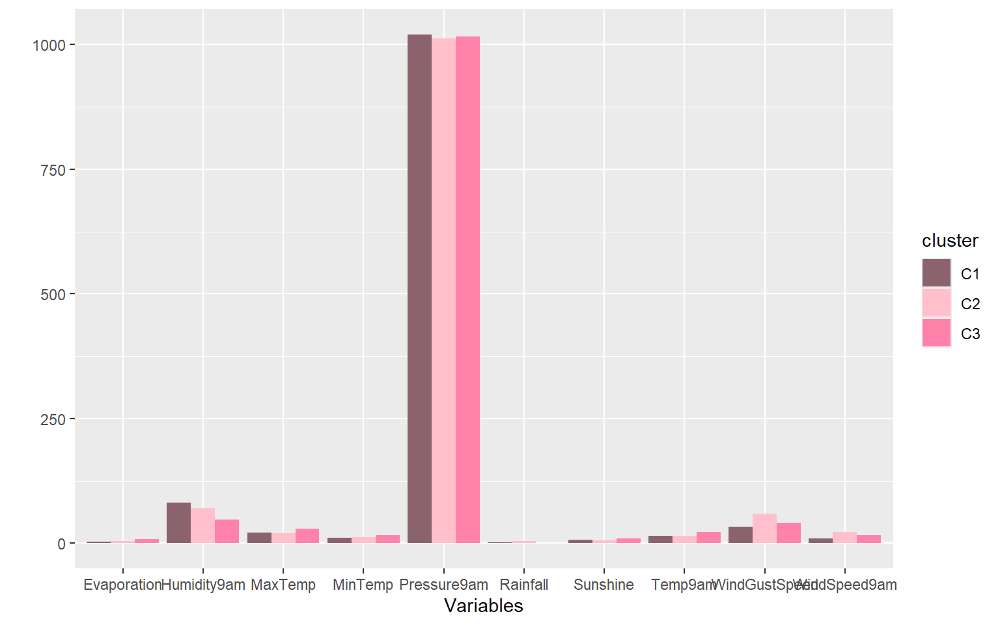
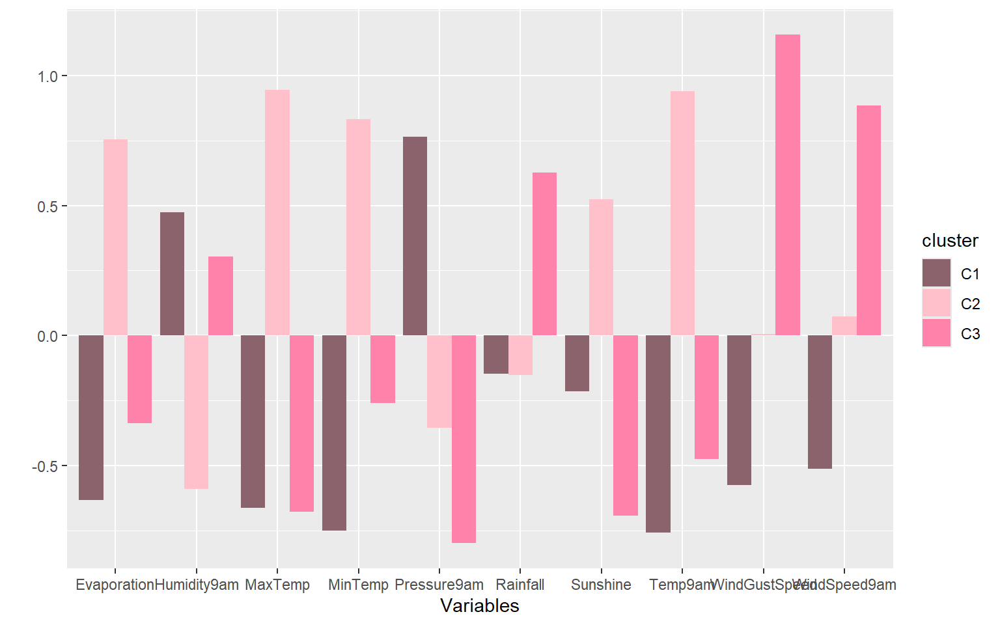
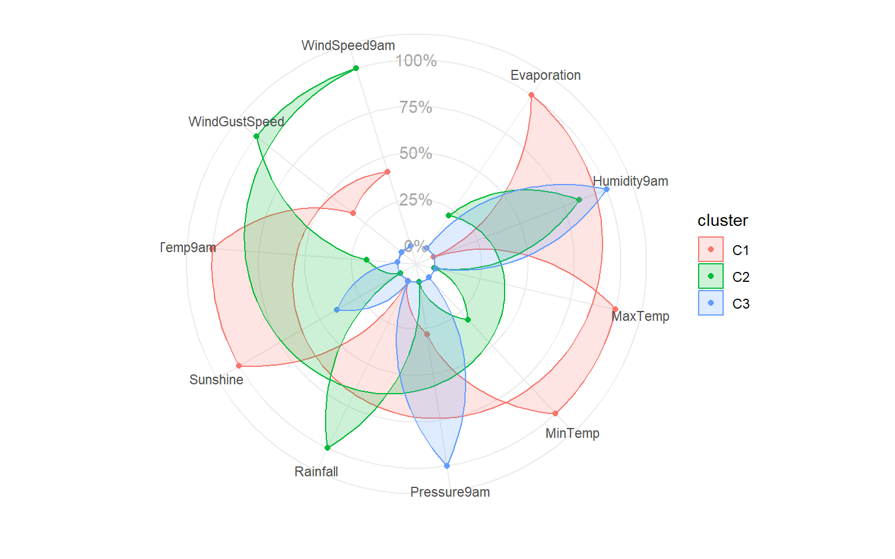
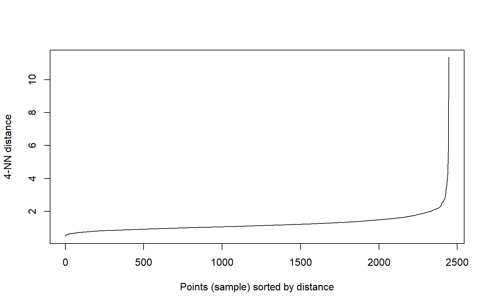
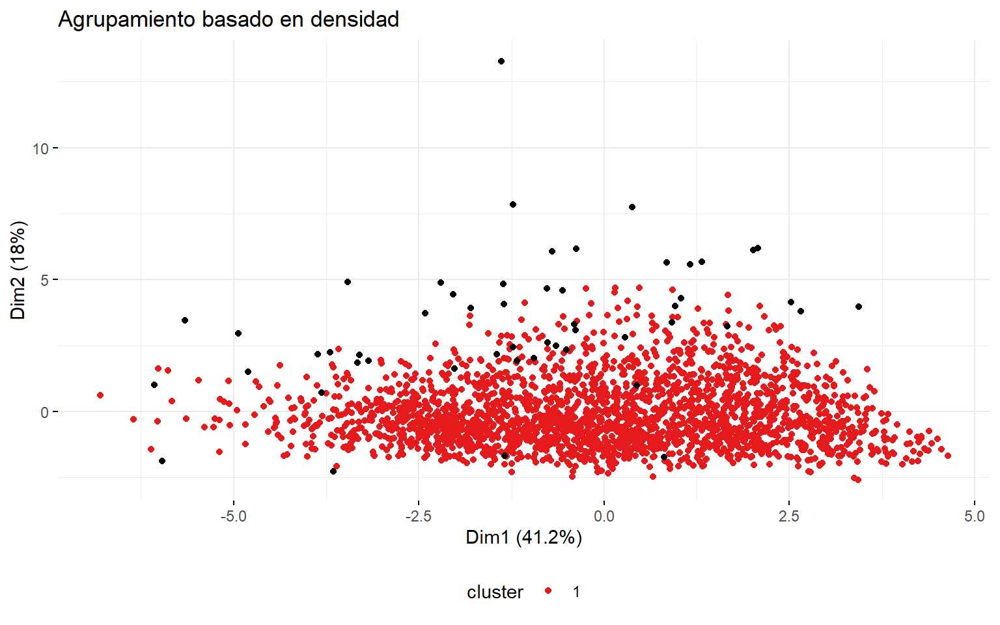
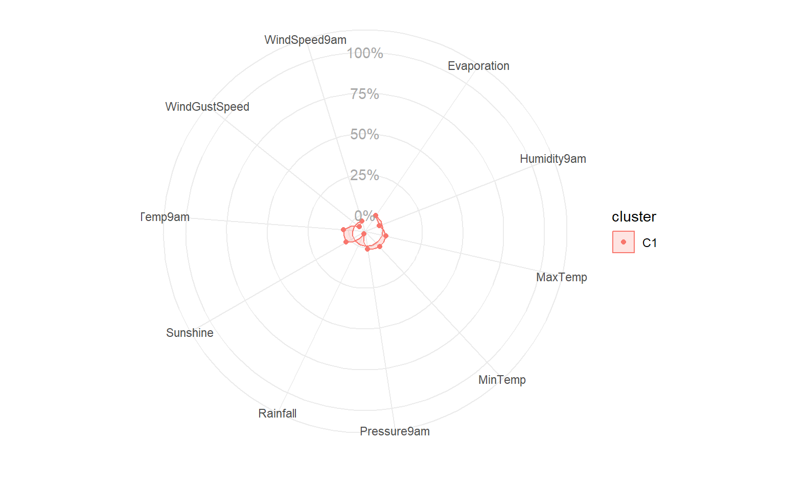
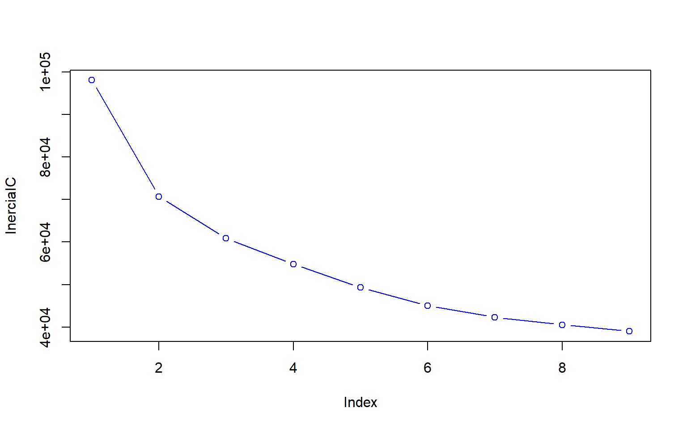

# Librerías


```r
library(readr)
library(cluster)
library(ggplot2)
library(dendextend)
```

```
## 
## ---------------------
## Welcome to dendextend version 1.17.1
## Type citation('dendextend') for how to cite the package.
## 
## Type browseVignettes(package = 'dendextend') for the package vignette.
## The github page is: https://github.com/talgalili/dendextend/
## 
## Suggestions and bug-reports can be submitted at: https://github.com/talgalili/dendextend/issues
## You may ask questions at stackoverflow, use the r and dendextend tags: 
## 	 https://stackoverflow.com/questions/tagged/dendextend
## 
## 	To suppress this message use:  suppressPackageStartupMessages(library(dendextend))
## ---------------------
```

```
## 
## Attaching package: 'dendextend'
```

```
## The following object is masked from 'package:stats':
## 
##     cutree
```

```r
library(patchwork)
library(factoextra)
```

```
## Welcome! Want to learn more? See two factoextra-related books at https://goo.gl/ve3WBa
```

```r
library(dbscan)
```

```
## 
## Attaching package: 'dbscan'
```

```
## The following object is masked from 'package:stats':
## 
##     as.dendrogram
```


# Ejercicio 2

**En este ejercicio vamos a utilizar el conjunto de datos weatherAUS.csv que contiene aproximadamente 5 años de observaciones meteorológicas diarias de diferentes lugares en Australia. La tabla contiene 53934 filas (individuos) y 11 columnas (variables), las cuales se explican a continuación.**

- **MinTemp: La temperatura mínima en grados centígrados.**
- **MaxTemp: La temperatura máxima en grados centígrados.**
- **Rainfall: La cantidad de lluvia registrada para el día en mm.**
- **Evaporation: La denominada bandeja de evaporacion (mm) clase A.**
- **Sunshine: El número de horas de sol brillante en el día.**
- **WindGustDir: La dirección de la ráfaga de viento más fuerte en las 24 horas hasta la medianoche.**
- **WindGustSpeed: La velocidad (km/h) de la ráfaga de viento más fuerte en las 24 horas hasta la medianoche.**
- **WindSpeed9am: Velocidad del viento (km/h) promediada durante 10 minutos antes de las 9 a.m.**
- **Humidity9am: Humedad (porcentaje) a las 9 a.m.**
- **Pressure9am: Presión atmosférica (hpa) reducida al nivel medio del mar a las 9 a.m.**
- **Temp9am: Temperatura (grados C) a las 9 a.m.**

**Efectúe un análisis de k-medias realizando los siguientes pasos:**

## a) Cargue la tabla de datos y ejecute un str(...), summary(...) y un dim(...), verifique la correcta lectura de los datos.

Primero para poder hacer el análisis indicado, debido a las funciones que se van a utilizar, se debe sembrar una semilla para que no cambien los resultados cada vez que se corre el código.


```r
set.seed(26)
```


```r
datos <- read.csv("weatherAUS.csv",header=TRUE, sep=",", dec=".", row.names=1)
str(datos)
```

```
## 'data.frame':	53934 obs. of  11 variables:
##  $ MinTemp      : num  12.1 13.4 16.6 17 14.4 12.7 9.9 16.1 16.4 8.3 ...
##  $ MaxTemp      : num  31.3 31.6 33.9 29 28.4 24.6 28.9 26.7 22.3 23.4 ...
##  $ Rainfall     : num  0 0 0 0 0 0 0 1.4 0.2 0 ...
##  $ Evaporation  : num  NA NA NA NA NA NA NA NA NA NA ...
##  $ Sunshine     : num  NA NA NA NA NA NA NA NA NA NA ...
##  $ WindGustDir  : chr  "E" "NNW" "W" "ENE" ...
##  $ WindGustSpeed: int  35 30 26 35 41 41 31 30 39 44 ...
##  $ WindSpeed9am : int  0 6 6 2 7 13 7 13 17 2 ...
##  $ Humidity9am  : int  60 63 63 68 68 62 64 84 40 65 ...
##  $ Pressure9am  : num  1016 1017 1017 1012 1016 ...
##  $ Temp9am      : num  20.8 21.5 24.1 22.7 15.9 16 16.1 21.2 18.6 14 ...
```

```r
summary(datos)
```

```
##     MinTemp         MaxTemp         Rainfall        Evaporation    
##  Min.   :-8.50   Min.   :-4.80   Min.   :  0.000   Min.   : 0.000  
##  1st Qu.: 7.30   1st Qu.:17.00   1st Qu.:  0.000   1st Qu.: 2.600  
##  Median :11.50   Median :22.70   Median :  0.000   Median : 4.800  
##  Mean   :12.18   Mean   :23.14   Mean   :  2.049   Mean   : 5.379  
##  3rd Qu.:17.00   3rd Qu.:29.50   3rd Qu.:  0.600   3rd Qu.: 7.400  
##  Max.   :33.90   Max.   :48.10   Max.   :206.200   Max.   :81.200  
##  NA's   :91      NA's   :55      NA's   :151       NA's   :5000    
##     Sunshine      WindGustDir        WindGustSpeed     WindSpeed9am  
##  Min.   : 0.000   Length:53934       Min.   :  9.00   Min.   : 0.00  
##  1st Qu.: 4.900   Class :character   1st Qu.: 31.00   1st Qu.: 9.00  
##  Median : 8.400   Mode  :character   Median : 39.00   Median :13.00  
##  Mean   : 7.651                      Mean   : 40.54   Mean   :14.51  
##  3rd Qu.:10.700                      3rd Qu.: 48.00   3rd Qu.:20.00  
##  Max.   :14.500                      Max.   :124.00   Max.   :67.00  
##  NA's   :5000                        NA's   :340      NA's   :224    
##   Humidity9am      Pressure9am      Temp9am     
##  Min.   :  0.00   Min.   : 982   Min.   :-7.20  
##  1st Qu.: 55.00   1st Qu.:1012   1st Qu.:11.60  
##  Median : 68.00   Median :1017   Median :16.00  
##  Mean   : 67.45   Mean   :1017   Mean   :16.96  
##  3rd Qu.: 82.00   3rd Qu.:1022   3rd Qu.:22.60  
##  Max.   :100.00   Max.   :1040   Max.   :39.40  
##  NA's   :445      NA's   :3044   NA's   :428
```

```r
dim(datos)
```

```
## [1] 53934    11
```

## b) Elimine las filas con NA usando el comando na.omit(...). ¿Cuántas filas se eliminaron?


```r
datos_limpio <- na.omit(datos)

#Cantidad de filas eliminadas
dim(datos)[1]-dim(datos_limpio)[1]
```

```
## [1] 5000
```

Como se puede observar al hacer la resta de la primera dimensión de la base de datos original y la nueva sin los NA se obtienen las filas eliminadas para un total de 5000. 

## c) Elimine de la tabla de datos la variable WindGustDir. ¿Por qué se debe eliminar? ¿Qué otra alternativa se tiene en lugar de eliminarla?


```r
datos_limpio <- datos_limpio[,-6]
```

Se debe eliminar porque es una variable de tipo categórica. Otra alternativa en lugar de eliminarla es convertirla a código disyuntivo completo.

## d) Observe que si ejecutamos el método clustering jerárquico hclust(...) con esta tabla de datos este nunca termina. ¿Por qué sucede esto?


```r
hclust(dist(datos),method = "complete")
```

Esto sucede porque estamos trabajando con una tabla de datos relativamente grande puesto que, sus dimensiones son de 48934 individuos y 11 variables. Entonces hay que recordar que cuando se aplica un clustering jerárquico, se calculan las distancias entre cada individuo. Para este caso nunca termina porque calcular las distancias entre 48934 individuos toma mucho costo computacional. 

## e) Ejecute un k−medias con k = 3 con los parámetros por defecto.


```r
k_medias <- kmeans(datos_limpio,centers=3)
```


```r
head(k_medias$cluster)
```

```
## 61183 61185 61186 61187 61188 61189 
##     2     1     1     1     3     1
```


```r
k_medias$centers
```

```
##    MinTemp  MaxTemp  Rainfall Evaporation Sunshine WindGustSpeed WindSpeed9am
## 1 10.91588 20.98747 2.3936178    3.494652 6.364323      32.59230     10.24703
## 2 11.84334 20.30622 4.4050017    4.627095 6.086662      59.01700     23.07905
## 3 15.78554 29.20335 0.2853579    7.969007 9.937774      40.48791     15.80603
##   Humidity9am Pressure9am  Temp9am
## 1    80.82333    1019.843 14.74738
## 2    70.85680    1012.177 15.31306
## 3    48.06267    1016.206 22.29497
```

## f ) Dé una interpretación de los resultados del punto anterior usando un gráfico de barras.


```r
color <- c("#CD6090","#CD6889", "#EE799F", "#FF82AB", "#DB7093",
           "pink4", "#CD919E", "#EEA9B8", "#FFB5C5", "#FFC0CB")

centros_gravedad <- k_medias$centers

centro_cluster1 <- centros_gravedad[1,]
centro_cluster1 <- data.frame("cluster" = "C1", "variable" = names(centro_cluster1),
                              "valor" = centros_gravedad[1,])
centro_cluster2 <- centros_gravedad[2,]
centro_cluster2 <- data.frame("cluster" = "C2", "variable" = names(centro_cluster2),
                              "valor" = centros_gravedad[2,])
centro_cluster3 <- centros_gravedad[3,]
centro_cluster3 <- data.frame("cluster" = "C3", "variable" = names(centro_cluster3),
                              "valor" = centros_gravedad[3,])
centros <- rbind(centro_cluster1, centro_cluster2, centro_cluster3)
for (x in unique(centros$variable)) {
  aux <- centros[centros$variable == x, "valor"]
  centros[centros$variable == x, "valor"] <- aux
}

# Juntos
ggplot(centros, aes(x = variable, y = valor, fill = cluster)) + 
  geom_bar(stat = "identity", position = "dodge") +
  scale_fill_manual(values = c("pink4", "#FFC0CB", "#FF82AB")) +
  labs(x = "Variables", y = "")
```



Como se puede observar se tiene un problema de escala con los datos esto debido a que no se estandarizaron antes de realizar método de k-medias. En todos los cluster se puede apreciar que el que tiene un mayor centro de gravedad es la variable Pressure9am pero, esto se puede deber a los valores de dicha variable que en comparación con las otras variables posee cantidades muy altas registradas, mientras que, las demás variables como se muestra en el gráfico las barras son muy pequeñas pues, los registros son cantidades pequeñas por ende, sus centros de gravedad también lo son. Incluso hay variables como Rainfall que al ser la cantidad de lluvia registrada para el día en mm existen muchos valores de 0 que hacen que el centro de gravedad sea casi nulo por lo que, en el gráfico debido a la escala no se aprecia. 

## g) Ejecute un k−medias con k = 3 con los parámetros por defecto, pero antes estandarice los datos.


```r
centrar_y_reducir <-  function(matriz){
  columnas <- ncol(matriz)
  filas <- nrow(matriz)

  for(i in 1:columnas){
    matriz[,i] <- (matriz[,i] - mean(matriz[,i])) / (sd(matriz[,i])*sqrt((filas - 1)/filas))
  }
  
  return(matriz)
}

datos_estandarizados <- centrar_y_reducir(datos_limpio)
k_medias_estandarizado <- kmeans(datos_estandarizados, centers = 3)
```


```r
head(k_medias_estandarizado$cluster)
```

```
## 61183 61185 61186 61187 61188 61189 
##     3     1     1     2     2     3
```


```r
k_medias_estandarizado$centers
```

```
##      MinTemp    MaxTemp   Rainfall Evaporation   Sunshine WindGustSpeed
## 1 -0.7510273 -0.6627428 -0.1475290  -0.6313955 -0.2132800  -0.574444823
## 2  0.8322556  0.9433115 -0.1521841   0.7545862  0.5241667   0.006194722
## 3 -0.2601220 -0.6787893  0.6277940  -0.3367601 -0.6928664   1.156759302
##   WindSpeed9am Humidity9am Pressure9am    Temp9am
## 1  -0.51120116   0.4736709   0.7653200 -0.7582633
## 2   0.07282034  -0.5902770  -0.3535016  0.9385230
## 3   0.88465100   0.3046577  -0.7986188 -0.4739261
```
## h) Dé una interpretación de los resultados del punto anterior usando un gráfico de barras. ¿Hay alguna diferencia respecto a la interpretación del punto f?


```r
centros_gravedad_estandarizados <- k_medias_estandarizado$centers

centro_estandarizado_cluster1 <- centros_gravedad_estandarizados[1,]
centro_estandarizado_cluster1 <- data.frame("cluster" = "C1", 
                                            "variable" = names(centro_estandarizado_cluster1),
                              "valor" = centros_gravedad_estandarizados[1,])
centro_estandarizado_cluster2 <- centros_gravedad_estandarizados[2,]
centro_estandarizado_cluster2 <- data.frame("cluster" = "C2", 
                                            "variable" = names(centro_estandarizado_cluster2),
                              "valor" = centros_gravedad_estandarizados[2,])
centro_estandarizado_cluster3 <- centros_gravedad_estandarizados[3,]
centro_estandarizado_cluster3 <- data.frame("cluster" = "C3", 
                                            "variable" = names(centro_estandarizado_cluster3),
                              "valor" = centros_gravedad_estandarizados[3,])
centros_estandarizados <- rbind(centro_estandarizado_cluster1, 
                                centro_estandarizado_cluster2, 
                                centro_estandarizado_cluster3)
for (x in unique(centros_estandarizados$variable)) {
  aux_estandarizado <- centros_estandarizados[centros_estandarizados$variable == x, "valor"]
  centros_estandarizados[centros_estandarizados$variable == x, "valor"] <- aux_estandarizado
}

# Juntos estandarizado
ggplot(centros_estandarizados, aes(x = variable, y = valor, fill = cluster)) + 
  geom_bar(stat = "identity", position = "dodge") +
  scale_fill_manual(values = c("pink4", "#FFC0CB", "#FF82AB")) +
  labs(x = "Variables", y = "")
```


Sí hay una diferencia con los gráficos de barras anteriores ya que ahora sí se encuentran los datos en una misma escala por lo que los centros de gravedad ya se pueden comparar entre sí de mejor manera y se pueden comparar con respecto al promedio global de la variable.

En el cluster 1 todas las variables excepto Humidity9am y Pressure9am poseen centros de gravedad negativos esto significa que los valores de estas variables dentro de este cluster se encuentran por debajo de la media global de la variable. Mientras que los centros de gravedad positivos y en este caso altos  de Humidity9am y Pressure9am significa que los valores se encuentran por encima de la media global de cada una de las variables.

En el cluster 2 las variables Evaporation y MinTemp poeen centros negativos pero cercanos a cero por lo que los valores de estas variables dentro del cluster 2 se encuentran por debajo de la media pero cercanos a esta y Humidity9am también tiene valores cercanos al promedio pero por encima de este, mientras que las variables MaxTemp, Pressure9am, Sunshine y Temp9am poseen valores mucho más pequeños que la media global. Lo contrario sucede con Rainfall, WindGustSpeed y WindSpeed9am las cuales dentro de este cluster se caracerizan por poseer valores más altos. 

Por último, en el cluster 3 WindGustSpeed posee valores muy cercanos al promedio de la variable al igual que WindSpeed9am. Las variables Evaporation, MaxTemp, MinTemp, Sunshine y Temp9am dentro de este cluster poseen valores mucho más altos que la media de la variable correspondiente. Las demás se encuentran por debajo. 

## i) Ejecute un k−medias con k = 3 con iter.max=1000 y nstart=50.


```r
k_medias_2 <- kmeans(datos_estandarizados, centers = 3, iter.max = 1000, 
                     nstart = 50)
```


```r
head(k_medias_2$cluster)  
```

```
## 61183 61185 61186 61187 61188 61189 
##     2     3     3     1     1     2
```


```r
k_medias_2$centers
```

```
##      MinTemp    MaxTemp   Rainfall Evaporation   Sunshine WindGustSpeed
## 1  0.8322556  0.9433115 -0.1521841   0.7545862  0.5241667   0.006194722
## 2 -0.2601220 -0.6787893  0.6277940  -0.3367601 -0.6928664   1.156759302
## 3 -0.7510273 -0.6627428 -0.1475290  -0.6313955 -0.2132800  -0.574444823
##   WindSpeed9am Humidity9am Pressure9am    Temp9am
## 1   0.07282034  -0.5902770  -0.3535016  0.9385230
## 2   0.88465100   0.3046577  -0.7986188 -0.4739261
## 3  -0.51120116   0.4736709   0.7653200 -0.7582633
```

## j) Dé una interpretación de los resultados del punto anterior usando un gráfico tipo radar.


```r
centros_gravedad_2<- k_medias_2$centers

centro_2_cluster1 <- centros_gravedad_2[1,]
centro_2_cluster1 <- data.frame("cluster" = "C1", 
                                            "variable" = names(centro_2_cluster1),
                                            "valor" = centros_gravedad_2[1,])
centro_2_cluster2 <- centros_gravedad_2[2,]
centro_2_cluster2 <- data.frame("cluster" = "C2", 
                                            "variable" = names(centro_2_cluster2),
                                            "valor" = centros_gravedad_2[2,])
centro_2_cluster3 <- centros_gravedad_2[3,]
centro_2_cluster3 <- data.frame("cluster" = "C3", 
                                            "variable" = names(centro_2_cluster3),
                                            "valor" = centros_gravedad_2[3,])
centros_2 <- rbind(centro_2_cluster1, 
                                centro_2_cluster2, 
                                centro_2_cluster3)
for (x in unique(centros_2$variable)) {
  aux_2 <- centros_2[centros_2$variable == x, "valor"]
  aux_2 <- aux_2 - min(aux_2)
  aux_2 <- aux_2 / max(aux_2)
  centros_2[centros_2$variable == x, "valor"] <- aux_2
}

# Gráfico de radar

ggplot(data = centros_2[order(centros_2$variable), ],
       aes(x = variable, y = valor, group = cluster)) + 
  geom_point(aes(colour = cluster)) +
  geom_polygon(aes(colour = cluster, fill = cluster), alpha = 0.2) +
  ylim(-0.1, 1) + labs(x = "", y = "") + theme_minimal() +
  theme(axis.ticks.y = element_blank(), axis.text.y = element_blank()) +
  annotate('text', x = 0, y = c(0, 0.25, 0.5, 0.75, 1),
           label = c("0%", "25%", "50%", "75%", "100%"), color = "darkgray") +
  coord_polar()
```



Al analizar el gráfico se puede observar que el clúster 1 se encuentra correlacionado fuertemente con las variables Evaporation, MaxTemp, MinTemp, Sunshine y Temp9am. También está impactado pero en menor medida por WindSpeed9am y WindGustSpeed. La variable Pressure9am solo impacta en un 25% al cluster 1 y Humidity9am se puede decir que no afecta a este cluster. Este cluster se caraceriza por poseer evaporacion alta, temperturas máximas y a las 9 a.m. muy altas y muchas horas de sol brillante en el día. 

Las variables por las que se ve fuertemente caracterizado el cluster 2 son WindGustSpeed, WindSpeed9am y Rainfall, también las observaciones de este cluster se ven impactadas pero en menor medida por la variable Humidity9am. Ahora con un impacto del 25% o menos se encuentran las variables de Evaporation, MinTemp y Temp9am. Este cluster se caracteriza por tener la velocidad de la ráfaga de viento más fuertes en las 24 horas hasta la medianoche, alta velocidad del viento promediada durante 10 minutos antes de las 9 a.m y alta cantidad de lluvia registrada para el día con baja evaporación, bajas temepraturas mínimas y a las 9 a.m.

En el cluster 3 las variables con valores altos, es decir, que impactan fuertemente a este cluster son Humidity9am y Pressure9am, y con un poco menos de un 50% la variable Sunshine. Es decir, este cluster se caracteriza por tener porcentajes de humedad a las 9 a.m. altos y presión atmosférica reducida al nivel medio del mar a las 9 a.m alta.  

## k) Observe que si ejecutamos el método k−medoides con k = 3 con nstart=50 con esta tabla de datos este método nunca termina o tarda demasiado. ¿Por qué sucede esto?

##  l) Ejecute un k−medoides con k = 3 con nstart=50. Para esto tome una muestra de 5 % de los datos, esto se puede lograr con el siguiente código:


```r
numero_filas <- nrow(datos_estandarizados)
muestra <- sample(1:numero_filas,numero_filas*0.05)
datos_muestra <- datos_estandarizados[muestra,]
modelo_kmd <- pam(datos_muestra, 3, nstart = 50)
```

## m) Aplique el método dbscan con todos los datos ¿Termina el método? Sino termina ejecútelo en la muestra del 5 %.

Con esta función podemos encontrar el valor correcto para el argumento eps del método dbscan.

```r
kNNdistplot(datos_muestra, k = 4)
```



Como se puede observar se puede tomar eps igual a 2, esto significa que va a buscar los clústeres en un radio de 2. 


```r
metodo_dbscan <- fpc::dbscan(datos_estandarizados, eps = 2, MinPts =4)
```

No termina de correr con todos los datos. Por lo tanto, se va a utilizar la muestra del 5%.


```r
metodo_dbscan <- fpc::dbscan(datos_muestra, eps = 2, MinPts =4)
graf <- fviz_cluster(metodo_dbscan, data = datos_muestra, stand =F,
                  ellipse = F, show.clust.cent = F,
                  geom = "point",shape = 19, palette = "Set1",
                  ggtheme = theme_minimal())
graf + labs(title = "Agrupamiento basado en densidad") +
  theme(legend.position = "bottom")
```



## n) Dé una interpretación de los resultados del punto anterior usando usando un gráfico tipo radar. ¿Qué diferencias nota respecto a k-medias?


```r
datos_graf_cluster <- datos_muestra
datos_graf_cluster$cluster <- metodo_dbscan$cluster

# Filtrar las observaciones que pertenecen al cluster 1
datos_graf_cluster <- datos_graf_cluster[datos_graf_cluster$cluster == 1, ]

# Calcular el centro de gravedad 
centro_cluster_dbscan <- colMeans(datos_graf_cluster[, -ncol(datos_graf_cluster)])

centro_cluster_dbscan <- data.frame("cluster" = "C1", 
                                    "variable" = names(centro_cluster_dbscan),
                              "valor" = centro_cluster_dbscan)
ggplot(data = centro_cluster_dbscan[order(centro_cluster_dbscan$variable), ],
       aes(x = variable, y = valor, group = cluster)) + 
  geom_point(aes(colour = cluster)) +
  geom_polygon(aes(colour = cluster, fill = cluster), alpha = 0.2) +
  ylim(-0.1, 1) + labs(x = "", y = "") + theme_minimal() +
  theme(axis.ticks.y = element_blank(), axis.text.y = element_blank()) +
  annotate('text', x = 0, y = c(0, 0.25, 0.5, 0.75, 1),
           label = c("0%", "25%", "50%", "75%", "100%"), color = "darkgray") +
  coord_polar()
```



La diferencia que se puede observar con el K-medias es la interpretabilidad de los datos. Con el dbscan solo se formó un cluster lo cual no nos da nigna información valiosa. Además, note que todas las variables se encuentran cerca o incluso en el 0% del gráfico. Por lo que no aporta mayor información. 

## ñ) Construya el Codo de Jambu usando iter.max=100 y nstart=5, ¿cuántos conglomerados (clústeres) sugiere el codo? Utilice también el método silhouette de la función fviz nbclust, ¿cuántos conglomerados (clústeres) sugiere este método? Para este ejercicio puede utilizar una muestra del 20 % en caso de limitaciones computacionales.

Debido a lmitaciones computacionales se va a utilizar la muestra del 20%.


```r
muestra_20 <- sample(1:numero_filas,numero_filas*0.2)
datos_muestra_20 <- datos_estandarizados[muestra_20,]
```


### Codo de Jambu


```r
InerciaIC<-rep(0,9)
for(k in 1:9) {
  grupos <- kmeans(datos_muestra_20, centers=k, nstart=5, iter.max=100)
  InerciaIC[k]<-grupos$tot.withinss
}
plot(InerciaIC,col="blue",type="b")
```



### Silhouette


```r
fviz_nbclust(datos_muestra_20, kmeans, method = "silhouette",k.max = 8)
```


Ambos métodos sugieren tomar 2 conglomerados. 
